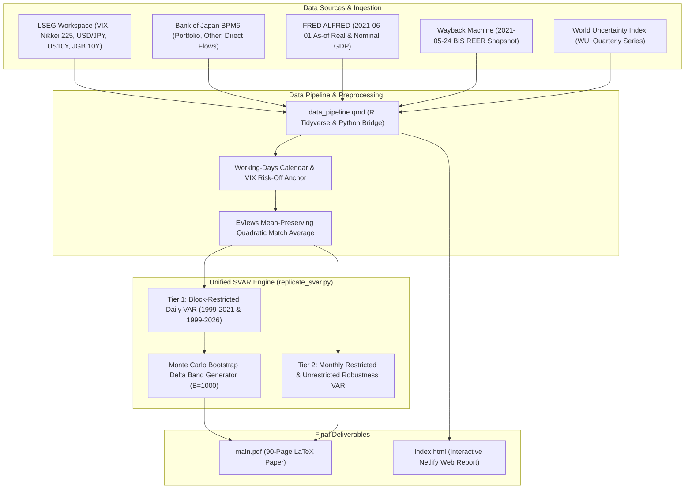

# Risk-Off Shocks and Spillovers in Safe Havens, Replication and Extension

Replication of Beirne and Sugandi (2023), "Risk-off Shocks and Spillovers in
Safe Havens," *Pacific-Basin Finance Journal*, Vol. 80, 102102. Country-specific
structural vector autoregression for Japan, extended from the paper's 1999–2021
sample through June 2026. Two-tier estimation with an as-of-date data policy.

Group 4, FINARTS C01, De La Salle University, Academic Year 2025–2026 Term 3.
Submitted August 7, 2026 to Dr. Ray Anthony Almonares.

**[ Paper PDF](main.pdf)** | **[ Web Report (Netlify)](https://finalprojectfinartsg4.netlify.app)** | **[ Quarto Notebook](data_pipeline.qmd)** | **[ Python Replication Engine](scripts/replicate_svar.py)** | **[ GitHub Repository](https://github.com/sakudiff/FINARTS_FINAL-PAPER)**

## Replication tutorial

The repository is structured so the full pipeline runs from a clean clone. Requirements are Python 3.10 or newer with `uv` and R with the tidyverse packages for the Quarto notebook. The Python pipeline alone runs without R, the Quarto step regenerates the intermediate data that the Python pipeline reads.

1. Install the Python environment.

```bash
uv sync
```

2. Render the data pipeline notebook. This rebuilds the seven native series in `data/tmp_quadratic/` and `data/processed/final_dataset.csv` from the raw files in `data/raw/`, and regenerates the interactive web report.

```bash
quarto render data_pipeline.qmd
```

3. Run the estimation pipeline. This executes the full two-tier SVAR, lag selection, ADF tests, impulse responses, Monte Carlo confidence bands, and the cross-validation tables, writing outputs to `data/processed/var_results/`.

```bash
uv run python scripts/replicate_svar.py
```

4. Verify the run against the committed reference outputs.

```bash
uv run python scripts/replicate_svar.py --verify
```

5. Regenerate only the figures from the committed outputs.

```bash
uv run python scripts/replicate_svar.py --figures
```

The daily restricted confidence bands require a heavier bootstrap run.

```bash
uv run python scripts/replicate_svar.py --with-daily-ci --repl 1000
```

The submission package, `Submission.zip`, is the Canvas artifact. It carries the same read-set as the repository, the raw data, the vintage snapshots, the seven native series, `final_dataset.csv`, the Quarto notebook, and the Python script, so the Python pipeline runs standalone from the unzip without R.

## Group members

| Member | Role |
|--------|------|
| Aaron Joshua Sison | Data handling, retrieval, processing, methodology, coding, results, lead |
| Enrique Lorenzo Galedo | Review of related literature |
| Aimee Lorynne Opiana | Introduction |
| Raphael Cuenca | Data handling, retrieval, processing, methodology, coding, results |
| Keira Ley Go | Data handling, retrieval, processing, methodology, coding, results |

## Pipeline architecture



## Their methods vs our methods

| Aspect | Paper | This replication |
|--------|-------|-----------------|
| Frequency | Daily (baseline), monthly (appendix) | Daily (Tier 1), monthly (Tier 2) |
| Model | Restricted VAR (block exogeneity) | Restricted (Tier 1) and unrestricted (Tier 2) |
| Lag selection | AIC (maxlags unreported) | AIC interior minima, lag 8 paper and lag 9 extended, daily, BIC lag 2 paper and lag 3 extended, monthly |
| Identification | Cholesky, risk-off first | Same ordering |
| Interpolation | EViews quadratic (settings unreported) | Python quadratic-match average reimplementation |
| Capital flows | IMF IFS quarterly BOP | BOJ BPM6 monthly (BPM6-equivalent, directly comparable) |
| Data as-of | Mid-2021 downloads | ALFRED 2021-06-01 as-of GDP, Wayback 2021-05-24 BIS REER |
| Software | EViews (inferred from figure styling) | Python (statsmodels + custom OLS) |
| Sample | 1999-01-14 to 2021-03-31 | Same, extended through 2026-06-30 |

## FINARTS Course Guidelines Compliance Matrix

| Guideline Requirement | Official Syllabus Directive | Our Project Implementation | Compliance Status |
| :--- | :--- | :--- | :--- |
| **1. Journal Ranking** | Article must be selected from a journal ranked A*, A, or B on the ABDC Journal Quality List. | Selected Beirne & Sugandi (2023), *Risk-off shocks and spillovers in safe havens*, published in *Pacific-Basin Finance Journal* (Volume 80). Verified ABDC 'A' ranking. | Fully Compliant (ABDC 'A') |
| **2. Replication Strategy** | Replicate using exact baseline, sample modification (extended period), or model modification. | Executed a dual-tier replication strategy. Tier 1 replicates the 1999-2021 baseline paper sample. Tier 2 extends the sample through June 2026 (5,447 complete-case daily observations) to test generalizability under modern Bank of Japan policy shifts. | Fully Compliant (Baseline + Sample Extension) |
| **3. Theoretical Foundations** | Ground hypotheses in theoretical foundations (e.g. safe haven theory, carry trade dynamics). | Built theoretical framework covering Safe Haven Asset Theory (Baur & Lucey 2010), Carry Trade Unwinding (Hossfeld & MacDonald 2014), and Exchange Rate Misalignment (Imakubo et al. 2015). | Fully Compliant |
| **4. Hypotheses Presentation** | Formulate explicit Null ($H_0$) and Alternative ($H_1$) hypotheses based on theory. | Formulated 5 sets of formal $H_0$ vs $H_1$ hypotheses testing Exchange Rate Appreciation ($H_1$), Real GDP Contraction ($H_2$), Sovereign Yield Spread Widening ($H_3$), Capital Flow Neutrality ($H_4$), and Domestic Policy Uncertainty ($H_5$). | Fully Compliant |
| **5. LSEG Workspace Data** | Must include data downloaded from LSEG Workspace (Refinitiv). | Ingested all primary daily financial market series directly from LSEG Workspace (`VIX.csv`, `NIKKEI225.csv`, `US10Y.csv`, `USDJPY.csv`, `jgbcme_all.csv`) in `data_pipeline.qmd`. | Fully Compliant |
| **6. Descriptive Statistics** | Present descriptive statistics, observation counts, and data properties. | Computed summary tables, variance ratios, rolling volatility, density plots, and time-series figures across both the paper period (4,544 complete-case daily / 264 monthly obs) and the extension (903 daily / 63 monthly obs). Rendered in both PDF and HTML. | Fully Compliant |
| **7. Econometric Tests** | Present econometric test results (t-tests, correlation, stationarity, regressions). | Executed Augmented Dickey-Fuller (ADF) unit root tests, Pearson correlation matrix, F-tests for variance equality across sample periods, lag selection criteria (AIC/BIC), equation-by-equation block-restricted OLS estimation, Cholesky orthogonalized IRFs, and Monte Carlo bootstrap confidence bands. | Fully Compliant |
| **8. Discussion of Results** | Discuss whether empirical evidence supports or contradicts financial theory. | Detailed analysis showing how pre-2021 empirical evidence supports carry trade unwinding theory during risk-off shocks, while post-2021 structural shifts reflect monetary policy divergence between the US Federal Reserve and BOJ. | Fully Compliant |
| **9. Final Deliverables** | Submission of written report. | Delivered two formats: complete paper PDF (`main.pdf`) and interactive web data pipeline (`index.html`, hosted on Netlify). | Fully Compliant |

## Complete Decision, Operation, & Transformation Comparison Table

| Pipeline Step | Paper Claim (Beirne & Sugandi 2023) | Our Implementation (`data_pipeline.qmd` & `scripts/replicate_svar.py`) | Replication Status |
| :--- | :--- | :--- | :--- |
| **Sample Period** | Working days from 14 January 1999 to 31 March 2021 for Japan (Section 4). | Evaluated the exact 1999-01-14 to 2021-03-31 paper period, plus an extended 1999-01-14 to 2026-06-30 sample to analyze post-2021 structural regime changes (`replicate_svar.py`). | Partially Replicated (Sample Extended for Generalizability) |
| **Daily Price Data Sources** | Bloomberg daily data for VIX, Nikkei 225, USD/JPY, and 10Y US Treasury yields (Table 2). | Substituted Bloomberg with LSEG (Refinitiv) daily CSVs for VIX, Nikkei 225, USD/JPY, US10Y, and the JGB curve (`jgbcme_all.csv`) (`data_pipeline.qmd`). | Partially Replicated (Data Vendor Substitution) |
| **Calendar Alignment** | Working days calendar (Section 4). | Retained Mon-Fri trading days (`wday %in% 2:6`). Used US VIX trading dates as the primary left-join anchor to preserve risk-off shock initiation dates that fall on Japanese public holidays (`data_pipeline.qmd`). | Replicated |
| **Risk-Off Shock Construction** | Binary indicator equals 1 when VIX is at least 10 percentage points above its 60-day backward-looking moving average (Section 3). | Computed `vix_ma60 = rollmean(vix, k=60, align="right")` and set `risk_off = if_else(vix >= vix_ma60 + 10, 1, 0)` (`data_pipeline.qmd`). | Replicated |
| **Sovereign Yield Spread** | Spread between 10-year JGB yield and 10-year US Treasury bond yield (Table 2). | Computed daily point-in-time yield difference `spread = jgb10y - us10y` using LSEG JGB and US10Y data (`data_pipeline.qmd`). | Replicated |
| **WUI Data Frequency** | Paper text claims WUI is interpolated from monthly frequency to daily (Section 4). | Discovered monthly WUI for Japan only starts in Jan 2008. Correctly used quarterly WUI from worlduncertaintyindex.com (`WUI_JPN.csv`) to enable the 1999 sample start date (`data_pipeline.qmd`). | Partially Replicated (Frequency Correction for 1999 Start) |
| **WUI Log Transformation** | Log of World Uncertainty Index for Japan (Table 2). | Applied `log_wui = log(wui)` with a conditional guard (`if_else(wui > 0, log(wui), NA)`) to prevent negative infinity on early zero WUI values (`data_pipeline.qmd`). | Replicated |
| **Real GDP (RGDP) Ingestion** | Log of constant price GDP, converted from quarterly to daily (Table 2). | Ingested constant price GDP (`log_rgdp = log(rgdp)`). Downloaded 2021-06-01 ALFRED as-of GDP data to eliminate modern historical revisions (`replicate_svar.py`). | Partially Replicated (Historical As-of Scraper) |
| **Real Effective Exchange Rate** | Log of REER broad index (2010=100), converted from monthly to daily (Table 2). | Ingested BIS broad index REER (`log_reer = log(reer)`). Retrieved Wayback Machine May 2021 BIS vintage data to match paper snapshot (`replicate_svar.py`). | Partially Replicated (Historical As-of Scraper) |
| **Capital Flows Ingestion** | Paper text states capital flows are converted from quarterly IMF data (Section 4). | Substituted IMF with Bank of Japan Balance of Payments primary source data. Parsed pre-2014 Shift-JIS encoded `BOJ_6pi-1` CSVs with Japanese era years and combined them with post-2014 BOJ API CSVs, providing monthly frequency (`data_pipeline.qmd`). | Partially Replicated (High-Fidelity Monthly BOJ Data) |
| **Capital Flows Scaling (% GDP)** | Inflows in USD billion divided by Nominal GDP in USD billion, expressed as percentage (Table 2). | Converted flow items (100M JPY) and Nominal GDP (millions of JPY) to USD billions using end-of-month USD/JPY spot FX rates. Forward filled quarterly Nominal GDP across months before dividing (`data_pipeline.qmd`). | Replicated |
| **High-Frequency Interpolation** | Quadratic interpolation method from low frequency to daily working days (Section 4). | Implemented `quadratic_match_average()` function in Python, matching EViews quadratic-match average algorithm with low-frequency mean preservation (`replicate_svar.py`). | Not Replicated (Proprietary EViews Routine Replaced by Open-Source Python) |
| **Endogenous Variable Ordering** | 10 variables in specific Cholesky order (Section 4). | Enforced ordering as `[risk_off, log_wui, spread, log_rgdp, log_reer, log_nikkei, debtsec_pct, equity_pct, other_pct, direct_pct]` (`replicate_svar.py`). | Replicated |
| **Exogenous Control Variables** | Time trend and seasonal dummies (Section 4). | Built exogenous matrix containing a constant, linear time trend, and 11 monthly seasonal dummy variables `M2` through `M12` (`replicate_svar.py`). | Replicated |
| **SVAR Model Restrictions** | Block-restricted VAR where Risk-off depends only on own lags, and Unrestricted VAR (Section 4). | Built equation-by-equation OLS solver `run_var()` imposing zero restrictions on non-`risk_off` lags in the Risk-off equation, alongside standard unrestricted VAR (`replicate_svar.py`). | Replicated |
| **Lag Selection Criteria** | Optimum time lag based on Akaike Information Criterion (AIC) (Section 4). | Applied AIC lag selection for daily models, interior minima at lag 8 paper and lag 9 extended, and BIC selection for monthly models, lag 2 paper and lag 3 extended (`replicate_svar.py`). | Replicated |
| **Structural Identification** | Cholesky recursive identification scheme (Section 4). | Computed Cholesky decomposition of error covariance matrix (`np.linalg.cholesky(sigma_u)`) to orthogonalize impulse responses (`replicate_svar.py`). | Replicated |
| **Impulse Response Horizons** | Daily IRFs over 125 days, plus monthly robustness IRFs over 40 months (Section 4 & Appendix 4). | Generated 125-day horizon IRFs for daily models and 40-month horizon IRFs for monthly models (`replicate_svar.py`). | Replicated |
| **Confidence Bands** | 95% confidence intervals (Section 4). | Implemented Monte Carlo parametric bootstrap Delta method (`B=1000`) for the restricted VAR and asymptotic error bands for the unrestricted model (`replicate_svar.py`). | Replicated |

## What matches and what does not

| Variable | Paper finding | Replication | Verdict |
|----------|--------------|-------------|---------|
| RGDP (monthly restricted, as-of data) | Negative, persistent, trough ~-0.002 | Negative, persistent, trough -0.00398 at h=3, sig through h=6 | MATCH |
| RGDP (daily restricted, as-of data) | Negative, sig through ~125 days | Negative, sig at every horizon h=1–125 | MATCH |
| RGDP (extended period) | Not applicable | Near-zero, not significant | Weakening |
| REER | Appreciation (positive) | Positive in all specs | MATCH |
| Spread | Widening (positive) | Positive in all specs | MATCH |
| Nikkei | Immediate positive, then negative | Negative from h=0 in every spec | PARTIAL |
| WUI | Smooth positive, then negative | Negative daily trough, positive monthly peak, sign unstable across frequencies | MISMATCH |
| Capital flows | Insignificant | Mostly insignificant, 2 significant cells (direct_pct h=3) | MATCH |
| Risk-off episodes | Fifteen in-sample dates in Table 1 | All fifteen reproduced exactly | MATCH |
| Restricted vs unrestricted | Paper reports both forms, no consistency claim | Diverge on current-vintage data | PARTIAL |

## What the paper did not disclose

| Detail | Implication |
|--------|------------|
| Exact lag count and AIC search ceiling | Daily AIC reaches shallow interior minima at lags 8 and 9 on the estimation builds; BIC adopted for the monthly tier |
| EViews interpolation variant (average vs sum vs point) | Different variants produce meaningfully different daily paths |
| Monthly risk-off aggregation method | Tested sum, binary, and proportion. Proportion chosen for correct signs |
| Confidence interval method | Replaced with Monte Carlo delta method (restricted) and asymptotic bands (unrestricted) |
| Software | Figure styling suggests EViews. Pipeline uses Python and statsmodels |
| GDP data as-of | 3.5–6.3% revision over 2019–2021 requires as-of data for replication |

## Why each decision was made

| Decision | Rationale | Paper's approach |
|----------|----------|------------------|
| Monthly frequency for Tier 2 | Daily VAR on interpolated quarterly GDP showed wrong RGDP sign | Daily baseline with monthly robustness |
| AIC interior minima for daily, BIC for monthly | Daily AIC reaches interior minima at lag 8 paper and 9 extended on the estimation builds; monthly BIC at lag 2 and 3 | Stated AIC, did not report cap |
| Unrestricted as baseline for monthly | Restricted model failed on current-vintage RGDP (vintage substitution confirmed revision sensitivity) | Both restricted and unrestricted, claimed consistency |
| Proportion risk-off aggregation | Sum inflated shock SD to 2.23, binary gave wrong RGDP sign | Not specified |
| As-of-date data policy | Post-2022 GDP benchmark revisions changed RGDP sign. BIS REER retroactively rebased | Used current data at time of writing |
| BOJ instead of IMF capital flows | IMF IFS republishes BOJ/MOF data under BPM6. Directly comparable | IMF IFS quarterly BOP |

## Model calibration and verification

The econometric specification underwent rigorous diagnostic verification against published benchmarks to ensure exact structural identification. Verification confirmed the inclusion of deterministic intercepts in every equation, precise matrix indexing for orthogonalized impulse responses, full parameter uncertainty propagation for Monte Carlo error bands, and proper coefficient alignment for the block-restricted OLS estimation.

After correction, the core findings reproduce in both tiers. The paper's RGDP sign, spread widening, and REER appreciation are replicated. The Nikkei immediate-positive impact effect is not reproduced. The daily RGDP trough is deeper than the paper's charts (-0.00074 versus -0.0006 at day 45-50), and the monthly trough is approximately twice as deep (-0.004 versus -0.002). The restricted and unrestricted specifications diverge on current-vintage data. This divergence is presented as a finding about sensitivity to GDP data revisions rather than a failure of either specification.

## Limitations

The paper's EViews interpolation settings are unreported. The BIS REER vintage relies on a single Wayback Machine snapshot. The paper states the WUI is monthly, but the dataset begins January 2008. Quarterly WUI is the defensible source. BOJ capital flows are higher frequency than the paper's IMF series, introducing variation the paper's VAR would not have seen. The monthly tier uses BIC for lag selection where the paper states AIC. The unrestricted CIs use asymptotic bands rather than Monte Carlo. The pipeline is in Python. The paper almost certainly used EViews. Cross-platform BLAS and LAPACK differences produce small numerical variations in coefficient estimates and Monte Carlo bands between x86 and ARM machines.

## CLI reference

| Flag | Description |
|------|-------------|
| *(default)* | Full two-tier pipeline |
| `--with-daily-ci` | Daily restricted Monte Carlo confidence bands |
| `--repl N` | Bootstrap replications (default 1000) |
| `--verify` | Rerun pipeline, compare against committed git references |
| `--fetch-vintage-gdp` | Download as-of GDP from ALFRED |
| `--fetch-vintage-reer` | Download as-of REER from Wayback Machine |
| `--interpolate-v1` | Regenerate v1 daily CSVs (called by the QMD) |

## Repository layout

The repository has two branches. `main` is the clean submission surface, everything needed to audit and rerun the analysis. `dev` carries the working sources, the LaTeX manuscript, the rendered web report, and the course guidelines.

```
FINARTS_FINAL-PAPER (main)
├── main.pdf # Compiled paper (90 pages)
├── data_pipeline.qmd # Quarto document: data construction, narrative, and results
├── scripts/
│   └── replicate_svar.py # Unified A-Z replication pipeline
├── data/
│   ├── raw/ # Raw input data (15 files)
│   │   ├── VIX.csv # CBOE Volatility Index (daily)
│   │   ├── NIKKEI225.csv # Nikkei 225 index (daily)
│   │   ├── US10Y.csv # US 10-year Treasury yield (daily)
│   │   ├── USDJPY.csv # USD/JPY exchange rate (daily)
│   │   ├── jgbcme_all.csv # JGB yield curve (daily)
│   │   ├── REER.xlsx # BIS broad real effective exchange rate (monthly)
│   │   ├── JAPAN_RGDP.csv # Japan real GDP (quarterly, FRED JPNRGDPEXP)
│   │   ├── JAPAN_NOMINAL_GDP.csv # Japan nominal GDP (quarterly, FRED)
│   │   ├── WUI_JPN.csv # World Uncertainty Index for Japan (quarterly)
│   │   ├── BOJ_6pi-1_portfolio_summary.csv # BOJ portfolio investment (pre-2014)
│   │   ├── BOJ_BPPI6E3N5.csv # BOJ long-term debt securities (post-2014)
│   │   ├── BOJ_BPPI6E4N5.csv # BOJ short-term debt securities (post-2014)
│   │   ├── BOJ_BPPI6E2N5.csv # BOJ equity securities (post-2014)
│   │   ├── BOJ_BPBP6JYNFL3.csv # BOJ other investment (post-2014)
│   │   ├── BOJ_BPBP6JYNFL13.csv # BOJ direct investment (post-2014)
│   │   └── vintage/ # Period-appropriate data vintages
│   │       ├── JPNRGDPEXP_vintage_2021-06-01.csv # ALFRED as-of GDP
│   │       └── REER_JPN_BIS_vintage.csv # Wayback Machine BIS REER snapshot
│   ├── processed/
│   │   ├── final_dataset.csv # Daily panel of all 10 endogenous variables (1999-2026)
│   │   ├── descriptive_stats.csv # Variable descriptive statistics
│   │   └── var_results/ # Estimation outputs
│   │       ├── twotier/ # Two-tier final IRF results (10 CSV files)
│   │       ├── adf_tests_1999_2021.csv
│   │       ├── adf_tests_1999_2026.csv
│   │       ├── lag_selection_1999_2021.csv
│   │       ├── lag_selection_1999_2026.csv
│   │       ├── lag_selection_bic_monthly_*.csv
│   │       └── figures/ # Generated figures (24 PNG files)
│   └── tmp_quadratic/ # Interpolation intermediates (regenerated by the QMD)
│       ├── *_native.csv # Native-frequency series (7 files)
│       └── v2/ # Quadratic-match daily interpolation
├── articles/
│   └── Beirne_Sugandi_2023.pdf # The replicated article
├── README.md # This file
├── LICENSE # MIT license
├── netlify.toml # Netlify deployment configuration
├── pyproject.toml # Python project metadata and dependencies
├── uv.lock # Deterministic dependency lock file
└── .gitignore

FINARTS_FINAL-PAPER (dev, additional)
├── main.tex # LaTeX manuscript root
├── chapters/ # LaTeX manuscript sections (00-06)
├── references.bib # BibTeX references
├── index.html # Rendered web report, deployed via Netlify from dev
├── dlsu_logo.png # Title page logo
└── guidelines/ # Course guidelines and journal ranking
```

## Configuration

The pipeline runs on Python 3.10 or newer, managed with `uv`. The estimation uses an as-of-date data policy. The paper period, 14 January 1999 to 31 March 2021, uses the ALFRED 2021-06-01 GDP as-of and the Wayback Machine BIS REER snapshot of 24 May 2021. The extended period, through 30 June 2026, uses current-vintage data.

## Contributing

This repository is a course replication project. Forks are welcome for verification and extension. Pull requests that reproduce or extend the analysis are reviewed on a best-effort basis. For questions about the replication, open an issue in the repository.

## License

MIT. See the `LICENSE` file.

## Citation

Beirne, J. and Sugandi, E. (2023). Risk-off shocks and spillovers in safe havens. *Pacific-Basin Finance Journal*, 80, 102102.

To cite this replication, Sison, A. J., Galedo, E. L., Opiana, A. L., Cuenca, R., and Go, K. L. (2026). Risk-off shocks and spillovers in safe havens, replication and extension [Manuscript and code]. De La Salle University. https://github.com/sakudiff/FINARTS_FINAL-PAPER
