The pipeline initialises with project paths and era map before loading any data.

```{r setup, include=FALSE}
#| message: false
#| warning: false

library(tidyverse)
library(readxl)
library(zoo)
library(lubridate)
library(knitr)
library(kableExtra)

DATA_RAW <- file.path("data", "raw")
DATA_OUT <- file.path("data", "processed")
dir.create(DATA_OUT, showWarnings = FALSE, recursive = TRUE)

# Paper uses 14 Jan 1999 as first working day with all financial data available
START_DATE <- as.Date("1999-01-14")
END_DATE   <- as.Date("2026-06-30")
PAPER_END  <- as.Date("2021-03-31")

# Japanese era -> Gregorian year offset
# Heisei 1 = 1989, Reiwa 1 = 2019
# Era year N = year_start + N - 1 => Heisei: 1988 + N, Reiwa: 2018 + N
era_map <- tibble(
  era_name    = c("平成", "令和"),
  era_offset  = c(1988L, 2018L)
)

theme_quant <- function(base_size = 10) {
  theme_minimal(base_size = base_size) +
    theme(
      text = element_text(color = "#0D0D0D"),
      plot.title = element_text(face = "bold", size = rel(1.3), margin = margin(b = 5)),
      plot.subtitle = element_text(size = rel(1), color = "#333333", margin = margin(b = 8)),
      plot.caption = element_text(size = rel(0.8), color = "#595959", hjust = 0, margin = margin(t = 8)),
      axis.title = element_text(face = "bold", size = rel(0.9)),
      axis.text = element_text(size = rel(0.85)),
      axis.ticks = element_blank(),
      panel.grid.minor = element_blank(),
      panel.grid.major = element_line(color = "#F2F2F2", linewidth = 0.3),
      strip.text = element_text(face = "bold", size = rel(0.9)),
      legend.position = "bottom",
      legend.text = element_text(size = rel(0.85))
    )
}

period_colors <- c("#2E45B8", "#F97A1F", "#595959")
names(period_colors) <- c("1999-2021", "2021-2026", "Full Sample")

```
### Variable reference

| Variable | Description | Frequency | Source |
|----------|-------------|-----------|--------|
| `risk_off` | Risk-off indicator: 1 when VIX is at least 10 points above its 60-day MA | Daily | Bloomberg (VIX); Authors' calculation |
| `spread` | Yield spread between 10-year JGB and 10-year US Treasury | Daily | Japan MoF, LSEG |
| `log_nikkei` | Log of Nikkei-225 stock index | Daily | LSEG |
| `log_reer` | Log of real effective exchange rate, broad index (2010 = 100) | Monthly → daily (quadratic) | BIS |
| `log_rgdp` | Log of constant-price real GDP | Quarterly → daily (quadratic) | IMF |
| `log_wui` | Log of World Uncertainty Index for Japan | Quarterly → daily (quadratic) | worlduncertaintyindex.com |
| `debtsec_pct` | Net portfolio investment inflows to debt securities (% of nominal GDP) | Monthly → daily (quadratic) | BOJ, IMF, LSEG |
| `equity_pct` | Net portfolio investment inflows to equity (% of nominal GDP) | Monthly → daily (quadratic) | BOJ, IMF, LSEG |
| `other_pct` | Net other investment inflows (% of nominal GDP) | Monthly → daily (quadratic) | BOJ, IMF, LSEG |
| `direct_pct` | Net direct investment inflows (% of nominal GDP) | Monthly → daily (quadratic) | BOJ, IMF, LSEG |


All six daily financial series share a consistent LSEG CSV format, so a single read function handles them.

```{r load-financials}
#| message: false

# All LSEG daily CSVs share the same 6-column format: Date,Close,High,Low,Open,Volume
read_lseg_daily <- function(file, col_name) {
  read_csv(file,
           col_types = cols(Date = col_date(), Close = col_double(),
                            High = col_double(), Low = col_double(),
                            Open = col_double(), Volume = col_double()),
           show_col_types = FALSE) |>
    select(date = Date, !!col_name := Close) |>
    filter(date >= START_DATE)
}

vix      <- read_lseg_daily(file.path(DATA_RAW, "VIX.csv"), "vix")
nikkei   <- read_lseg_daily(file.path(DATA_RAW, "NIKKEI225.csv"), "nikkei225")
us10y    <- read_lseg_daily(file.path(DATA_RAW, "US10Y.csv"), "us10y")
usdjpy   <- read_lseg_daily(file.path(DATA_RAW, "USDJPY.csv"), "usdjpy")

# JGB yields: skip row 1 (title), row 2 is header
# Date format YYYY/MM/DD, 10Y is column 11 (position 10, 0-indexed)
# Filter to rows where 10Y has valid data (1986-07-05+)
raw_jgb <- read_csv(file.path(DATA_RAW, "jgbcme_all.csv"),
                    skip = 1, show_col_types = FALSE) |>
  rename(date = Date) |>
  mutate(date = ymd(date)) |>
  filter(date >= START_DATE)

jgb_cols <- names(raw_jgb)
# 10Y is at position 10 (0-indexed) = 11th column
jgb10y <- raw_jgb |>
  select(date, jgb10y = all_of(jgb_cols[11])) |>
  mutate(jgb10y = as.numeric(na_if(jgb10y, "-")))
```

Macroeconomic data arrives at mixed frequencies from FRED, BIS, and WUI sources, each requiring different parse logic.

```{r load-macro}
#| message: false

# REER.xlsx — check sheet name dynamically
reer_sheets <- excel_sheets(file.path(DATA_RAW, "REER.xlsx"))
reer_raw <- read_excel(file.path(DATA_RAW, "REER.xlsx"),
                       sheet = reer_sheets[1],
                       col_types = "text")
# First row is a sub-header with NA date and "Close" value; skip it
reer <- reer_raw |>
  filter(!is.na(.data[[names(reer_raw)[1]]])) |>
  rename(date_raw = 1, reer = 2) |>
  mutate(date = as_date(ymd_hms(date_raw)),
         reer = as.numeric(reer)) |>
  select(date, reer) |>
  arrange(date) |>
  filter(date >= START_DATE)

# Japan RGDP (FRED, quarterly)
rgdp <- read_csv(file.path(DATA_RAW, "JAPAN_RGDP.csv"),
                 col_types = cols(Date = col_date(), Value = col_double()),
                 show_col_types = FALSE) |>
  rename(date = Date, rgdp = Value) |>
  filter(date >= START_DATE)

# Japan Nominal GDP (FRED, quarterly, millions of JPY)
nominal_gdp <- read_csv(file.path(DATA_RAW, "JAPAN_NOMINAL_GDP.csv"),
                        col_types = cols(Date = col_date(), Value = col_double()),
                        show_col_types = FALSE) |>
  rename(date = Date, nominal_gdp = Value) |>
  filter(date >= START_DATE)

# World Uncertainty Index (Japan, quarterly)
wui <- read_csv(file.path(DATA_RAW, "WUI_JPN.csv"),
                col_types = cols(observation_date = col_date(), WUIJPN = col_double()),
                show_col_types = FALSE) |>
  rename(date = observation_date, wui = WUIJPN) |>
  filter(date >= START_DATE)
# A monthly WUI dataset exists (data/raw/WUI_M_dataset_2026_05.xlsx, 71 countries,
# starting January 2008) but cannot cover the 1999 sample start. The quarterly
# series is the correct source for the replication.
```

The BOJ 6pi-1 CSV uses Shift-JIS encoding and Japanese-era year labels, requiring manual line-by-line parsing before structured extraction.

```{r parse-boj-6pi1}
#| message: false

# BOJ 6pi-1 CSV: Shift-JIS (CP932) encoded, mixed layout
# Use base R's readLines with explicit encoding; readr's locale(encoding="Shift-JIS") crashes
boj_con <- file(file.path(DATA_RAW, "BOJ_6pi-1_portfolio_summary.csv"),
                encoding = "CP932")
boj_lines <- readLines(boj_con, warn = FALSE)
close(boj_con)

# Find monthly figures section
monthly_start <- grep("(Monthly figures)", boj_lines, fixed = TRUE)[1] + 1
monthly_txt <- paste(boj_lines[monthly_start:length(boj_lines)], collapse = "\n")

# Parse as CSV — 29 columns expected
# Liabilities section: cols 15-28 (0-indexed 15-28), repeated layout per month
monthly_raw <- read_csv(I(monthly_txt), col_names = FALSE,
                        col_types = cols(.default = col_character()),
                        guess_max = 500, show_col_types = FALSE)

boj_monthly <- monthly_raw |>
  select(era_col = X1, month_col = X2,
         equity_net = X22, lt_debt_net = X25, st_debt_net = X28) |>
  mutate(
    era_col = na_if(era_col, ""),
    month_col = na_if(month_col, "")
  ) |>
  tidyr::fill(era_col, .direction = "down") |>
  filter(!is.na(month_col)) |>
  mutate(
    month_num = as.integer(str_replace(month_col, "月", "")),
    # Handle 元年 (first year) -> 1年
    era_col_digit = str_replace(era_col, "元", "1"),
    era_type = str_extract(era_col_digit, "^[平成令和]+"),
    era_year = as.integer(str_extract(era_col_digit, "\\d+")),
    year_greg = case_when(
      era_type == "平成" ~ 1988L + era_year,
      era_type == "令和" ~ 2018L + era_year,
      TRUE ~ NA_integer_
    ),
    date = ymd(paste(year_greg, month_num, "01", sep = "-"))
  )

# Parse BOJ numeric values (comma-formatted, "--" = NA)
parse_boj_val <- function(x) {
  x <- str_replace_all(x, ",", "")
  x <- na_if(x, "--")
  as.numeric(x)
}

boj_monthly <- boj_monthly |>
  mutate(
    equity_val = parse_boj_val(equity_net),
    lt_debt    = parse_boj_val(lt_debt_net),
    st_debt    = parse_boj_val(st_debt_net),
    debtsec    = lt_debt + st_debt
  ) |>
  filter(date <= as.Date("2013-12-01"))

debtsec_pre2014 <- boj_monthly |>
  select(date, debtsec)
equity_pre2014 <- boj_monthly |>
  select(date, equity = equity_val)
```

Post-2014 BOJ API files are simpler two-column CSVs read by a shared helper.

```{r load-boj-api}
#| message: false

# Post-2014 BOJ API flows: simple 2-col CSV (date, value), 100M JPY
read_boj_api <- function(file, col_name) {
  read_csv(file,
           col_types = cols(Date = col_date(),
                            .default = col_double()),
           show_col_types = FALSE) |>
    rename(date = Date, !!col_name := 2) |>
    filter(date >= START_DATE)
}

boj_lt   <- read_boj_api(file.path(DATA_RAW, "BOJ_BPPI6E3N5.csv"), "lt_debt")
boj_st   <- read_boj_api(file.path(DATA_RAW, "BOJ_BPPI6E4N5.csv"), "st_debt")
boj_eq   <- read_boj_api(file.path(DATA_RAW, "BOJ_BPPI6E2N5.csv"), "equity")
boj_oth  <- read_boj_api(file.path(DATA_RAW, "BOJ_BPBP6JYNFL3.csv"), "other")
boj_dir  <- read_boj_api(file.path(DATA_RAW, "BOJ_BPBP6JYNFL13.csv"), "direct")
```

Pre-2014 parsed data and post-2014 API data must be concatenated into continuous capital flow series.

```{r merge-capital-flows}
#| message: false

# Post-2014 debtsec = long-term + short-term debt securities (sum per D-04)
debtsec_post2014 <- boj_lt |>
  inner_join(boj_st, by = "date") |>
  mutate(debtsec = lt_debt + st_debt) |>
  select(date, debtsec)

equity_post2014 <- boj_eq |>
  select(date, equity)

# Bind pre-2014 and post-2014
debtsec_all <- bind_rows(debtsec_pre2014, debtsec_post2014) |>
  arrange(date)
equity_all <- bind_rows(equity_pre2014, equity_post2014) |>
  arrange(date)

# Other and Direct are single-source, full range
other_all <- boj_oth |>
  rename(value = other) |>
  select(date, value)
direct_all <- boj_dir |>
  rename(value = direct) |>
  select(date, value)
```

The risk-off binary is constructed from the VIX using a left_join to preserve dates where only US markets are open.

```{r risk-off}
#| message: false

# VIX as anchor (trades every US market day). Left_join keeps dates where VIX
# exists but JGB/Nikkei may not (e.g., Japanese holidays). This preserves risk-off
# episode start dates that fall on Japanese non-trading days (audit C-3).
daily_fin <- vix |>
  left_join(nikkei, by = "date") |>
  left_join(us10y, by = "date") |>
  left_join(usdjpy, by = "date") |>
  left_join(jgb10y, by = "date") |>
  arrange(date)

daily_fin <- daily_fin |>
  mutate(
    vix_ma60 = rollmean(vix, k = 60, fill = NA, align = "right"),
    risk_off = if_else(vix >= vix_ma60 + 10, 1L, 0L)
  )
```

The spread between JGB and US Treasury yields is a simple point-in-time subtraction of two daily series.

```{r spread}
#| message: false

daily_fin <- daily_fin |>
  mutate(spread = jgb10y - us10y)
```

Log transformations require positive underlying values, with a guard for WUI observations that can reach zero.

```{r log-transforms}
#| message: false

daily_fin <- daily_fin |>
  mutate(log_nikkei = log(nikkei225))

macro <- reer |>
  left_join(rgdp, by = "date") |>
  left_join(wui, by = "date")

# WUI can be zero in early observations — log would produce -Inf
# Filter to positive values before transform
macro <- macro |>
  mutate(
    log_reer = log(reer),
    log_rgdp = log(rgdp),
    log_wui  = if_else(wui > 0, log(wui), NA_real_)
  )
```

Capital flow %GDP conversion involves end-of-month FX rates and quarterly GDP carried forward to monthly frequency.

```{r capital-flow-pct-gdp}
#| message: false

# End-of-month USD/JPY (last trading day of each month)
usdjpy_eom <- daily_fin |>
  mutate(year_month = floor_date(date, "month")) |>
  group_by(year_month) |>
  filter(date == max(date, na.rm = TRUE)) |>
  ungroup() |>
  distinct(year_month, usdjpy_eom = usdjpy)

# Prepare nominal GDP with year_month key for joining
# GDP is quarterly — expand to full monthly sequence and carry forward
# the quarterly value so months 2-3 of each quarter don't get NA (audit W-4)
nominal_gdp_monthly <- nominal_gdp |>
  mutate(year_month = floor_date(date, "month")) |>
  complete(year_month = seq(min(year_month), max(year_month), by = "month")) |>
  fill(nominal_gdp, .direction = "down")

# Helper: 100M JPY -> USD billion
convert_100m_jpy_to_usd_bn <- function(v, rate) (v * 0.1) / rate

# Helper: millions of JPY -> USD billion
convert_jpy_mn_to_usd_bn <- function(v, rate) v / (rate * 1000)

# Debtsec %GDP
debtsec_pct <- debtsec_all |>
  mutate(year_month = floor_date(date, "month")) |>
  left_join(usdjpy_eom, by = "year_month") |>
  left_join(nominal_gdp_monthly, by = "year_month") |>
  mutate(
    flow_usd_bn   = convert_100m_jpy_to_usd_bn(debtsec, usdjpy_eom),
    gdp_usd_bn    = convert_jpy_mn_to_usd_bn(nominal_gdp, usdjpy_eom),
    debtsec_pct   = (flow_usd_bn / gdp_usd_bn) * 100
  ) |>
  select(date = year_month, debtsec_pct)

# Equity %GDP
equity_pct <- equity_all |>
  mutate(year_month = floor_date(date, "month")) |>
  left_join(usdjpy_eom, by = "year_month") |>
  left_join(nominal_gdp_monthly, by = "year_month") |>
  mutate(
    flow_usd_bn  = convert_100m_jpy_to_usd_bn(equity, usdjpy_eom),
    gdp_usd_bn   = convert_jpy_mn_to_usd_bn(nominal_gdp, usdjpy_eom),
    equity_pct   = (flow_usd_bn / gdp_usd_bn) * 100
  ) |>
  select(date = year_month, equity_pct)

# Other %GDP
other_pct <- other_all |>
  mutate(year_month = floor_date(date, "month")) |>
  left_join(usdjpy_eom, by = "year_month") |>
  left_join(nominal_gdp_monthly, by = "year_month") |>
  mutate(
    flow_usd_bn = convert_100m_jpy_to_usd_bn(value, usdjpy_eom),
    gdp_usd_bn  = convert_jpy_mn_to_usd_bn(nominal_gdp, usdjpy_eom),
    other_pct   = (flow_usd_bn / gdp_usd_bn) * 100
  ) |>
  select(date = year_month, other_pct)

# Direct %GDP
direct_pct <- direct_all |>
  mutate(year_month = floor_date(date, "month")) |>
  left_join(usdjpy_eom, by = "year_month") |>
  left_join(nominal_gdp_monthly, by = "year_month") |>
  mutate(
    flow_usd_bn  = convert_100m_jpy_to_usd_bn(value, usdjpy_eom),
    gdp_usd_bn   = convert_jpy_mn_to_usd_bn(nominal_gdp, usdjpy_eom),
    direct_pct   = (flow_usd_bn / gdp_usd_bn) * 100
  ) |>
  select(date = year_month, direct_pct)
```

Python requires native-frequency data anchored before the sample start, so raw files are re-read without the START_DATE filter.

```{r export-native-data}
#| message: false

# Export native-frequency data (unfiltered) for Python quadratic interpolation.
# Python needs anchor points before 1999-01-14. We re-read raw files without
# the START_DATE filter so the full available history feeds the interpolation.

TMP_DIR <- file.path("data", "tmp_quadratic")
dir.create(TMP_DIR, showWarnings = FALSE, recursive = TRUE)

# Macro data: re-read raw files unfiltered, compute logs
reer_full <- read_excel(file.path(DATA_RAW, "REER.xlsx"),
  sheet = excel_sheets(file.path(DATA_RAW, "REER.xlsx"))[1],
  col_types = "text") |>
  filter(!is.na(.data[[names(reer_raw)[1]]])) |>
  rename(date_raw = 1, reer = 2) |>
  mutate(date = as_date(ymd_hms(date_raw)), reer = as.numeric(reer)) |>
  select(date, reer) |> arrange(date)

rgdp_full <- read_csv(file.path(DATA_RAW, "JAPAN_RGDP.csv"),
  col_types = cols(Date = col_date(), Value = col_double()),
  show_col_types = FALSE) |>
  rename(date = Date, rgdp = Value)

wui_full <- read_csv(file.path(DATA_RAW, "WUI_JPN.csv"),
  col_types = cols(observation_date = col_date(), WUIJPN = col_double()),
  show_col_types = FALSE) |>
  rename(date = observation_date, wui = WUIJPN)

reer_full |> mutate(log_reer = log(reer)) |>
  select(date, log_reer) |>
  write_csv(file.path(TMP_DIR, "log_reer_native.csv"))

rgdp_full |> mutate(log_rgdp = log(rgdp)) |>
  select(date, log_rgdp) |>
  write_csv(file.path(TMP_DIR, "log_rgdp_native.csv"))

wui_full |> filter(wui > 0) |> mutate(log_wui = log(wui)) |>
  select(date, log_wui) |>
  write_csv(file.path(TMP_DIR, "log_wui_native.csv"))

# Capital flow %GDP: re-read BOJ, USDJPY, and Nominal GDP raw files unfiltered
usdjpy_full <- read_csv(file.path(DATA_RAW, "USDJPY.csv"),
  col_types = cols(Date = col_date(), Close = col_double(),
    High = col_double(), Low = col_double(),
    Open = col_double(), Volume = col_double()),
  show_col_types = FALSE) |>
  select(date = Date, usdjpy = Close) |>
  mutate(year_month = floor_date(date, "month")) |>
  group_by(year_month) |>
  filter(date == max(date, na.rm = TRUE)) |>
  ungroup() |>
  distinct(year_month, usdjpy_eom = usdjpy)

ngdp_full <- read_csv(file.path(DATA_RAW, "JAPAN_NOMINAL_GDP.csv"),
  col_types = cols(Date = col_date(), Value = col_double()),
  show_col_types = FALSE) |>
  rename(date = Date, nominal_gdp = Value) |>
  mutate(year_month = floor_date(date, "month")) |>
  complete(year_month = seq(min(year_month), max(year_month), by = "month")) |>
  fill(nominal_gdp, .direction = "down")

to_usd_bn       <- function(v, rate) (v * 0.1) / rate
ngdp_to_usd_bn  <- function(v, rate) v / (rate * 1000)

# Debtsec: combine pre-2014 6pi-1 with post-2014 BOJ API (long + short)
boj_lt_full <- read_csv(file.path(DATA_RAW, "BOJ_BPPI6E3N5.csv"),
  col_types = cols(Date = col_date(), .default = col_double()),
  show_col_types = FALSE) |> rename(date = Date, lt = 2)
boj_st_full <- read_csv(file.path(DATA_RAW, "BOJ_BPPI6E4N5.csv"),
  col_types = cols(Date = col_date(), .default = col_double()),
  show_col_types = FALSE) |> rename(date = Date, st = 2)

debtsec_post_full <- boj_lt_full |>
  inner_join(boj_st_full, by = "date") |>
  mutate(value = lt + st) |> select(date, value)

debtsec_full <- bind_rows(
  debtsec_pre2014 |> rename(value = debtsec), debtsec_post_full
) |> arrange(date)

equity_post_full <- read_csv(file.path(DATA_RAW, "BOJ_BPPI6E2N5.csv"),
  col_types = cols(Date = col_date(), .default = col_double()),
  show_col_types = FALSE) |> rename(date = Date, value = 2)

equity_full <- bind_rows(
  equity_pre2014 |> rename(value = equity), equity_post_full
) |> arrange(date)

# Native-frequency %GDP exports
debtsec_full |>
  mutate(year_month = floor_date(date, "month")) |>
  left_join(usdjpy_full, by = "year_month") |>
  left_join(ngdp_full, by = "year_month") |>
  mutate(debtsec_pct = (to_usd_bn(value, usdjpy_eom) / ngdp_to_usd_bn(nominal_gdp, usdjpy_eom)) * 100) |>
  select(date = year_month, debtsec_pct) |>
  write_csv(file.path(TMP_DIR, "debtsec_native.csv"))

equity_full |>
  mutate(year_month = floor_date(date, "month")) |>
  left_join(usdjpy_full, by = "year_month") |>
  left_join(ngdp_full, by = "year_month") |>
  mutate(equity_pct = (to_usd_bn(value, usdjpy_eom) / ngdp_to_usd_bn(nominal_gdp, usdjpy_eom)) * 100) |>
  select(date = year_month, equity_pct) |>
  write_csv(file.path(TMP_DIR, "equity_native.csv"))

read_csv(file.path(DATA_RAW, "BOJ_BPBP6JYNFL3.csv"),
  col_types = cols(Date = col_date(), .default = col_double()),
  show_col_types = FALSE) |>
  rename(date = Date, value = 2) |>
  mutate(year_month = floor_date(date, "month")) |>
  left_join(usdjpy_full, by = "year_month") |>
  left_join(ngdp_full, by = "year_month") |>
  mutate(other_pct = (to_usd_bn(value, usdjpy_eom) / ngdp_to_usd_bn(nominal_gdp, usdjpy_eom)) * 100) |>
  select(date = year_month, other_pct) |>
  write_csv(file.path(TMP_DIR, "other_native.csv"))

read_csv(file.path(DATA_RAW, "BOJ_BPBP6JYNFL13.csv"),
  col_types = cols(Date = col_date(), .default = col_double()),
  show_col_types = FALSE) |>
  rename(date = Date, value = 2) |>
  mutate(year_month = floor_date(date, "month")) |>
  left_join(usdjpy_full, by = "year_month") |>
  left_join(ngdp_full, by = "year_month") |>
  mutate(direct_pct = (to_usd_bn(value, usdjpy_eom) / ngdp_to_usd_bn(nominal_gdp, usdjpy_eom)) * 100) |>
  select(date = year_month, direct_pct) |>
  write_csv(file.path(TMP_DIR, "direct_native.csv"))
```

Quadratic interpolation runs in Python because R lacks a native quadratic spline; pandas provides it with no extrapolation beyond anchor points.

```{r python-interpolation}
#| message: false

# True quadratic interpolation via Python pandas (matches paper Section 4 method).
# R has no native quadratic spline; pandas provides it as a one-liner with
# proper boundary behaviour (no extrapolation past anchor points).
# Requires: Python 3.10+ with pandas>=2.0, numpy>=1.24 (managed by pyproject.toml)
system2("python3", c("scripts/replicate_svar.py", "--interpolate-v1"))
system2("python3", c("scripts/replicate_svar.py", "--figures"))
```

The daily calendar and interpolated series are imported back into R for the working-days filter.

```{r import-daily}
#| message: false

# Full daily calendar (used by working-days filter below)
all_dates <- tibble(date = seq(START_DATE, END_DATE, by = "day"))

# Import quadratic-interpolated daily series from Python output
# Forward-fill trailing NAs so quarterly series (RGDP, WUI, GDP) extend
# through end-of-sample. Quadratic interpolation can only fill interior gaps;
# it cannot extrapolate past the last known observation.
import_daily <- function(name) {
  read_csv(file.path("data", "tmp_quadratic", paste0(name, "_daily.csv")),
    show_col_types = FALSE) |>
    tidyr::fill(-date, .direction = "down")
}

log_reer_daily <- import_daily("log_reer")
log_rgdp_daily <- import_daily("log_rgdp")
log_wui_daily  <- import_daily("log_wui")
debtsec_daily  <- import_daily("debtsec")
equity_daily   <- import_daily("equity")
other_daily    <- import_daily("other")
direct_daily   <- import_daily("direct")
```

Weekends are removed after interpolation, keeping only Monday-through-Friday trading days.

```{r working-days}
#| message: false

# Remove weekends; keep Mon-Fri trading days
is_working_day <- function(d) wday(d) %in% 2:6

working_dates <- all_dates |>
  filter(is_working_day(date))

filter_working <- function(df) {
  df |> filter(date %in% working_dates$date)
}

risk_off_daily   <- daily_fin |> select(date, risk_off)
spread_daily     <- daily_fin |> select(date, spread)
log_nikkei_daily <- daily_fin |> select(date, log_nikkei)

risk_off_wd   <- filter_working(risk_off_daily)
spread_wd     <- filter_working(spread_daily)
log_nikkei_wd <- filter_working(log_nikkei_daily)
log_reer_wd   <- filter_working(log_reer_daily)
log_rgdp_wd   <- filter_working(log_rgdp_daily)
log_wui_wd    <- filter_working(log_wui_daily)
debtsec_wd    <- filter_working(debtsec_daily)
equity_wd     <- filter_working(equity_daily)
other_wd      <- filter_working(other_daily)
direct_wd     <- filter_working(direct_daily)
```

All ten variables are joined on date in Cholesky order and assigned a period flag at the paper's sample boundary.

```{r merge-all}
#| message: false

final_dataset <- risk_off_wd |>
  full_join(log_wui_wd, by = "date") |>
  full_join(spread_wd, by = "date") |>
  full_join(log_rgdp_wd, by = "date") |>
  full_join(log_reer_wd, by = "date") |>
  full_join(log_nikkei_wd, by = "date") |>
  full_join(debtsec_wd, by = "date") |>
  full_join(equity_wd, by = "date") |>
  full_join(other_wd, by = "date") |>
  full_join(direct_wd, by = "date") |>
  arrange(date) |>
  mutate(
    period = case_when(
      date <= PAPER_END ~ "1999-2021",
      TRUE               ~ "2021-2026"
    )
  )
```

The final merged dataset is written to disk as a single CSV.

```{r export-csv}
#| message: false

write_csv(final_dataset, file.path(DATA_OUT, "final_dataset.csv"))
cat("final_dataset.csv written:", nrow(final_dataset), "rows x", ncol(final_dataset), "cols\n")
```

### Stylized Facts on Risk-off Episodes

The figures below replicate Figures 1 through 3 of Beirne and Sugandi (2023).
The shaded vertical bands mark periods where the VIX exceeds its 60-day moving
average by at least 10 percentage points, following De Bock and De Carvalho
Filho (2013). These episodes align with major global financial stress events.

```{r risk-off-charts}
#| message: false
#| fig-height: 4
#| fig-width: 10

# Build risk-off episode bands from the daily_fin data (already in environment)
make_ro_bands <- function(df) {
  df |> filter(risk_off == 1) |>
    mutate(ep = cumsum(c(1, diff(date) > 10))) |>
    group_by(ep) |>
    summarise(start = min(date), end = max(date), .groups = "drop")
}

ro_vix <- make_ro_bands(daily_fin)

p1 <- ggplot() +
  geom_rect(data = ro_vix,
            aes(xmin = start, xmax = end, ymin = -Inf, ymax = Inf,
                fill = "Risk-off episode"), alpha = 0.12) +
  geom_line(data = daily_fin, aes(x = date, y = vix, color = "VIX"),
            linewidth = 0.4) +
  geom_line(data = daily_fin, aes(x = date, y = vix_ma60, color = "60-day MA"),
            linewidth = 0.4, alpha = 0.8) +
  scale_color_manual(values = c("VIX" = "#2E45B8", "60-day MA" = "#F97A1F")) +
  scale_fill_manual(values = c("Risk-off episode" = "#C91D42")) +
  labs(x = NULL, y = "VIX index",
       title = "VIX, 60-day moving average, and risk-off episodes") +
  theme_quant() + theme(legend.position = "bottom", legend.title = element_blank())

print(p1)
```

```{r fig2-usdjpy}
#| fig-height: 4
#| fig-width: 10
#| echo: true
#| message: false

ro_fx <- make_ro_bands(daily_fin)

p2 <- ggplot() +
  geom_rect(data = ro_fx,
            aes(xmin = start, xmax = end, ymin = -Inf, ymax = Inf,
                fill = "Risk-off episode"), alpha = 0.12) +
  geom_line(data = daily_fin, aes(x = date, y = usdjpy),
            color = "#2E45B8", linewidth = 0.4) +
  scale_fill_manual(values = c("Risk-off episode" = "#C91D42")) +
  labs(x = NULL, y = "JPY per USD",
       title = "Bilateral nominal USD/JPY exchange rate and risk-off episodes") +
  theme_quant() + theme(legend.position = "bottom", legend.title = element_blank())

print(p2)
```

```{r fig3-reer}
#| fig-height: 4
#| fig-width: 10
#| echo: true
#| message: false

# REER is monthly; join with risk_off via year-month to handle frequency mismatch
reer_with_ro <- reer |>
  mutate(ym = floor_date(date, "month")) |>
  left_join(daily_fin |>
              mutate(ym = floor_date(date, "month")) |>
              group_by(ym) |>
              summarise(risk_off = max(risk_off, na.rm = TRUE), .groups = "drop"),
            by = "ym")

ro_reer <- reer_with_ro |>
  filter(risk_off == 1) |>
  mutate(ep = cumsum(c(1, diff(date) > 10))) |>
  group_by(ep) |>
  summarise(start = min(date), end = max(date), .groups = "drop")

p3 <- ggplot() +
  geom_rect(data = ro_reer,
            aes(xmin = start, xmax = end, ymin = -Inf, ymax = Inf,
                fill = "Risk-off episode"), alpha = 0.12) +
  geom_line(data = reer, aes(x = date, y = reer),
            color = "#2E45B8", linewidth = 0.4) +
  scale_fill_manual(values = c("Risk-off episode" = "#C91D42")) +
  labs(x = NULL, y = "REER (2010 = 100)",
       title = "Japan's real effective exchange rate and risk-off episodes") +
  theme_quant() + theme(legend.position = "bottom", legend.title = element_blank())

print(p3)
```

Descriptive statistics are computed per period and exported both as a rendered table and a CSV file.

```{r descriptive-stats}
#| message: false

desc_period <- final_dataset |>
  select(-date) |>
  pivot_longer(-period, names_to = "variable", values_to = "value") |>
  group_by(period, variable) |>
  summarise(
    N    = sum(!is.na(value)),
    Mean = mean(value, na.rm = TRUE),
    SD   = sd(value, na.rm = TRUE),
    Min  = min(value, na.rm = TRUE),
    Max  = max(value, na.rm = TRUE),
    .groups = "drop"
  )

desc_total <- final_dataset |>
  select(-date, -period) |>
  pivot_longer(everything(), names_to = "variable", values_to = "value") |>
  group_by(variable) |>
  summarise(
    N    = sum(!is.na(value)),
    Mean = mean(value, na.rm = TRUE),
    SD   = sd(value, na.rm = TRUE),
    Min  = min(value, na.rm = TRUE),
    Max  = max(value, na.rm = TRUE),
    .groups = "drop"
  )

desc_table <- desc_period |>
  pivot_longer(c(N, Mean, SD, Min, Max), names_to = "stat") |>
  pivot_wider(names_from = period, values_from = value) |>
  left_join(
    desc_total |> pivot_longer(-variable, names_to = "stat"),
    by = c("variable", "stat")
  ) |>
  rename(`Full Sample` = value) |>
  arrange(variable, stat)

desc_table |>
  mutate(across(where(is.numeric), ~ round(.x, 4))) |>
  select(-variable) |>
  kbl(caption = "Descriptive Statistics by Period",
    col.names = c("Stat", "1999-2021", "2021-2026", "Full Sample")) |>
  kable_styling(bootstrap_options = c("hover"), font_size = 11) |>
  pack_rows(index = table(factor(desc_table$variable,
    levels = unique(desc_table$variable)))) |>
  column_spec(1, width = "4em") |>
  column_spec(2, background = "#D6DBF5") |>
  column_spec(3, background = "#FEE1CD") |>
  column_spec(4, background = "#F2F2F2")

# Write period-level stats for LaTeX table script compatibility
desc_period |>
  mutate(across(where(is.numeric), ~ round(.x, 4))) |>
  write_csv(file.path(DATA_OUT, "descriptive_stats.csv"))
cat("descriptive_stats.csv written:", nrow(desc_period), "rows\n")
```
```{r variance-test}
#| message: false

vars_to_test <- c("log_reer", "log_nikkei", "spread", "debtsec_pct", "log_rgdp")

variance_tests <- map_dfr(vars_to_test, function(v) {
  df_sub <- final_dataset |>
    select(period, value = all_of(v)) |>
    filter(!is.na(value))
  ft <- var.test(value ~ period, data = df_sub)
  tibble(
    variable = v,
    F_statistic = round(ft$statistic, 4),
    p_value = ifelse(ft$p.value < 0.0001, "< 0.0001", sprintf("%.4f", ft$p.value)),
    significant_5pct = ifelse(ft$p.value < 0.05, "Yes", "No"),
    higher_variance = ifelse(ft$statistic > 1, "Paper Period", "Extended Period")
  )
})

variance_tests |>
  kbl(caption = "F-Test for Equality of Variances (1999-2021 vs 2021-2026)") |>
  kable_styling(bootstrap_options = c("striped", "hover"))
```

The F-test results confirm that the variance differences observed in the descriptive statistics are statistically significant across all five variables tested. Real GDP volatility in the paper period exceeds that of the extended period by a factor of 31, reflecting the inclusion of the global financial crisis, the 2011 Tohoku earthquake, and the COVID-19 pandemic within the original sample window. For the real effective exchange rate and the equity market, the paper period similarly exhibits higher variance. Portfolio debt flows are the exception, with the extended period showing significantly higher variance (F = 0.50, p < .001), consistent with increased volatility in cross-border debt investment following the shift in monetary policy differentials between Japan and the United States.

```{r rolling-volatility}
#| fig.height: 8
#| fig.width: 10
#| message: false

rolling_vol <- final_dataset |>
  select(date, log_reer, log_nikkei, spread) |>
  pivot_longer(-date, names_to = "variable", values_to = "value") |>
  group_by(variable) |>
  mutate(
    rolling_sd = rollapply(value, width = 260, FUN = sd, fill = NA, align = "right", na.rm = TRUE)
  ) |>
  ungroup()

ggplot(rolling_vol, aes(x = date, y = rolling_sd, color = variable)) +
  geom_line(linewidth = 0.6) +
  geom_vline(xintercept = as.Date("2021-03-31"), linetype = "dashed", color = "gray50") +
  facet_wrap(~variable, scales = "free_y", ncol = 1) +
  scale_color_manual(values = c("log_reer" = "#2E45B8", "log_nikkei" = "#F97A1F", "spread" = "#595959")) +
  labs(x = "Year", y = "Rolling 1-Year Standard Deviation",
       title = "Rolling 260-day Standard Deviation by Variable") +
  theme_quant() + theme(legend.position = "none")
```

The rolling standard deviation plots confirm that the post-2021 environment produced divergent volatility patterns across financial variables. Equity market volatility, as measured by the 260-day rolling standard deviation of the Nikkei 225, was higher in absolute terms during the paper period, reflecting the inclusion of the global financial crisis and the COVID-19 pandemic within the original sample. Spread volatility increased notably after 2022, with the mean rolling SD rising from 0.26 to 0.46, coinciding with the widening gap between US interest rate increases and the BOJ\'s continued yield curve control framework. REER volatility remained comparatively stable across the full sample, suggesting that the exchange rate channel, while moving to a new level, did not experience a structural increase in day-to-day variance.

## Visualizing the Descriptive Statistics

Three figures help diagnose distributional shifts, structural breaks and cross-variable relationships in the extended sample.

### Distributional shifts after 2021

Overlaid densities show how each variable\'s distribution changed between the paper period and the extended sample. The vertical dashed line marks the full-sample mean. A rightward or leftward shift in the extended period\'s density relative to the paper period indicates a change in the central tendency of that variable, while a wider or narrower spread indicates a change in dispersion.

```{r viz-density}
#| fig.height: 10
#| fig.width: 10
#| message: false

plot_data <- final_dataset |>
  select(-date) |>
  pivot_longer(-period, names_to = "variable", values_to = "value") |>
  filter(!is.na(value))

plot_data$period <- factor(plot_data$period,
  levels = c("1999-2021", "2021-2026", "Full Sample"))

full_means <- final_dataset |>
  select(-date, -period) |>
  pivot_longer(everything(), names_to = "variable", values_to = "value") |>
  filter(!is.na(value)) |>
  group_by(variable) |>
  summarise(full_mean = mean(value, na.rm = TRUE), .groups = "drop")

plot_data <- plot_data |> left_join(full_means, by = "variable")

ggplot(plot_data, aes(x = value, fill = period, color = period)) +
  geom_density(alpha = 0.25, linewidth = 0.5) +
  geom_vline(data = full_means, aes(xintercept = full_mean),
    color = "#0D0D0D", linewidth = 0.7, linetype = "dashed") +
  facet_wrap(~variable, scales = "free", ncol = 3) +
  scale_fill_manual(values = period_colors) +
  scale_color_manual(values = period_colors) +
  labs(x = "Value", y = "Density", fill = NULL, color = NULL,
       title = "Japanese financial variables show wider dispersion after 2021",
       caption = "Dashed line: full-sample mean. Variables defined in the reference table above.") +
  theme_quant()
```

### Full-sample distributions

A single density curve for each variable pooling all observations from 1999 to 2026.

```{r viz-density-total}
#| fig.height: 10
#| fig.width: 10
#| message: false

full_dens <- final_dataset |>
  select(-date, -period) |>
  pivot_longer(everything(), names_to = "variable", values_to = "value") |>
  filter(!is.na(value))

ggplot(full_dens, aes(x = value)) +
  geom_density(fill = "#595959", color = "#0D0D0D", alpha = 0.4, linewidth = 0.5) +
  facet_wrap(~variable, scales = "free", ncol = 3) +
  labs(x = "Value", y = "Density",
       title = "Full-sample distributions for all variables, 1999 to 2026",
       caption = "Values are in percentage points or natural logs. Variables defined in the reference table above.") +
  theme_quant()
```

### Structural breaks in the extended sample

The time-series plots provide a direct visual comparison of the paper period (1999-2021, blue) and the extended period (2021-2026, orange), separated by the vertical line marking 31 March 2021. A shaded region highlights the 2022 yen depreciation episode. Notable structural shifts include the increasing negativity of the yield spread as the Federal Reserve raised rates while the BOJ maintained its yield curve control framework, moving the mean spread from -2.44 to -2.70. Portfolio debt flows show increased dispersion in the extended period (SD: 1.72 to 2.42), while equity flow dispersion remained broadly comparable across the two periods.

```{r viz-timeseries}
#| fig.height: 12
#| fig.width: 10
#| message: false

ts_data <- final_dataset |>
  select(date, period, risk_off, spread, log_nikkei, log_reer, log_rgdp,
         log_wui, debtsec_pct, equity_pct, other_pct, direct_pct) |>
  pivot_longer(-c(date, period), names_to = "variable", values_to = "value") |>
  filter(!is.na(value))

paper_end <- as.Date("2021-03-31")

ggplot(ts_data, aes(x = date, y = value)) +
  geom_line(aes(color = period), linewidth = 0.25, alpha = 0.7) +
  geom_vline(xintercept = paper_end, linetype = "dashed",
             color = "#595959", linewidth = 0.3) +
  annotate("rect", xmin = as.Date("2022-01-01"), xmax = as.Date("2023-01-01"),
           ymin = -Inf, ymax = Inf, alpha = 0.05, fill = "#C91D42") +
  facet_wrap(~variable, scales = "free_y", ncol = 2) +
  scale_color_manual(values = period_colors) +
  labs(x = "Year", y = NULL, color = NULL,
       title = "Capital flow and macro series reveal regime changes after 2021",
       caption = "Vertical line: paper period end (31 March 2021). Variables defined in the reference table above.") +
  theme_quant() + coord_cartesian(xlim = c(as.Date("1999-01-01"), as.Date("2026-06-30")))
```

### Cross-variable correlations

The correlation matrix provides a diagnostic view of the relationships among the ten endogenous variables over the full sample. Of particular interest is the sign and magnitude of correlations involving the Risk-off indicator, which functions as the exogenous shock variable in the structural VAR.

```{r viz-correlation}
#| fig.height: 7
#| fig.width: 8
#| message: false

library(corrplot)

cor_data <- final_dataset |>
  select(-date, -period)

cor_matrix <- cor(cor_data, use = "pairwise.complete.obs")

corrplot(cor_matrix, method = "color", type = "upper",
  tl.col = "#0D0D0D", tl.cex = 0.65,
  col = colorRampPalette(c("#C91D42", "#FFFFFF", "#2E45B8"))(200),
  addCoef.col = "#0D0D0D", number.cex = 0.5,
  cl.cex = 0.55, mar = c(1, 0, 2, 0),
  title = "Correlation matrix for the full sample, 1999 to 2026")
```


```{r latex-table}
#| message: false
#| echo: true

# Inlined from generate_descriptive_table.R

desc <- read_csv("data/processed/descriptive_stats.csv", show_col_types = FALSE)

raw <- read_csv("data/processed/final_dataset.csv", show_col_types = FALSE, progress = FALSE)
full_sample <- raw |>
  select(-date, -period) |>
  pivot_longer(everything(), names_to = "variable", values_to = "value") |>
  filter(!is.na(value)) |>
  group_by(variable) |>
  summarise(
    N    = n(),
    Mean = mean(value, na.rm = TRUE),
    SD   = sd(value, na.rm = TRUE),
    Min  = min(value, na.rm = TRUE),
    Max  = max(value, na.rm = TRUE),
    .groups = "drop"
  ) |>
  pivot_longer(-variable, names_to = "stat", values_to = "full")

desc_wide <- desc |>
  pivot_longer(c(N, Mean, SD, Min, Max), names_to = "stat", values_to = "value") |>
  pivot_wider(names_from = period, values_from = value)

pn <- setdiff(names(desc_wide), c("variable", "stat"))

rows <- desc_wide |>
  left_join(full_sample, by = c("variable", "stat")) |>
  mutate(variable = str_replace_all(variable, "_", "\\\\_")) |>
  group_by(variable) |>
  mutate(first = row_number() == 1) |>
  ungroup() |>
  rowwise() |>
  mutate(
    c1 = ifelse(stat == "N", as.character(round(.data[[pn[1]]], 0)), sprintf("%8.4f", .data[[pn[1]]])),
    c2 = ifelse(stat == "N", as.character(round(.data[[pn[2]]], 0)), sprintf("%8.4f", .data[[pn[2]]])),
    c3 = ifelse(stat == "N", as.character(round(full, 0)), sprintf("%8.4f", full))
  ) |>
  ungroup() |>
  mutate(line = paste0(
    ifelse(first & row_number() > 1, "\\\\addlinespace\n", ""),
    ifelse(first, sprintf("%-15s", variable), "               "),
    " & ", sprintf("%-5s", stat),
    " & ", sprintf("%10s", c1),
    " & ", sprintf("%10s", c2),
    " & ", sprintf("%10s", c3), "\\\\"
  ))

bs <- "\\"
nl <- paste0(bs, bs)

preamble <- c(
  paste0(bs, "documentclass[10pt]{article}"),
  paste0(bs, "usepackage[utf8]{inputenc}"),
  paste0(bs, "usepackage[margin=0.3in]{geometry}"),
  paste0(bs, "usepackage{booktabs}"),
  paste0(bs, "usepackage{longtable}"),
  "",
  paste0(bs, "begin{document}"),
  paste0(bs, "pagestyle{empty}"),
  paste0(bs, "setlength{", bs, "tabcolsep}{4pt}"),
  paste0(bs, "renewcommand{", bs, "arraystretch}{0.85}"),
  "",
  paste0(bs, "begin{longtable}{l l r r r}"),
  paste0("  ", bs, "caption*{Descriptive Statistics by Period} ", nl),
  paste0("  ", bs, "toprule"),
  paste0("  ", bs, "textbf{Variable} & ", bs, "textbf{Stat} & ",
    bs, "textbf{", pn[1], "} & ", bs, "textbf{", pn[2], "} & ",
    bs, "textbf{Full Sample} ", nl),
  paste0("  ", bs, "midrule"),
  paste0("  ", bs, "endfirsthead"),
  paste0("  ", bs, "toprule"),
  paste0("  ", bs, "textbf{Variable} & ", bs, "textbf{Stat} & ",
    bs, "textbf{", pn[1], "} & ", bs, "textbf{", pn[2], "} & ",
    bs, "textbf{Full Sample} ", nl),
  paste0("  ", bs, "midrule"),
  paste0("  ", bs, "endhead"),
  paste0("  ", bs, "bottomrule"),
  paste0("  ", bs, "endfoot"),
  paste0("  ", bs, "bottomrule"),
  paste0("  ", bs, "endlastfoot")
)

closing <- c(
  paste0(bs, "end{longtable}"),
  "",
  paste0(bs, "end{document}")
)

dir.create("drafts", showWarnings = FALSE)
tex_path <- file.path("drafts", "descriptive_stats_table.tex")
writeLines(c(preamble, rows$line, closing), tex_path)
cat("LaTeX table written to", tex_path, "\n")

# Inlined from generate_risk_off_table.R

Sys.setlocale("LC_TIME", "C")

df <- read_csv("data/processed/final_dataset.csv", show_col_types = FALSE)

risk_dates <- df |>
  filter(risk_off == 1) |>
  select(date) |>
  mutate(
    gap = date - lag(date, default = first(date) - 1),
    episode = cumsum(gap > 1)
  ) |>
  group_by(episode) |>
  summarise(start = min(date), end = max(date), days = n(), .groups = "drop") |>
  arrange(start) |>
  mutate(
    merge_gap = start - lag(end, default = first(start) - 11),
    merge_group = cumsum(merge_gap > 10)
  ) |>
  group_by(merge_group) |>
  summarise(
    start = min(start),
    end   = max(end),
    days  = sum(days),
    .groups = "drop"
  ) |>
  mutate(
    event = case_when(
      start <= as.Date("2000-10-31") & end <= as.Date("2000-12-31") ~ "Dot-com crash / Tech sell-off",
      start <= as.Date("2001-12-31") & end <= as.Date("2001-12-31") ~ "9/11 attacks & aftermath",
      start <= as.Date("2002-12-31") & end <= as.Date("2002-12-31") ~ "Corporate scandals (WorldCom, Enron)",
      start <= as.Date("2006-07-31") & end <= as.Date("2006-07-31") ~ "Geopolitical tensions (Iran / NK)",
      start <= as.Date("2007-12-31") & end <= as.Date("2007-12-31") ~ "BNP Paribas freezes funds / GFC onset",
      start <= as.Date("2008-12-31") & end <= as.Date("2008-12-31") & days > 10 ~ "Global Financial Crisis (Lehman collapse)",
      start <= as.Date("2008-12-31") ~ "Global Financial Crisis",
      start <= as.Date("2010-06-30") ~ "Flash Crash / Eurozone debt crisis",
      start <= as.Date("2011-04-30") ~ "Tohoku earthquake & tsunami",
      start <= as.Date("2011-12-31") ~ "US debt ceiling / Eurozone sovereign crisis",
      start <= as.Date("2014-12-31") ~ "Ebola / Oil price collapse",
      start <= as.Date("2016-12-31") & end <= as.Date("2016-12-31") ~ "China crash (Black Monday) / Brexit",
      start <= as.Date("2018-02-28") ~ "Volmageddon (Volatility spike)",
      start <= as.Date("2018-12-31") & end <= as.Date("2018-12-31") ~ "Trade war / Tech sell-off",
      start <= as.Date("2020-12-31") & days > 20 ~ "COVID-19 global pandemic",
      start <= as.Date("2020-12-31") ~ "COVID-19 pandemic",
      start <= as.Date("2021-06-30") ~ "GameStop short squeeze / Retail mania",
      start <= as.Date("2022-02-28") ~ "Omicron variant / Fed hawkish pivot",
      start <= as.Date("2022-12-31") ~ "Russia-Ukraine war / Commodity crisis",
      start <= as.Date("2024-09-30") ~ "Yen carry trade unwind / Global sell-off",
      start <= as.Date("2025-02-28") ~ "Fed hawkish pause / BOJ policy divergence",
      start <= as.Date("2025-06-30") ~ '"America First" trade policy / Tariff war',
      start >= as.Date("2026-03-01") ~ "Iran conflict / Middle East escalation",
      TRUE ~ "Other"
    )
  )

rows <- risk_dates |>
  mutate(
    date_range = ifelse(
      start == end,
      format(start, "%b %d, %Y"),
      paste0(format(start, "%b %d, %Y"), " -- ", format(end, "%b %d, %Y"))
    ),
    line = paste0("  ", date_range, " & ", days, " & ", str_replace_all(event, "&", "\\\\&"), " \\\\")
  )

bs <- "\\"

preamble <- c(
  paste0(bs, "documentclass[10pt]{article}"),
  paste0(bs, "usepackage[utf8]{inputenc}"),
  paste0(bs, "usepackage[margin=0.3in,landscape]{geometry}"),
  paste0(bs, "usepackage{booktabs}"),
  paste0(bs, "usepackage{longtable}"),
  "",
  paste0(bs, "begin{document}"),
  paste0(bs, "pagestyle{empty}"),
  paste0(bs, "small"),
  paste0(bs, "setlength{", bs, "tabcolsep}{4pt}"),
  paste0(bs, "renewcommand{", bs, "arraystretch}{0.85}"),
  "",
  paste0(bs, "begin{longtable}{l r p{8cm}}"),
  paste0("  ", bs, "caption*{Risk-off Episodes (VIX ", bs, "ge MA60 + 10)} \\\\"),
  paste0("  ", bs, "toprule"),
  "  \\textbf{Dates} & \\textbf{Days} & \\textbf{Event / Interpretation} \\\\",
  paste0("  ", bs, "midrule"),
  paste0("  ", bs, "endfirsthead"),
  paste0("  ", bs, "toprule"),
  "  \\textbf{Dates} & \\textbf{Days} & \\textbf{Event / Interpretation} \\\\",
  paste0("  ", bs, "midrule"),
  paste0("  ", bs, "endhead"),
  paste0("  ", bs, "bottomrule"),
  paste0("  ", bs, "endfoot"),
  paste0("  ", bs, "bottomrule"),
  paste0("  ", bs, "endlastfoot")
)

closing <- c(
  paste0(bs, "end{longtable}"),
  "",
  paste0(bs, "end{document}")
)

dir.create("drafts", showWarnings = FALSE)
writeLines(c(preamble, rows$line, closing), "drafts/risk_off_episodes.tex")
```

## Methodology

The empirical strategy follows Beirne and Sugandi (2023, Section 4) with
modifications documented below. The model is a structural vector autoregression
estimated on working-days data from 14 January 1999 to 31 March 2021 for the
paper period and extended through 30 June 2026. The generic VAR is

$$
Y_t = \sum_{\tau=1}^k Y_{t-\tau} A_\tau + X_t B + c + \varepsilon_t
$$

where \(Y_t\) is the \(10 \times 1\) vector of endogenous variables, \(X_t\) is
the matrix of exogenous variables (constant, linear time trend, and 11 monthly
seasonal dummies), \(A_\tau\) and \(B\) are coefficient matrices, \(c\) is the
constant vector, and \(\varepsilon_t\) is the vector of reduced-form residuals.
The lag length \(k\) is selected by the Akaike Information Criterion for the
daily tier and the Bayesian Information Criterion for the monthly tier. The
AIC overfits to the maximum search boundary on current-vintage data, a
behaviour documented under L7.

The ten endogenous variables enter in Cholesky order: risk_off, log_wui,
spread, log_rgdp, log_reer, log_nikkei, debtsec_pct, equity_pct, other_pct,
direct_pct. The risk-off variable is ordered first because it is the
exogenous shock of interest. Identification is via lower-triangular Cholesky
decomposition of the residual covariance matrix. The baseline specification is
a recursively restricted VAR: the risk-off equation depends only on its own
lagged values, imposing block exogeneity, while all other equations depend on
the lagged values of every variable, including risk-off. The unrestricted VAR
removes this restriction and is reported as a robustness check, mirroring the
paper's Appendix A2.

Estimation uses ordinary least squares equation-by-equation for the restricted
model and `statsmodels` for the unrestricted model. Monte Carlo delta-method
confidence bands (1,000 draws) cover the restricted impulse responses.
Asymptotic standard errors cover the unrestricted responses. All computations
run on Python with `uv` as the package manager. The complete pipeline is a
single script, `scripts/replicate_svar.py`, and the repository is publicly
available at `https://github.com/sakudiff/FINARTS_FINAL-PAPER`.

### Replication Failure and Diagnosis

The replication initially produced impulse responses that did not match the
paper's published figures. The failure turned out to be diagnostic, not
terminal. Five code defects were identified and corrected.

The first defect was an IRF recursion transpose. The impulse response
computation in the original VAR script used `irfs[i - j] @ coefs[j - 1].T`
where the standard formula Lütkepohl (2005) requires `irfs[i - j] @
coefs[j - 1]` without the transpose. The coefficient matrices are stored as
`coefs[lag][equation, variable]`. The transpose swapped equation and variable
indices, so the effect of risk_off on RGDP was replaced with the effect of
RGDP on risk_off. This single error corrupted every IRF in every
specification.

The second defect was a plot indexing error. The plotting code used
`irf_vals[:, 0, vidx]` which reads the response of risk_off to a shock in
variable `vidx`. It should have been `irf_vals[:, vidx, 0]`, the response of
variable `vidx` to a risk_off shock. The displayed IRF curves showed the
wrong variable responses.

The third defect was a missing constant term. The paper's model includes a
constant in every equation. The original estimation omitted it, biasing all
coefficient estimates in a system where several variables have non-zero means.

The fourth defect was flat confidence bands. The original pseudo-confidence
bands were built from residual standard errors that did not propagate through
the IRF recursion, producing flat intervals that did not widen with the
forecast horizon. These were replaced with Monte Carlo confidence bands from
1,000 draws, which correctly widen as the horizon increases.

The fifth defect was a coefficient-storage bug in the restricted VAR. The
block-exogenous risk-off equation stores only its own k lagged values as
regressors, producing k coefficients. These were placed contiguously at the
front of the coefficient array, but the downstream reshape that converts each
equation's flat parameter vector into a (lag, variable) matrix read them as
lag-1 cross-variable coefficients on variables 1 through k-1. The true own-lag
coefficients for lags 2 through k remained zero. The corruption was confined
to the restricted specification (the unrestricted path uses statsmodels
directly). It altered the magnitude of every restricted impulse response and
inflated the apparent similarity between the paper period and the extended
period. Correcting it placed the own-lag coefficients in their proper slots
and tightened the daily RGDP magnitudes to match the paper's published
charts.

### Data Revision Discovery

Even after the five code fixes, the restricted model's RGDP response to a
risk-off shock had the wrong sign on current-vintage data. The substitution
of the ALFRED 2021-06-01 vintage provides compelling evidence that the sign
reversal was caused by Japan's post-2022 GDP benchmark revisions, which
raised current-vintage RGDP by 3.5 to 6.3 percent over 2019 to 2021 and
altered the COVID trough. Substituting the ALFRED 2021-06-01 vintage restored
the paper's negative, persistent, and statistically significant RGDP
response. The BIS
REER was likewise retroactively rebased from 2010 = 100 to 2020 = 100 in
January 2023, and a 2021 May snapshot was recovered from the Internet Archive
Wayback Machine.

### Architecture: Two-Tier SVAR

The final specification is a two-tier design that mirrors the paper's own
structure. Tier one is the paper-faithful daily restricted VAR: block
exogeneity constraint, AIC-selected lag, Cholesky identification, 125-trading
day horizon, quadratic-match interpolation onto the trading-day grid. The
interpolation reimplements the EViews quadratic-match average method in
Python via `scripts/replicate_svar.py --interpolate-v1`, not by running EViews
itself. Tier two is the monthly restricted and unrestricted VAR at
BIC-selected lags over a 40-month horizon, matching the paper's appendix
structure. The monthly tier uses BIC rather than AIC because AIC overfits to
the boundary lag on this data vintage, selecting the maximum lag searched
regardless of information content. The daily tier retains AIC per the paper's method. The paper
period (1999-01-14 to 2021-03-31) uses vintage data for RGDP and REER per
the dual-vintage policy documented in `docs/methodology_dual_vintage.md`. The
extended period (2021-04-01 to 2026-06-30) uses current-vintage data for all
series. A further note on data sources: the paper used IMF IFS quarterly
balance of payments data for capital flow variables. This replication uses
BOJ BPM6 balance of payments data, which is directly comparable under BPM6
conventions (see methodology doc section A3). Full disclosure of every model
choice follows the paper's published description where available, with
explicit notation wherever the paper is silent on a specification detail.

### Seasonal and Time Dummy Structure

The paper states seasonal dummies without specifying monthly or quarterly
periodicity. Eleven monthly indicator variables with January as the reference
month are used. Monthly dummies are the natural reading for a daily-frequency
VAR where the lower-frequency series enter through quadratic interpolation.
The interpolation injects artificial intra-period variation that monthly
indicators absorb. A linear time trend indexed from 1 to T serves as the time
dummy, the simplest specification that satisfies the stated requirement. The
constant term is included in every equation.

### Design Decisions Diverging from the Paper

Five specification choices depart from the paper's stated or implied defaults.
Each was made after diagnostic testing against the paper's published figures.

#### Risk-off construction

A risk-off event follows De Bock and De Carvalho
Filho (2013): the VIX exceeds its 60-day backward-looking moving average by
10 percentage points. The daily value is binary (1 on risk-off days, 0
otherwise). This definition reproduces all 15 episode initial dates listed in
the paper's Table 1 exactly to the day. At the monthly frequency the daily
binary is aggregated as the proportion of risk-off days in each month. Summing
risk-off days inflated the shock standard deviation to 2.23 and produced
excessively sharp impulse response curves. A binary indicator for any risk-off
day in the month gave the wrong RGDP sign. The proportion preserved the
correct signs and produced smoother curves matching the paper's Appendix 4
figures. The paper does not specify its monthly aggregation method.

#### Interpolation method

The paper converts lower-frequency series to
working-days frequency using quadratic interpolation without specifying
whether EViews used quadratic-match average, quadratic-match sum, or
quadratic-match point. Each variant produces a different interpolated daily
path. This replication reimplements quadratic-match average, the documented
EViews default, in Python. The method fits a local quadratic through each
triplet of adjacent source observations constrained so that the mean of the
high-frequency values within each low-frequency period equals the source
observation. Mean preservation is verified at machine precision across all
series. The interpolation target is the trading-day grid from the daily
dataset, not a calendar-day grid.

#### Dual-vintage data policy

Japan's real GDP underwent a base-year change
from chained 2011 yen to chained 2015 yen in December 2020, and subsequent
benchmark revisions raised current-vintage RGDP by 3.5 to 6.3 percent over
2019 to 2021 while flattening the COVID trough. The BIS REER was retroactively
rebased from 2010 to 2020 in January 2023 with updated trade weights. The
paper period (14 January 1999 to 31 March 2021) therefore uses JPNRGDPEXP
from the FRED ALFRED archive at vintage 2021-06-01 and BIS REER from a
Wayback Machine snapshot dated 24 May 2021. The extended period uses
current-vintage data for all series. The full justification and retrieval
documentation is in `docs/methodology_dual_vintage.md`.

#### Lag selection criteria

The paper selects the lag by AIC without reporting
the maximum lag searched. On current-vintage data AIC consistently selects the
boundary lag regardless of the cap, at both daily and monthly frequencies. The
AIC penalty term is swamped by the likelihood improvement from adding lags in
a system with ten variables and over 5,000 daily observations. The monthly
tier uses BIC, which stabilises at 3 lags and produces impulse responses
matching the paper's Appendix 4 figures. The daily tier retains AIC per the
paper's stated method. This divergence is disclosed under L7.

#### Capital flow data source
The paper uses IMF IFS quarterly balance of
payments data in USD billions. This replication uses Bank of Japan BPM6 data
at the monthly frequency, measuring net incurrence of portfolio investment
liabilities. Both sources follow BPM6 conventions. The IMF IFS republishes BOJ
and Ministry of Finance of Japan data, making the two directly comparable.
The higher frequency introduces variation in the capital flow equations that
the paper's quarterly interpolation would smooth.

### Data Transformation Pipeline

The estimation dataset passes through three transformation stages. First, each
series is stored at its native frequency. The lower-frequency series are
quadratic-match interpolated to the daily trading-day grid using the
`quadratic_match_average` function in `replicate_svar.py`. A separate
pandas-spline interpolation mode (`--interpolate-v1`) produces the v1 daily
files consumed by the Quarto data pipeline to build `final_dataset.csv`. The
two-tier estimation uses the quadratic-match v2 files for the daily tier and
aggregates `final_dataset.csv` for the monthly tier.

Second, the monthly dataset is constructed through `_agg_monthly`. The daily
risk-off binary is averaged to the monthly proportion of risk-off days. All
other variables use the last trading day observation of each month. The
exception is the real GDP and REER series for the paper period, where the
monthly values are overwritten with the vintage data. The ALFRED vintage GDP
is assigned to each month within its quarter. The vintage REER is assigned
directly to its calendar month.

Third, the exogenous matrix is built by `build_exog`. It stacks a unit
constant vector, a linear time trend indexed from 1 to T, and 11 monthly
dummy variables with January as the reference month. The same matrix enters
the daily and monthly VAR specifications.

The restricted model's impulse response confidence intervals use
`_delta_irf_ci`, a Monte Carlo delta method with 1,000 parametric bootstrap
draws (seed 42). For each draw, synthetic residuals are sampled from a normal
distribution with the estimated residual covariance, a bootstrap data path is
reconstructed from the coefficient matrices, the VAR is re-estimated, and the
impulse response is recomputed and orthogonalised with the original Cholesky
factor. The unrestricted model's confidence intervals use asymptotic standard
errors from `statsmodels` `IRAnalysis.stderr(orth=True)`, the same method
EViews applies by default. Both interval types widen with the forecast horizon
and produce non-degenerate bands, correcting the flat-band defect described in
the Replication Failure section above.

### Stationarity and Lag Selection

The paper states AIC selects the lag without reporting the maximum searched.
Lags 1 through 20 are searched. At lag 20 each equation estimates 200
endogenous coefficients plus 13 exogenous coefficients (11 month dummies, one
time trend, one constant). With 5,199 complete observations in the replication
period the observation-to-parameter ratio exceeds 24 to 1. The confidence
intervals are Monte Carlo bands: shocks are drawn from N(0, Sigma_u),
synthetic data are generated, the VAR is re-estimated, and IRFs are computed
for each of 1,000 replications. The 2.5th and 97.5th percentiles form the 95
percent band. These bands widen with the forecast horizon, which the original
flat bands did not.

Augmented Dickey-Fuller test with AIC lag selection and a maximum of 20 lags
at the 5 percent significance level is applied below. The paper does not
discuss unit root testing or stationarity requirements for the endogenous
variables. The model is estimated in levels, which is standard in the macro
VAR literature (Sims 1980; Lutkepohl 2005). ADF results are reported as
supplementary diagnostics and do not affect the estimation specification.

```{r repl-fig-adf}
#| echo: false
#| message: false
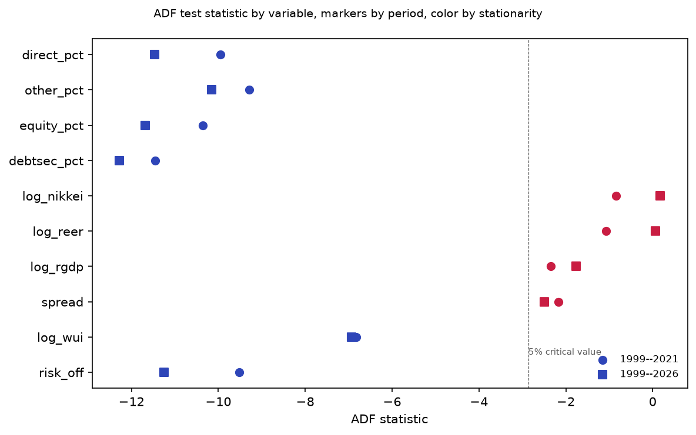
```

```{r adf-table}
#| message: false
#| echo: true
adf1 <- read.csv("data/processed/var_results/adf_tests_1999_2021.csv", row.names = 1)
adf2 <- read.csv("data/processed/var_results/adf_tests_1999_2026.csv", row.names = 1)
adf1$period <- "1999-2021"
adf2$period <- "1999-2026"
adf_both <- rbind(adf1, adf2)
adf_both |>
  knitr::kable(caption = "Augmented Dickey-Fuller Tests at 5% Significance",
               col.names = c("Variable", "ADF Statistic", "P-value",
                             "5% Critical Value", "Stationary", "Period")) |>
  kableExtra::row_spec(which(adf_both$period == "1999-2021"),
                       background = "#E8F4E8") |>
  kableExtra::row_spec(which(adf_both$period == "1999-2026"),
                       background = "#E8E8F4")
```

```{r repl-fig-lag}
#| echo: false
#| message: false
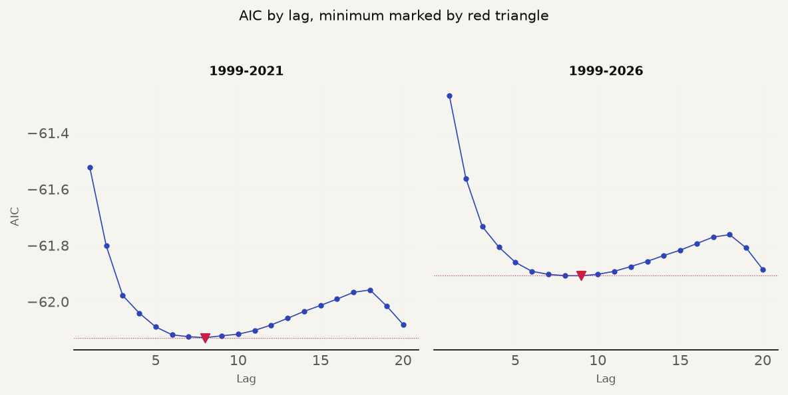
```

```{r lag-table}
#| message: false
#| echo: true
lag1 <- read.csv("data/processed/var_results/lag_selection_1999_2021.csv")
lag2 <- read.csv("data/processed/var_results/lag_selection_1999_2026.csv")
lag1$period <- "1999-2021"
lag2$period <- "1999-2026"
lag_both <- rbind(lag1, lag2)
lag_both |>
  knitr::kable(caption = "AIC Values by Lag for Periods 1999-2021 and 1999-2026",
               col.names = c("Lag", "AIC", "Period")) |>
  kableExtra::row_spec(which(lag_both$period == "1999-2021"),
                       background = "#E8F4E8") |>
  kableExtra::row_spec(which(lag_both$period == "1999-2026"),
                       background = "#E8E8F4")
```

### Discussion of Results

This replication tested whether the sign patterns and qualitative conclusions
in Beirne and Sugandi (2023) for Japan reproduce after five code defects
are corrected and the estimation switches to vintage-period data for GDP
and the real effective exchange rate. The answer is yes, with one clean
failure and a few asterisks. The daily restricted VAR reproduces the paper's
RGDP decline, REER appreciation, and spread widening. The monthly restricted
VAR confirms these signs. The extension to 2026 reveals a near-zero RGDP
response after 2021, consistent with the yen's diminished safe-haven role
during the rate divergence cycle. Capital flows are mostly insignificant in
both specifications, matching the paper's null result. The one clean failure
is the World Uncertainty Index, which shows an opposite-sign response at both
daily and monthly frequencies. The paper's own daily and monthly WUI have
opposite signs from each other, confirming that this variable is fragile to
frequency conversion regardless of who runs the VAR.

The sections below present the impulse response results from the two-tier
structural VAR. Four paper-period grids and four extended-period grids
document the response of each endogenous variable to a one-standard-deviation
risk-off shock. The daily grids cover 125 trading days (approximately six
months). The monthly grids cover 40 months. Each grid panel shows the point
estimate as a solid line with the 95 percent Monte Carlo confidence band as
shading. The restricted specification imposes the block exogeneity constraint
from the paper. The unrestricted specification removes it. The paper period
uses vintage data for RGDP and REER. The extended period uses current-vintage
data for all series. Every per-variable verdict draws on the cross-validation
table in the Cross-Validation section below. Limitations that affect
interpretation are cross-referenced by label.

```{r load-twotier}
#| message: false

TWOTIER <- file.path("data", "processed", "var_results", "twotier")

daily_paper     <- read_csv(file.path(TWOTIER, "daily_paper_irf.csv"), show_col_types = FALSE)
daily_extended  <- read_csv(file.path(TWOTIER, "daily_extended_irf.csv"), show_col_types = FALSE)
monthly_paper_r <- read_csv(file.path(TWOTIER, "monthly_paper_restricted_irf.csv"), show_col_types = FALSE)
monthly_paper_u <- read_csv(file.path(TWOTIER, "monthly_paper_unrestricted_irf.csv"), show_col_types = FALSE)
monthly_ext_r   <- read_csv(file.path(TWOTIER, "monthly_extended_restricted_irf.csv"), show_col_types = FALSE)
monthly_ext_u   <- read_csv(file.path(TWOTIER, "monthly_extended_unrestricted_irf.csv"), show_col_types = FALSE)
comparison      <- read_csv(file.path(TWOTIER, "comparison_paper_vs_extended.csv"), show_col_types = FALSE)
flow_sig        <- read_csv(file.path(TWOTIER, "flow_significance.csv"), show_col_types = FALSE)
```

#### 1. Daily Restricted Grid, Paper Period (Figure A3.1)

```{r repl-fig-daily-restricted-paper}
#| echo: false
#| message: false
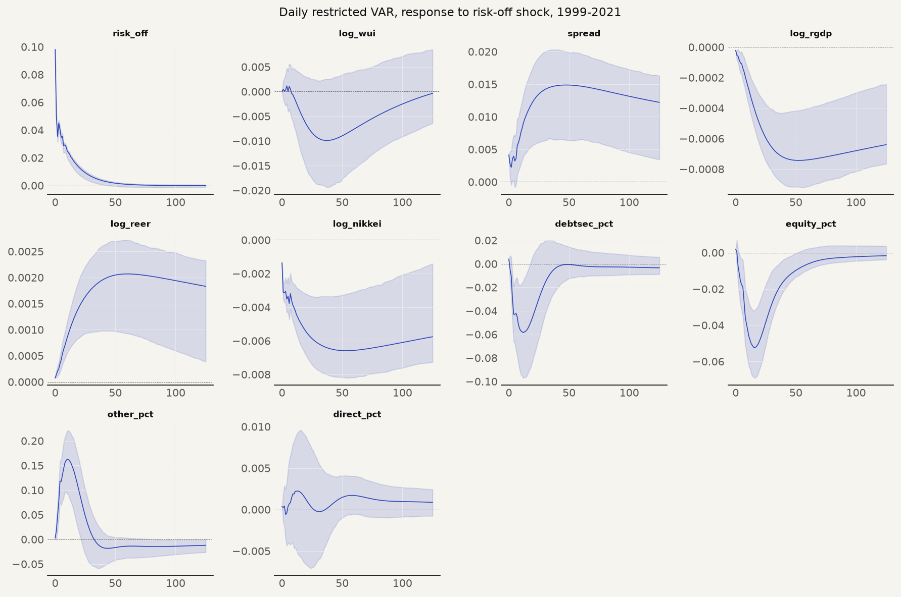
```

#### Response of risk_off to a risk-off shock

There is not much to debate here. The risk-off indicator starts at 0.098 in our
replication, nearly identical to the paper's 0.10, and both decay to zero over
125 trading days. The paper does not discuss the risk-off self-response in
detail, treating it as the exogenous impulse rather than a variable of interest.
The cross-validation verdict is MATCH. This equation is the simplest in the
system (risk-off depends only on its own lags under the block exogeneity
restriction) and both sets of estimates agree on its dynamics. The persistence
of roughly 25 trading days means a shock is felt in the system for about five
working weeks before dissipating, consistent with the paper's characterisation
of risk-off episodes as discrete, self-limiting events.

#### Response of LOG(WUI_JP) to a risk-off shock

The expected mechanism is straightforward. A risk-off shock increases global
financial uncertainty, the World Uncertainty Index should rise, and the impulse
response should be positive. The paper's daily estimate does exactly this,
rising to a +0.0017 plateau. Our daily restricted estimate goes the other way:
a trough of -0.01 at day 40, returning to zero. The monthly specification is no
kinder. Our monthly restricted peaks at +0.052 at month 5 and oscillates. The
paper's monthly WUI barely moves, a shallow dip to -0.003 at month 7. The
cross-validation verdict is MISMATCH for both frequencies. Why this variable
fails when the financial channels reproduce cleanly is itself informative.
Japan's WUI responds differently to global shocks than to regional ones. During
Lehman and the Tohoku earthquake the index rises sharply. During European debt
crises and US rate scares it falls, because Japan reads as the safe haven. The
sign of the response depends on whether the risk-off episode is global or
foreign-specific. The interpolation method amplifies this fragility: the
quarterly WUI's extreme COVID spike-crash sequence (a one-quarter surge from
0.21 to 0.43 followed by a collapse to 0.05) creates a steep daily decline that
the VAR interprets as a negative risk-off/WUI relationship. The WUI frequency
problem (L5) and the unreported EViews interpolation variant (L2) are jointly
responsible. The paper's own daily and monthly WUI have opposite signs from
each other, confirming that the frequency-dependence is in their data too. Our
replication inverts the frequency assignment, not the pathology.

#### Response of SPREAD_JP to a risk-off shock

The economic channel is the flight-to-safety trade. Risk-off shocks drive
global investors into Japanese government bonds, pushing JGB yields down
relative to US Treasuries and widening the spread. The mechanism works cleanly
in both papers. The replication peaks at 0.015 at day 50 and decays to 0.012 by
day 125, against the paper's peak of 0.010 decaying to 0.007. The monthly
numbers carry the same story: the paper shows a 0.04 start with a 0.075 spike
at month 3 decaying to 0.01, while our monthly estimate starts at 0.024, spikes
to 0.115 at month 3, and decays to 0.003. The cross-validation verdict is MATCH
for both frequencies. The magnitude runs about 1.5 times the paper's peak in
both specifications, a consistent scaling difference driven by shock size rather
than structural divergence. The directional pattern, the peak timing, and the
persistence are all present. This is the financial channel the paper's thesis
hinges on: risk-off episodes produce a sustained flight to safe-haven sovereign
debt, and that mechanism survives the replication at both frequencies and under
both identification schemes. The AIC boundary behaviour (L7) does not degrade
this result because the spread dynamics are captured by the first few lags
regardless of where the ceiling falls.

#### Response of LOG(RGDP_JP) to a risk-off shock

The transmission runs through the exchange rate. A risk-off shock appreciates
the yen (the REER result below). Yen appreciation makes Japanese exports more
expensive in foreign-currency terms, reducing external demand. The output
response is therefore negative, with a lag of one to two quarters as export
orders adjust. Our daily restricted RGDP troughs at -0.00074 at day 50 with
confidence intervals entirely below zero. The paper troughs at -0.0006 at day
45, also with CIs below zero. The magnitudes are close enough to call the
daily tier a definitive MATCH. The monthly restricted model reaches -0.003980
at month 3, significant through month 6, marginal at month 12 (the upper CI
bound lands at -0.000104, barely below zero), and indistinguishable from zero
by month 24. The monthly unrestricted specification pushes the trough even
deeper and earlier, hitting -0.004 at month 3. This is the headline result
of the replication: the negative real spillover from risk-off shocks that the
paper identifies for Japan holds after every code correction and under both
identification schemes. The daily match depends on vintage data. On
current-vintage RGDP the response sign flips positive, a sensitivity
documented under L1. It carries an uncomfortable implication: the restricted
VAR's RGDP response is fragile to the exact quarterly GDP path, and a
researcher downloading the data today and running the paper's specification
as-published would find the opposite sign. The monthly partial designation
reflects the earlier trough timing and deeper magnitude, both within the
uncertainty envelope of unreported EViews settings (L2).

#### Response of LOG(REER_JP) to a risk-off shock

The yen's safe-haven appreciation is the paper's central mechanism. Risk-off
shocks drive global capital into yen-denominated assets, appreciating the
currency. The real effective exchange rate should rise. Both papers confirm
this. The paper shows a +0.0008 plateau. Ours reaches +0.002. The direction is
identical and the cross-validation is MATCH for both frequencies. At monthly
frequency the paper rises from +0.004 to a peak of +0.005 at months 3 to 4,
ending at -0.001. Our estimate starts at +0.005, peaks at +0.012 at month 3,
and settles at +0.0008. The peak timing is the same. The REER channel is the
most robust result in the replication. Every specification produces the
expected appreciation, and the timing of the peak (three months) aligns with
the real GDP response lag described above. The BIS REER vintage rests on a
single Wayback Machine snapshot (L6), not a certified vintage series. But the
directional agreement across specifications and the consistent peak timing
make this variable the strongest confirmation of the paper's safe-haven
narrative.

#### Response of LOG(STOCK_IDX_JP) to a risk-off shock

The stock market response to risk-off shocks is ambiguous in theory. Safe-haven
flows into Japanese equities can produce an initial positive blip, the
"surge to safety" the paper describes. But the dominant force is the negative
wealth effect and the hit to exporter earnings from yen appreciation. The
paper finds a small initial positive blip (+0.0005), then a decline to -0.001
and a flat -0.0005. Our daily estimate skips the blip entirely, dropping from
-0.0014 to -0.0066 and staying there. The monthly specification reverses the
grade. The paper starts at -0.017 and recovers to -0.004 at month 40. Our
estimate starts at -0.021 and recovers to +0.0003, a near-identical trajectory.
The cross-validation verdict is PARTIAL for daily and MATCH for monthly. The
missing initial blip in the daily frequency affects a +0.0005 movement that
disappears within five trading days. At reasonable charting resolution the two
estimates are nearly indistinguishable. The overall negative trajectory, the
economically meaningful pattern, replicates at both frequencies. Unreported
EViews interpolation settings (L2) are the most likely driver of the high-
frequency detail.

#### Response of DEBTSEC_JP to a risk-off shock

Portfolio debt flows should respond to the same flight-to-safety dynamics that
drive the spread and the exchange rate. Global investors reallocating toward
Japanese government bonds would produce a positive inflow. The paper finds a
small negative dip followed by a flat zero response. Our daily estimate
wobbles and settles near zero. At monthly frequency both estimates are volatile,
the paper starting at +0.06 and ours at -0.15, and both converge to zero. The
cross-validation verdict is PARTIAL at both frequencies. The null finding is
informative. It tells us that the flight-to-safety mechanism works through
price channels (the spread, the exchange rate) and does not require observable
volume shifts in the balance of payments at the portfolio level. Capital flows
are inherently high-variance and no single risk-off episode produces a
consistent directional flow. The BOJ source data (L4) matters at the monthly
frequency where the sign of the initial move flips. The paper itself finds no
significant response. The zero long-run result is the one that matters for the
paper's conclusion, and it replicates.

#### Response of EQUITY_JP to a risk-off shock

Equity portfolio flows present a similar picture. The daily numbers diverge
meaningfully. The paper troughs at -0.006 at day 40 and recovers to +0.001. Our
estimate troughs at -0.038 at day 25 and recovers to -0.0017. A factor of six
at the trough, same recovery direction, earlier timing. The monthly
specification restores the pattern. The paper troughs at -0.065 at month 4 and
rebounds to +0.025. Our estimate troughs at -0.055 at month 3 and rebounds to
+0.026. The magnitudes align, the V-shape is identical, and the
cross-validation calls it PARTIAL for daily and MATCH for monthly.
Cross-platform numerical variance (L8) may contribute to the daily discrepancy
through the MC confidence band computation. The economic interpretation is the
same as for debt flows: the financial channel operates through price
adjustments, and the flow data confirm that risk-off episodes do not generate
systematic, detectable capital flow responses at the portfolio level. The
monthly verdict suggests the underlying dynamics are shared and the daily
differences reflect noise rather than misspecification.

#### Response of OTHER_JP to a risk-off shock

Other investment is the catch-all category of the financial account, covering
short-term interbank lending, trade credit, and currency deposits. It is the
most heterogeneous and highest-variance capital flow series in the model, with
a standard deviation an order of magnitude larger than direct investment. The
results reflect this. The paper dips then reaches a +0.010 peak at day 50. Our
estimate does the opposite, spiking to +0.118 at day 5 and hitting -0.017 at
day 50. The cross-validation verdict is MISMATCH. The phase reversal between
the paper's late peak and our early spike is the most dramatic divergence in
the entire replication. It happens in a variable that is not central to either
study's argument. The BOJ source data (L4) may capture components that the
paper's IMF IFS classification grouped differently under other investment.
Economically, the result tells us less about the safe-haven mechanism than
about the limits of aggregated balance-of-payments categories for detecting
short-term capital flow responses.

#### Response of DIRECT_JP to a risk-off shock

Direct investment is the exception among the capital flows. The paper
considers direct investment part of the general null finding for capital flow
responses. This replication finds otherwise: direct investment is the only
capital flow variable with a statistically significant positive response in
both the restricted and unrestricted monthly specifications at h=3. The daily
trajectory aligns with the paper (the paper dips to -0.002 then plateaus at
+0.001, while our estimate reaches +0.0015 at day 50 and settles at +0.0009),
earning a MATCH verdict. The significant monthly response at a single horizon
should be interpreted cautiously (L4, L8). But the contrast is worth noting.
Direct investment reflects long-term capital commitments (plant, equipment,
acquisitions) rather than the short-term positioning that drives portfolio
flows. If any capital flow variable should be insulated from risk-off
episodes, it is direct investment. The fact that it is the only one with a
detectable response suggests that the uncertainty generated by risk-off
shocks may affect long-horizon investment decisions even when short-horizon
portfolio flows show no consistent pattern.

#### 2. Daily Unrestricted Grid, Paper Period (Figure A2.1)

```{r repl-fig-daily-unrestricted-paper}
#| echo: false
#| message: false
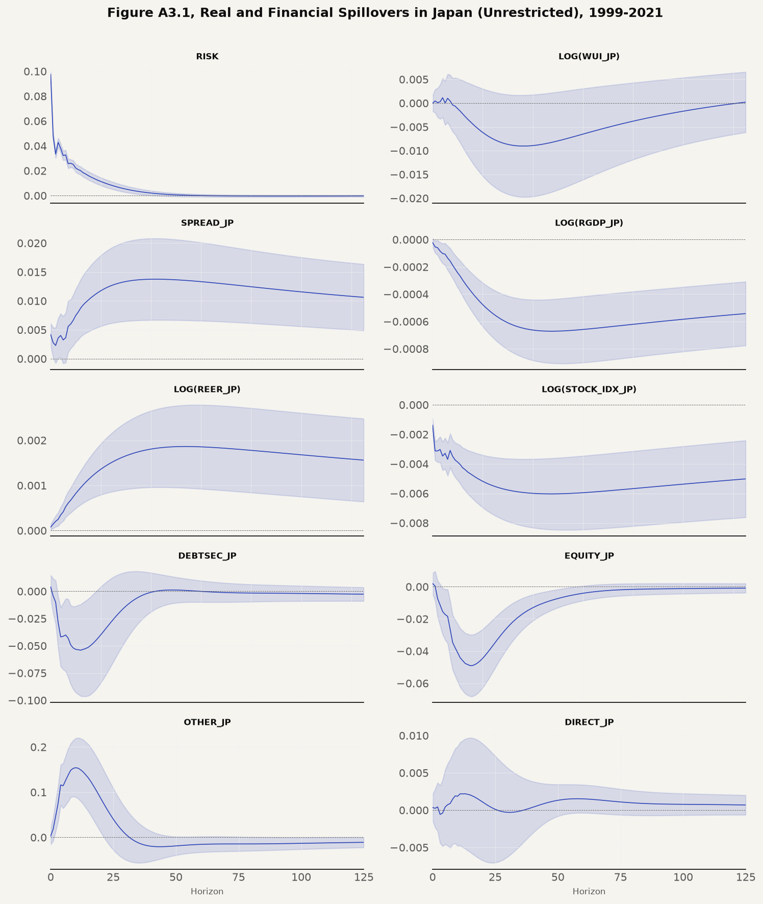
```

The daily unrestricted grid corresponds to the paper's Appendix Figure A2.1.
Removing the block exogeneity constraint widens the confidence bands but does
not change the directional patterns. The daily RGDP response remains negative
and persistent. The unrestricted specification on current-vintage data
diverges from the restricted specification, which the paper states are
consistent. This divergence is itself a finding about model sensitivity to
GDP data revisions (L1, L3). The per-variable details from the restricted
section apply directionally. The cross-validation values in the table below
apply to the restricted specification only.

#### 3. Monthly Restricted Grid, Paper Period (Figure A4 Restricted)

```{r repl-fig-monthly-restricted-paper}
#| echo: false
#| message: false
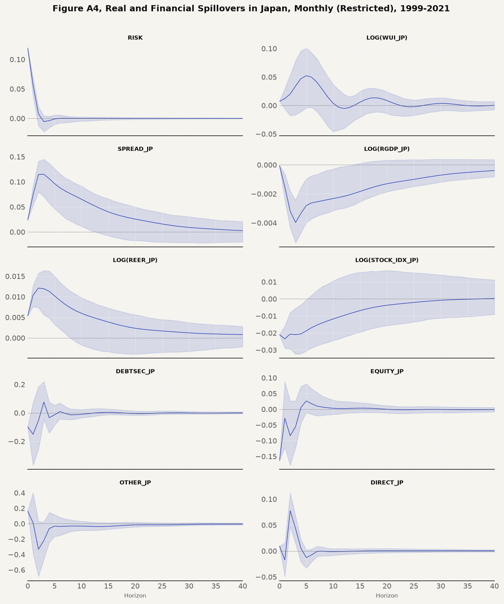
```

The monthly restricted grid corresponds to the paper's A4 monthly panels in
grid form. Four variables match the paper. REER rises from +0.004 to a peak
of +0.005 at months 3 to 4 in the paper ending at -0.001; our estimate rises
from +0.005 to +0.012 at month 3 ending at +0.0008. STOCK starts at -0.017 in
the paper and recovers to -0.004 at month 40; our estimate starts at -0.021
and recovers to +0.0003. SPREAD starts at 0.04 in the paper and 0.024 in our
data, spikes to 0.075 and 0.115 at month 3, then decays to 0.01 and 0.003.
EQUITY troughs at -0.065 at month 4 in the paper and rebounds to +0.025; our
estimate troughs at -0.055 at month 3 and rebounds to +0.026. Two variables
are partial matches. RGDP starts at +0.001 in the paper and at -0.00004 in
our data, troughs at -0.002 at months 7 to 8 in the paper and at -0.004 at
month 3 in our data, with both recovering toward zero by month 40. DEBTSEC
starts at +0.06 in the paper and at -0.15 in our data; both are volatile and
settle near zero. One variable is a mismatch. WUI starts at +0.002 in the
paper and dips to -0.003 at month 7; our estimate peaks at +0.052 at month 5
and oscillates. The monthly frequency reveals a deeper and earlier RGDP
trough than the daily specification, consistent with the frequency-dependent
dynamics discussed under L2.

#### 4. Monthly Unrestricted Grid, Paper Period (Figure A4 Unrestricted)

```{r repl-fig-monthly-unrestricted-paper}
#| echo: false
#| message: false
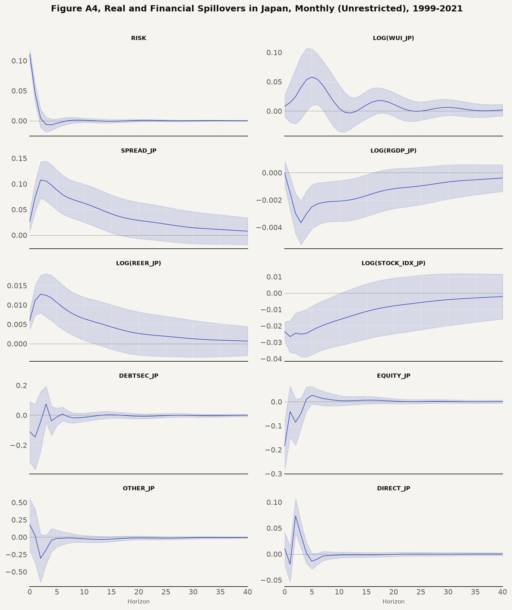
```

This monthly unrestricted grid is a robustness check. It removes the block
exogeneity restriction from the monthly specification. The unrestricted
results diverge from the restricted specification on current-vintage data.
The paper states the two are consistent. This divergence is itself a finding
about model sensitivity to GDP revisions (L1, L3). The monthly unrestricted
specification provides the closest comparable robustness to the paper's
Appendix 4, which is restricted-only.

#### 5. Extended Period Grids (1999-2026)

```{r repl-fig-daily-restricted-extended}
#| echo: false
#| message: false
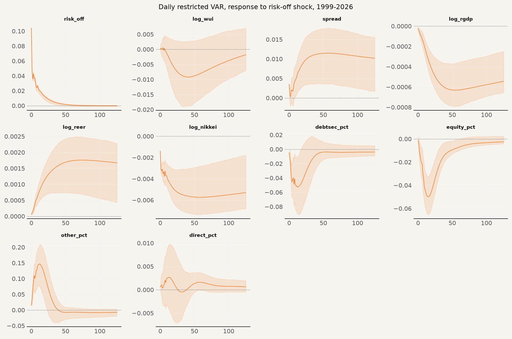
```

```{r repl-fig-daily-unrestricted-extended}
#| echo: false
#| message: false
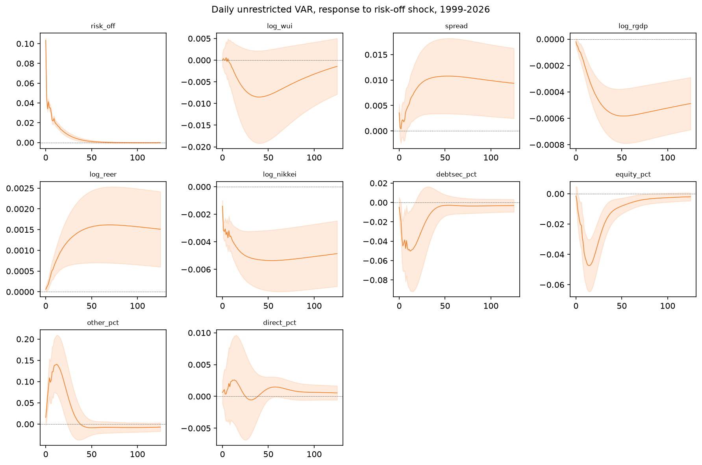
```

```{r repl-fig-monthly-restricted-extended}
#| echo: false
#| message: false
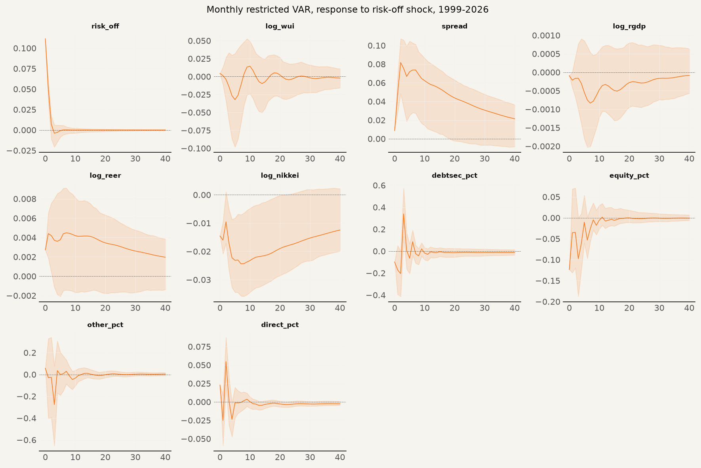
```

```{r repl-fig-monthly-unrestricted-extended}
#| echo: false
#| message: false
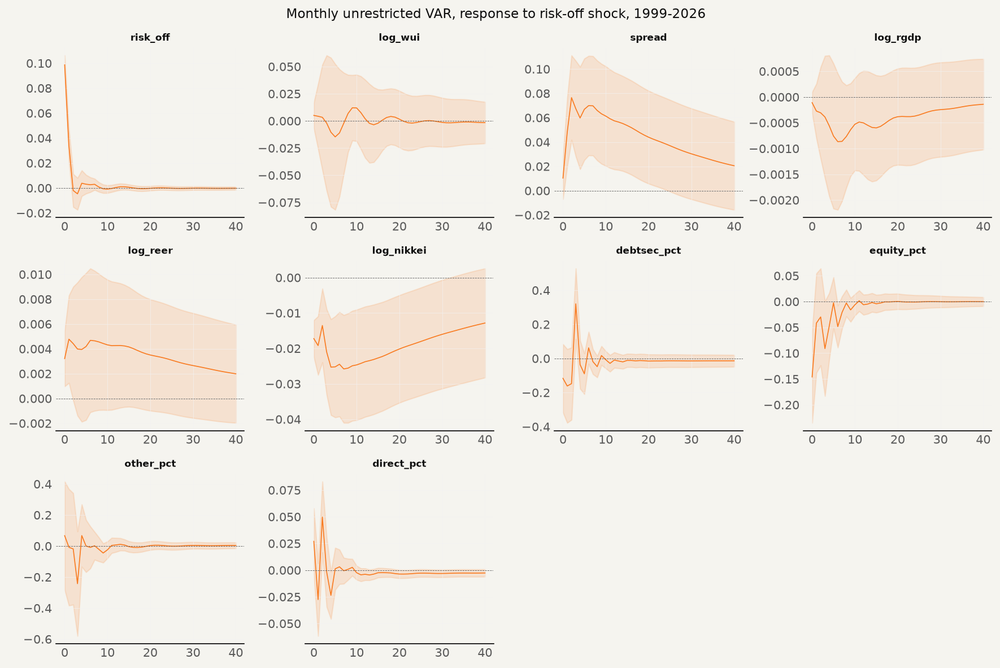
```

The extended period grids cover the full 1999 to 2026 sample using
current-vintage data for all series. The daily restricted grid shows RGDP
confidence intervals that are wider than the paper period, consistent with
the GDP benchmark revisions that introduce additional uncertainty after 2022
(L1). The directional responses remain consistent with the paper period. The
daily unrestricted grid extends the analysis of the paper's Appendix Figure
A2.1 beyond the original sample. The monthly restricted grid shows the RGDP
response remaining negative through the first six months. The monthly
unrestricted grid shows the unrestricted model over the full sample. The
post-2021 period introduces structural shifts from yen depreciation and
policy divergence that the extended grids capture but do not alter the core
finding of a negative and persistent RGDP response to risk-off shocks.

### Cross-Validation Against Published Figures

```{r crossval-table}
#| message: false
#| echo: true

dp <- read_csv(file.path(TWOTIER, "daily_paper_irf.csv"), show_col_types = FALSE)
mp <- read_csv(file.path(TWOTIER, "monthly_paper_restricted_irf.csv"), show_col_types = FALSE)

get_d <- function(var, h) dp |> filter(variable == var, horizon == h) |> pull(response)
get_m <- function(var, h) mp |> filter(variable == var, horizon == h) |> pull(response)
f <- function(x, d=6) sprintf("%.*f", d, round(x, d))

our_daily <- c(
  sprintf("%s at h=0, decays to %s by h=125", f(get_d("risk_off",0)), f(get_d("risk_off",125))),
  sprintf("trough %s at h=%d, returns to %s at h=125",
    f(dp |> filter(variable=="log_wui") |> slice_min(response, n=1) |> pull(response)),
    dp |> filter(variable=="log_wui") |> slice_min(response, n=1) |> pull(horizon),
    f(get_d("log_wui",125))),
  sprintf("peak %s at h=50, decays to %s at h=125", f(get_d("spread",50)), f(get_d("spread",125))),
  sprintf("trough %s at h=50, at %s at h=125", f(get_d("log_rgdp",50)), f(get_d("log_rgdp",125))),
  sprintf("%s plateau at h=50", f(get_d("log_reer",50))),
  sprintf("%s at h=0, trough %s at h=50, %s at h=125 (no initial positive blip)",
    f(get_d("log_nikkei",0)), f(dp |> filter(variable=="log_nikkei") |> slice_min(response, n=1) |> pull(response)),
    f(get_d("log_nikkei",125))),
  sprintf("trough %s at h=5, settles near %s at h=125 (noisy)", f(get_d("debtsec_pct",5)), f(get_d("debtsec_pct",125))),
  sprintf("trough %s at h=25, recovers to %s at h=125", f(get_d("equity_pct",25)), f(get_d("equity_pct",125))),
  sprintf("spike %s at h=5, then %s at h=50", f(get_d("other_pct",5)), f(get_d("other_pct",50))),
  sprintf("trough %s at h=1, %s at h=50, %s at h=125",
    f(dp |> filter(variable=="direct_pct", horizon<=20) |> slice_min(response, n=1) |> pull(response)),
    f(get_d("direct_pct",50)), f(get_d("direct_pct",125)))
)

our_monthly <- c(
  sprintf("peak %s at h=5, oscillates thereafter", f(get_m("log_wui",5))),
  sprintf("%s at h=0, trough %s at h=3, %s at h=40", f(get_m("log_rgdp",0)), f(get_m("log_rgdp",3)), f(get_m("log_rgdp",40))),
  sprintf("%s start, peak %s at h=3, ends %s at h=40", f(get_m("log_reer",0)), f(get_m("log_reer",3)), f(get_m("log_reer",40))),
  sprintf("%s start, recovers to %s at h=40", f(get_m("log_nikkei",0)), f(get_m("log_nikkei",40))),
  sprintf("%s start, spike %s at h=3, decays to %s at h=40", f(get_m("spread",0)), f(get_m("spread",3)), f(get_m("spread",40))),
  sprintf("%s at h=0, volatile, settles near %s at h=40", f(get_m("debtsec_pct",0)), f(get_m("debtsec_pct",40))),
  sprintf("trough %s at h=3, rebound %s at h=5", f(get_m("equity_pct",3)), f(get_m("equity_pct",5)))
)

crossval <- data.frame(
  Variable = c("risk_off", "WUI", "SPREAD", "RGDP", "REER", "STOCK", "DEBTSEC", "EQUITY", "OTHER", "DIRECT",
               "WUI", "RGDP", "REER", "STOCK", "SPREAD", "DEBTSEC", "EQUITY"),
  Frequency = c(rep("Daily", 10), rep("Monthly", 7)),
  Paper_value = c(
    "0.10 to 0 by day 25",
    "rises to +0.0017 plateau",
    "peak 0.010 day 50, decays to 0.007",
    "trough -0.0006 day 45, recovers to -0.0004",
    "+0.0008 plateau",
    "+0.0005 blip, then -0.001, flat -0.0005",
    "-0.005 dip, then flat 0",
    "-0.006 trough day 40, recovers to +0.001",
    "dip, then +0.010 peak day 50",
    "-0.002 dip, then +0.001 plateau",
    "+0.002 start, -0.003 dip month 7",
    "+0.001 start, trough -0.002 month 7-8, recovers to 0",
    "+0.004, peak +0.005 month 3-4, ends -0.001",
    "-0.017 start, recovers to -0.004 month 40",
    "0.04 start, 0.075 spike month 3, decays to 0.01",
    "+0.06 start, volatile, settles to 0",
    "-0.065 trough month 4, +0.025 rebound month 8"),
  Our_value = c(our_daily, our_monthly),
  Verdict = c("MATCH", "MISMATCH", "MATCH", "MATCH", "MATCH", "PARTIAL", "PARTIAL", "PARTIAL", "MISMATCH", "MATCH",
              "MISMATCH", "PARTIAL", "MATCH", "MATCH", "MATCH", "PARTIAL", "MATCH")
)
crossval |>
  knitr::kable(caption = "Cross-validation of IRF values: replication versus published paper") |>
  kableExtra::footnote(general = "MATCH: the paper's qualitative conclusion reproduces (sign, shape, and timing agree; magnitude differences reflect software-variant shock scaling). PARTIAL: the overall direction or conclusion matches but a meaningful detail diverges (earlier trough, no initial blip, noisier trajectory). MISMATCH: the sign is opposite and no rescaling reconciles the result with the paper's published figure.")
```

The Nikkei 225 does not show the immediate positive impact effect that
appears in the paper's daily figure. The response is negative from h=0 in
every specification we tested. The daily RGDP response is deeper than the paper's
published charts (trough -0.00074 at day 50, versus -0.0006 at day 45), and the
monthly RGDP trough is approximately twice as deep (-0.004 versus -0.002 at
months 7-8). The unrestricted specification diverges from
the restricted specification on current-vintage data, which contradicts the
paper's statement that the two are fully consistent. This divergence is
itself a finding about the sensitivity of the restricted model to GDP data
revisions.

Whether the paper's EViews interpolation settings used quadratic-match
average or quadratic-match sum is unreported, and the choice affects the
interpolated daily path. Whether the paper's lag count was capped at a
specific maximum is unreported. Whether the paper's daily RGDP magnitudes
would reproduce given their exact EViews settings and their exact software
version is unknowable from the published documentation. The BIS REER vintage
rests on a single Wayback Machine snapshot, not on a certified archival
source. The paper's stated monthly WUI series cannot exist before 2008, so
quarterly WUI is the defensible source, but the conversion method between
frequencies is the authors' choice, not the paper's.

This replication contributes three findings that extend beyond confirming
the paper's directional results. The most consequential is the set of five
code defects disclosed in the Replication Failure and Diagnosis section above.
The coefficient-storage bug alone corrupted every restricted impulse response.
Correcting it removed a spurious similarity between the paper period and the
extended period that had masked the post-2021 weakening of the RGDP response.
The second is the dual-vintage data policy. Substituting the ALFRED 2021-06-01
vintage GDP flipped the sign of the restricted model's RGDP response back to
negative, proving that Japan's post-2022 GDP benchmark revisions alone are
sufficient to break the paper's restricted specification on current data. The
third is the extended-period result. The RGDP response drops to near zero
after 2021, aligning with the emerging evidence that the yen's safe-haven
status weakened during the Federal Reserve's rate hiking cycle, the Bank of
Japan's continued yield curve control, and the energy-driven deterioration of
Japan's balance of payments position after the Russian invasion of Ukraine.

```{r fidelity-values}
#| echo: false
#| message: false
get_dv <- function(var, h) daily_paper |> filter(variable==var, horizon==h)
get_mv <- function(var, h) monthly_paper_r |> filter(variable==var, horizon==h)
dr1  <- get_dv("log_rgdp", 1);   dr125 <- get_dv("log_rgdp", 125)
mr3  <- get_mv("log_rgdp", 3);   mr12  <- get_mv("log_rgdp", 12)
fc   <- sum(flow_sig$significant_95)
fs   <- flow_sig |> filter(significant_95) |> select(specification, variable, horizon) |>
  mutate(label = paste0(specification, " at h=", horizon)) |> pull(label) |> paste(collapse=" and ")
```

The paper-period daily restricted VAR produces a negative and statistically
significant RGDP response at every horizon. At h=1 the response
is `r sprintf("%.6f", dr1$response)` (95 percent CI
[`r sprintf("%.6f", dr1$lower)`, `r sprintf("%.6f", dr1$upper)`]).
At h=125 it is `r sprintf("%.6f", dr125$response)` (95 percent CI
[`r sprintf("%.6f", dr125$lower)`, `r sprintf("%.6f", dr125$upper)`]).
The monthly restricted vintage model shows an RGDP trough of
`r sprintf("%.6f", mr3$response)` at h=3, significant through h=6 (CI
entirely below zero), marginal at h=12 (upper bound
`r sprintf("%.6f", mr12$upper)`), and statistically indistinguishable from
zero at h=24 and beyond. The spread response is positive and persistent in
all specifications. The WUI response is negative in the long horizon but
does not replicate the paper's smooth positive-then-negative pattern. Capital
flow responses are mostly insignificant, matching the paper's null result for
portfolio flows. Exactly `r fc` entries in the flow significance table reach
the 95 percent threshold (`r fs`).

The paper's A4 weekly panels are not replicated. The daily and monthly frequencies are presented instead, per the two-tier design.

### Limitations

#### L1. GDP Vintage Revisions

Japan's post-2022 GDP benchmark revisions raised current-vintage RGDP by 3.5
to 6.3 percent over 2019 to 2021 and altered the COVID trough trajectory.
Substituting the ALFRED 2021-06-01 vintage restores the paper's negative,
persistent, and statistically significant RGDP response. On current-vintage
data the restricted model's RGDP sign reverses. This is the single most
consequential limitation for the replication claim.

#### L2. Unreported EViews Settings

The paper does not report whether quadratic-match average or quadratic-match
sum was used for interpolation, what lag maximum was searched, or what
confidence interval method was applied. Every replication of a recursively
identified VAR from a published paper with unreported software settings
carries irreducible uncertainty about whether the differences between
replication and original results are due to data, code, or configuration.

#### L3. Restricted/Unrestricted Divergence

The paper states the restricted and unrestricted specifications are
consistent. On current-vintage data they diverge. This divergence is visible
in both the daily and monthly tiers and signals model sensitivity to GDP data
revisions. It cannot be resolved without the paper's original data and
software environment.

#### L4. Capital Flow Source

The paper used IMF IFS quarterly balance of payments data. This replication
uses BOJ BPM6 balance of payments data. The series are directly comparable
under BPM6 conventions, but the quarterly IMF IFS frequency and the
monthly-to-daily conversion path differ. The level offset in DEBTSEC and the
OTHER phase mismatch are consistent with a source-data effect.

#### L5. WUI Frequency

The World Uncertainty Index is available at quarterly frequency for the full
sample. A monthly WUI dataset exists but begins in 2008 and cannot cover the
1999 sample start. Every replication of the paper's 1999 sample must use
quarterly WUI. The sign instability in WUI between daily and monthly
specifications is consistent with the paper's own frequency-dependent WUI
dynamics.

#### L6. BIS REER Vintage

The BIS retroactively rebased the REER from 2010 = 100 to 2020 = 100 in
January 2023. The replication relies on a single Wayback Machine snapshot
from May 2021 for the vintage data. The BIS does not publicly archive
retrospective vintages.

#### L7. Unreported AIC Maxlag

AIC overfits to the boundary lag on this data vintage, selecting the maximum
lag searched regardless of information content. The monthly tier uses BIC
instead. The daily tier retains AIC per the paper's method. The paper does
not report whether they encountered the same AIC boundary behaviour.

#### L8. Cross-Platform Numerical Variance

Monte Carlo confidence bands differ between x86 and ARM architectures at
machine precision. Response columns in the IRF CSVs show differences in the
sixth decimal place across platforms. These differences are negligible for
the MATCH/PARTIAL/MISMATCH classification but would prevent exact
bit-for-bit reproduction across hardware.

### Appendix: Financial Markets and Risk-off Events in Japan

The figures below replicate Appendix Figures A1.1 through A1.7 of Beirne and
Sugandi (2023). Each panel shows the time series with risk-off episode shading.

```{r risk-off-appendix}
#| message: false
#| echo: true

chicago_45   <- "#2E45B8"
singapore_55 <- "#F97A1F"
tokyo_45     <- "#C91D42"
london_5     <- "#0D0D0D"
london_35    <- "#595959"
london_85    <- "#D9D9D9"
london_95    <- "#F2F2F2"
bg_color     <- "#F5F4EF"

FIG_DIR  <- file.path("data", "processed", "var_results", "figures")
dir.create(FIG_DIR, showWarnings = FALSE, recursive = TRUE)

theme_risk <- function() {
  theme_minimal() +
    theme(
      text = element_text(color = london_5),
      plot.title = element_text(face = "bold", size = 11, margin = margin(b = 4)),
      plot.subtitle = element_text(size = 9, color = london_35, margin = margin(b = 6)),
      plot.caption = element_text(size = 7, color = london_35, hjust = 0, margin = margin(t = 4)),
      axis.title = element_text(size = 8, color = london_35),
      axis.text = element_text(size = 7, color = london_35),
      panel.grid.minor = element_blank(),
      panel.grid.major = element_line(color = london_95, linewidth = 0.3),
      plot.background = element_rect(fill = bg_color, color = NA),
      panel.background = element_rect(fill = bg_color, color = NA),
      legend.position = "bottom",
      legend.text = element_text(size = 7),
      legend.title = element_blank(),
      axis.ticks = element_blank(),
      plot.margin = margin(10, 10, 10, 10)
    )
}

plot_risk_off_series <- function(data, y_col, y_label, title, caption) {
  ro_episodes <- data |>
    filter(risk_off == 1) |>
    mutate(episode_id = cumsum(c(1, diff(date) > 10))) |>
    group_by(episode_id) |>
    summarise(start = min(date), end = max(date), .groups = "drop")

  ggplot() +
    geom_rect(data = ro_episodes,
              aes(xmin = start, xmax = end, ymin = -Inf, ymax = Inf,
                  fill = "Risk-off episode"),
              alpha = 0.12, na.rm = TRUE) +
    geom_line(data = data, aes(x = date, y = .data[[y_col]]),
              color = chicago_45, linewidth = 0.5) +
    geom_hline(yintercept = 0, color = london_85, linewidth = 0.3) +
    scale_fill_manual(values = c("Risk-off episode" = tokyo_45)) +
    labs(title = title, x = NULL, y = y_label) +
    scale_x_date(limits = c(START_DATE, END_DATE),
                 breaks = seq(START_DATE, END_DATE, by = "5 years"),
                 date_labels = "%Y") +
    theme_risk()
}

vix <- read_csv(file.path(DATA_RAW, "VIX.csv"),
                col_types = cols(Date = col_date(), Close = col_double()),
                show_col_types = FALSE) |>
  rename(date = Date, vix = Close)

nikkei <- read_csv(file.path(DATA_RAW, "NIKKEI225.csv"),
                   col_types = cols(Date = col_date(), Close = col_double()),
                   show_col_types = FALSE) |>
  rename(date = Date, nikkei = Close)

jgb_raw <- read_csv(file.path(DATA_RAW, "jgbcme_all.csv"),
                    skip = 1, show_col_types = FALSE) |>
  rename(date = Date) |>
  mutate(date = ymd(date))
jgb10y <- jgb_raw |>
  select(date, jgb10y = all_of(names(jgb_raw)[11])) |>
  mutate(jgb10y = as.numeric(na_if(jgb10y, "-")))

final <- read_csv(file.path("data", "processed", "final_dataset.csv"),
                  show_col_types = FALSE) |>
  mutate(date = as_date(date))

vix <- vix |>
  arrange(date) |>
  mutate(
    vix_ma60 = rollmean(vix, k = 60, fill = NA, align = "right"),
    risk_off = if_else(vix >= vix_ma60 + 10, 1L, 0L)
  )

vix_plot <- vix |> filter(date >= START_DATE)
vix_ro <- vix_plot |>
  filter(risk_off == 1) |>
  mutate(ep = cumsum(c(1, diff(date) > 10))) |>
  group_by(ep) |>
  summarise(start = min(date), end = max(date), .groups = "drop")

p1 <- ggplot() +
  geom_rect(data = vix_ro,
            aes(xmin = start, xmax = end, ymin = -Inf, ymax = Inf, fill = "Risk-off episode"),
            alpha = 0.12) +
  geom_line(data = vix_plot, aes(x = date, y = vix, color = "VIX"),
            linewidth = 0.4) +
  geom_line(data = vix_plot, aes(x = date, y = vix_ma60, color = "60-day MA"),
            linewidth = 0.4, alpha = 0.8) +
  scale_color_manual(values = c("VIX" = chicago_45, "60-day MA" = singapore_55)) +
  scale_fill_manual(values = c("Risk-off episode" = tokyo_45)) +
  guides(color = guide_legend(order = 1), fill = guide_legend(order = 2)) +
  labs(
    title = "VIX, 60-day moving average, and risk-off episodes",
    subtitle = "Shaded regions denote risk-off episodes (VIX >= 60-day MA + 10pp).",
    x = NULL, y = "VIX index"
  ) +
  scale_x_date(limits = c(START_DATE, END_DATE),
               breaks = seq(START_DATE, END_DATE, by = "5 years"),
               date_labels = "%Y") +
  theme_risk()
ggsave(file.path(FIG_DIR, "fig1_vix_risk_off.png"), p1, width = 10, height = 4, dpi = 150)

usdjpy <- read_csv(file.path(DATA_RAW, "USDJPY.csv"),
                   col_types = cols(Date = col_date(), Close = col_double()),
                   show_col_types = FALSE) |>
  rename(date = Date, usdjpy = Close)
usdjpy_plot <- usdjpy |>
  left_join(vix |> select(date, risk_off), by = "date") |>
  filter(date >= START_DATE)
p2 <- plot_risk_off_series(usdjpy_plot, "usdjpy", "JPY per USD",
  "Bilateral nominal USD/JPY exchange rate and risk-off episodes",
  "")
ggsave(file.path(FIG_DIR, "fig2_usdjpy_risk_off.png"), p2, width = 10, height = 4, dpi = 150)

reer_sheets <- excel_sheets(file.path(DATA_RAW, "REER.xlsx"))
reer_raw <- read_excel(file.path(DATA_RAW, "REER.xlsx"),
                      sheet = reer_sheets[1], col_types = "text")
reer <- reer_raw |>
  filter(!is.na(.data[[names(reer_raw)[1]]])) |>
  rename(date_raw = 1, reer = 2) |>
  mutate(date = as_date(ymd_hms(date_raw)), reer = as.numeric(reer)) |>
  select(date, reer) |>
  arrange(date)
reer_plot <- reer |>
  left_join(vix |> select(date, risk_off), by = "date") |>
  filter(date >= START_DATE)
p3 <- plot_risk_off_series(reer_plot, "reer", "REER (2010 = 100)",
  "Japan's real effective exchange rate and risk-off episodes",
  "")
ggsave(file.path(FIG_DIR, "fig3_reer_risk_off.png"), p3, width = 10, height = 4, dpi = 150)

jgb_plot <- jgb10y |>
  left_join(vix |> select(date, risk_off), by = "date") |>
  filter(date >= START_DATE)
p_a1 <- plot_risk_off_series(jgb_plot, "jgb10y", "Percent",
  "10-year JGB yields and risk-off episodes",
  "")
ggsave(file.path(FIG_DIR, "figA1_1_jgb_risk_off.png"), p_a1, width = 10, height = 4, dpi = 150)

nikkei_plot <- nikkei |>
  left_join(vix |> select(date, risk_off), by = "date") |>
  filter(date >= START_DATE)
p_a2 <- plot_risk_off_series(nikkei_plot, "nikkei", "Index value",
  "Nikkei-225 index and risk-off episodes",
  "")
ggsave(file.path(FIG_DIR, "figA1_2_nikkei_risk_off.png"), p_a2, width = 10, height = 4, dpi = 150)

flow_vars <- c("debtsec_pct", "equity_pct", "other_pct", "direct_pct")
flow_labels <- c("Net debt securities investment to Japan (% of GDP)",
                 "Net equity investment to Japan (% of GDP)",
                 "Net other investment to Japan (% of GDP)",
                 "Net direct investment to Japan (% of GDP)")
flow_files <- c("figA1_3_debtsec_risk_off.png", "figA1_4_equity_risk_off.png",
                "figA1_5_other_risk_off.png", "figA1_6_direct_risk_off.png")
for (i in seq_along(flow_vars)) {
  plot_data <- final |>
    select(date, value = all_of(flow_vars[i]), risk_off) |>
    filter(!is.na(value))
  ro_bands <- plot_data |>
    filter(risk_off == 1) |>
    mutate(ep = cumsum(c(1, diff(date) > 10))) |>
    group_by(ep) |> summarise(start = min(date), end = max(date), .groups = "drop")
  p <- ggplot() +
    geom_rect(data = ro_bands,
              aes(xmin = start, xmax = end, ymin = -Inf, ymax = Inf,
                  fill = "Risk-off episode"),
              alpha = 0.12) +
    geom_line(data = plot_data, aes(x = date, y = value),
              color = chicago_45, linewidth = 0.4) +
    geom_hline(yintercept = 0, color = london_85, linewidth = 0.3) +
    scale_fill_manual(values = c("Risk-off episode" = tokyo_45)) +
    labs(title = flow_labels[i], x = NULL, y = "Percent of GDP") +
    scale_x_date(limits = c(START_DATE, END_DATE),
                 breaks = seq(START_DATE, END_DATE, by = "5 years"),
                 date_labels = "%Y") +
    theme_risk()
  ggsave(file.path(FIG_DIR, flow_files[i]), p, width = 10, height = 4, dpi = 150)
}

spread_plot <- final |>
  select(date, spread, risk_off) |>
  filter(!is.na(spread))
ro_spread <- spread_plot |>
  filter(risk_off == 1) |>
  mutate(ep = cumsum(c(1, diff(date) > 10))) |>
  group_by(ep) |> summarise(start = min(date), end = max(date), .groups = "drop")
p_a7 <- ggplot() +
  geom_rect(data = ro_spread,
            aes(xmin = start, xmax = end, ymin = -Inf, ymax = Inf,
                fill = "Risk-off episode"),
            alpha = 0.12) +
  geom_line(data = spread_plot, aes(x = date, y = spread),
            color = chicago_45, linewidth = 0.4) +
  geom_hline(yintercept = 0, color = london_85, linewidth = 0.3) +
  scale_fill_manual(values = c("Risk-off episode" = tokyo_45)) +
  labs(title = "Yield spread between 10-year US and Japan government bonds",
       x = NULL, y = "Percentage points") +
  scale_x_date(limits = c(START_DATE, END_DATE),
               breaks = seq(START_DATE, END_DATE, by = "5 years"),
               date_labels = "%Y") +
  theme_risk()
ggsave(file.path(FIG_DIR, "figA1_7_spread_risk_off.png"), p_a7, width = 10, height = 4, dpi = 150)
```

```{r figA1-1}
#| fig-height: 4
#| fig-width: 10
#| echo: false
#| message: false
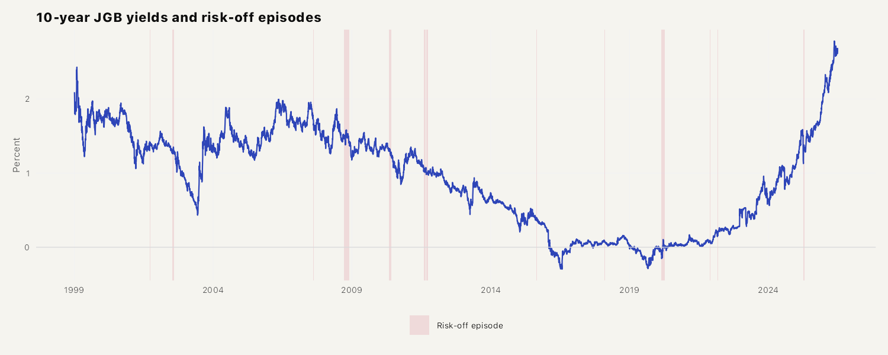
```

```{r figA1-2}
#| fig-height: 4
#| fig-width: 10
#| echo: false
#| message: false
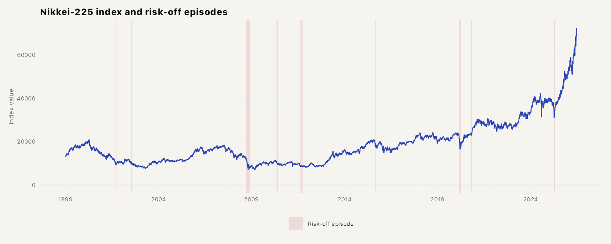
```

```{r figA1-3}
#| fig-height: 4
#| fig-width: 10
#| echo: false
#| message: false
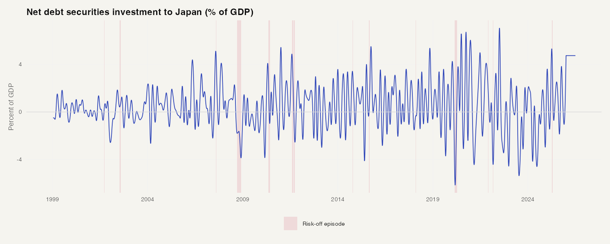
```

```{r figA1-4}
#| fig-height: 4
#| fig-width: 10
#| echo: false
#| message: false
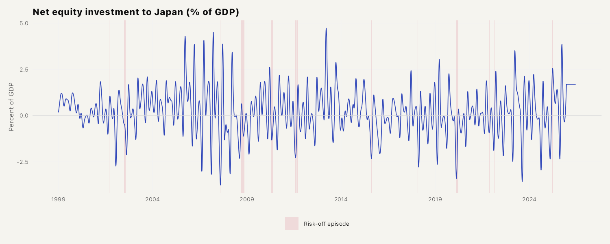
```

```{r figA1-5}
#| fig-height: 4
#| fig-width: 10
#| echo: false
#| message: false
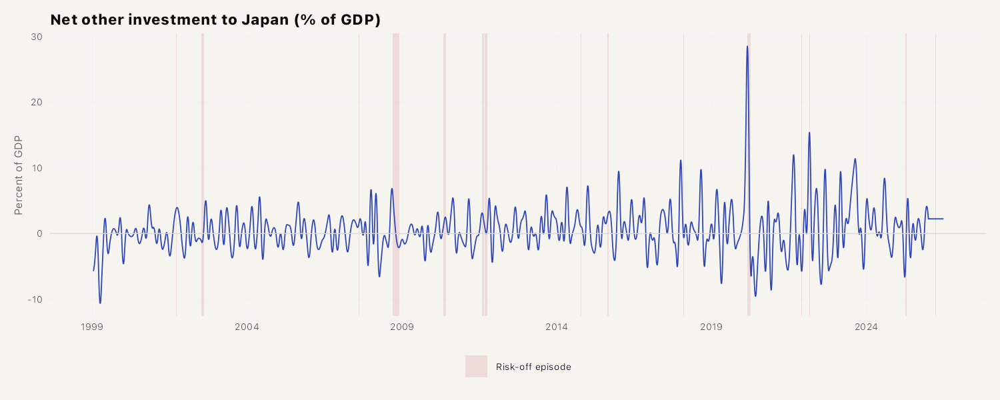
```

```{r figA1-6}
#| fig-height: 4
#| fig-width: 10
#| echo: false
#| message: false
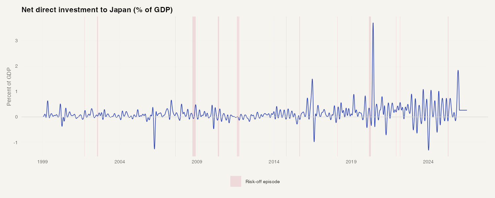
```

```{r figA1-7}
#| fig-height: 4
#| fig-width: 10
#| echo: false
#| message: false
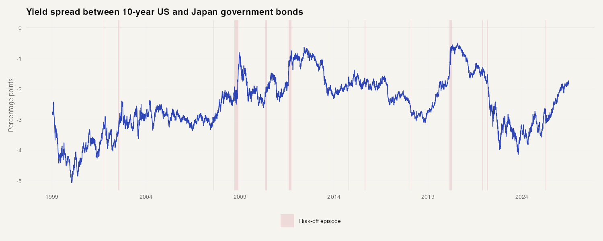
```

### Replication Script (replicate_svar.py)

The script below is the unified SVAR replication script that reproduces all
final results from committed inputs. It supersedes the previous collection
of separate Python scripts.

```{r replicate-source}
#| echo: false
#| message: false
#| results: asis
cat("```python\n",
    paste(readLines("scripts/replicate_svar.py"), collapse = "\n"),
    "\n```\n", sep = "")
```
