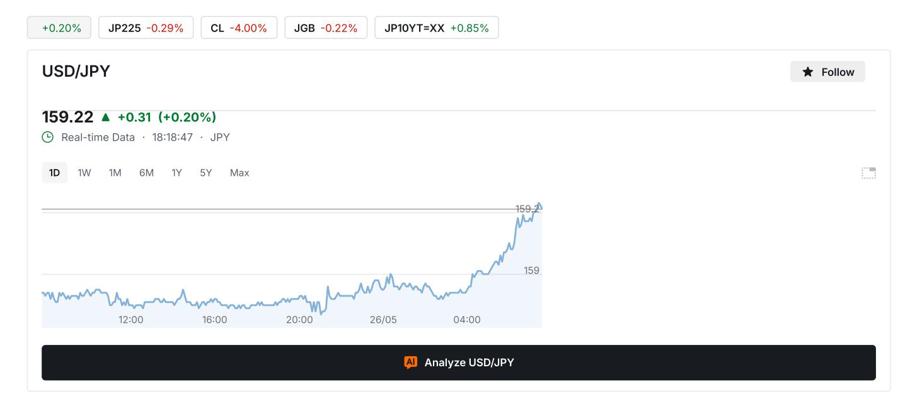
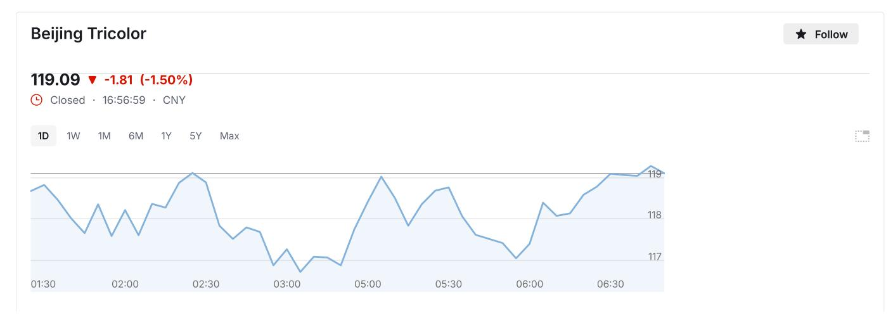
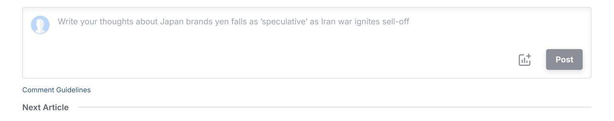

## Japan brands yen falls as 'speculative' as Iran war ignites sell-off

By

Published 31/03/2026, 0333 pm Updated 31/03/2026, 0336 pm

## By Leika Kihara and Takaya Yamaguchi

TOKYO, March 31 Reuters) - Japan on Tuesday labelled recent [yen](https://au.investing.com/currencies/usd-jpy) falls as speculative for the first time since the Middle East war began, shifting its focus back to currency short-sellers as policymakers braced for a triple market sell-off driven by fresh inflationary concerns.

While data showed core inflation in Japan's capital slowed in March, analysts expect surging oil prices from the Iran war and higher import costs from the weak yen to pile pressure on the Bank of Japan to raise interest rates as soon as April.

As the yen lingered near the key 160-per-dollar mark, Finance Minister Satsuki Katayama on Tuesday repeated Tokyo's readiness to respond "on all fronts" against volatile moves.

"We're seeing speculative moves heightening in the currency market," as well as in the oil futures market, Katayama told parliament. It was the first time she explicitly mentioned yen moves as speculative since the onemonth-old Middle East conflict triggered renewed declines in the currency.

The remark compared with those until Monday that speculative traders in the oil futures markets could be affecting yen moves.

After briefly rising after Katayama's remarks, the yen stood around 159.93 per dollar on Tuesday, remaining a whisker away from the 160 level seen as authorities' line in the sand for intervention.

FOCUS ON FUNDAMENTALS

Japanese authorities have justified past yen interventions by describing the currency's moves as speculative and too rapid, pointing to G7 and G20 agreements that disorderly, excessive FX moves that deviate from fundamentals were harmful to growth.

Tsuyoshi Ueno, an economist at NLI Research Institute, cast doubt on whether recent yen falls were out of sync with fundamentals, as the declines were driven largely by investor demand for the safe-haven dollar.

"It's part of escalated verbal intervention," he said of Katayama's latest comments. "If the yen slides below 162 fairly quickly, 165 would be the next threshold. That's when we could see large fluctuations and prompt Japan to intervene," he said.

## DOUBLE PUNCH

Markets have been rattled this month after the Iran war effectively shut the Strait of Hormuz, a chokepoint for about a fifth of global oil and gas flows, driving up crude oil prices and demand for the safe-haven dollar.

Soaring oil prices from the Middle East conflict add to inflationary pressures from the weak yen, which has been a political headache for policymakers by pushing up import costs.

Concern over the fallout from the war hit Japanese stocks with the Nikkei [average](https://au.investing.com/indices/japan-ni225) on course to fall more than 11% in March. Risk of too-high inflation also led investors to sell Japanese [government](https://au.investing.com/rates-bonds/japan-govt.-bond) bonds with the benchmark 10 year yield rising on Monday to levels unseen since 1999.

Economy minister Minoru Kiuchi told reporters on Tuesday the government was closely watching not just the currency but also the bond market for any "excessive moves" in yields.

The spectre of a triple selling in Japanese assets complicates the Bank of Japan's decision on whether to hike rates soon to combat inflationary pressure, or tread cautiously to avoid hurting a fragile economy.

Advertisement

Annual core inflation in Tokyo slowed to a nearly two-year low in March and stayed below the central bank's target for a second straight month, data showed on Tuesday, as the effect of fuel subsidies offset rising raw material costs from a weak yen.

But analysts expect the slowdown to be temporary as the Iran war and a persistently weak yen heighten inflationary pressure, a risk BOJ policymakers debated in earnest at their March meeting.

Given the yen's renewed slide and hawkish communication from the BOJ, markets are pricing in roughly a 70% chance of a rate hike at the bank's next policy meeting on April 2728.

"Given the double punch from the weak yen and oil spike, the risk of an inflation overshoot is heightening," said Mari Iwashita, executive rates strategist at Nomura Securities.

"Unlike in the past, companies are more actively passing on costs. Japan has become more prone to secondround effects than during the 2022 Ukraine war."

## Which stock should you buy in your very next trade?

AI computing powers are changing the stock market. Investing.com's ProPicks AI includes dozens of winning stock portfolios chosen by our advanced AI.

Year to date, 3 out of 4 global portfolios are beating their benchmark indexes, with 98% in the green. Our flagship Tech Titans strategy doubled the S&P 500 within 18 months, including notable winners like Super Micro Computer (+185%) and AppLovin (+157%).

Which stock will be the next to soar? Search the website...

# Latest comments

## ECB warns of private credit risks amid euro area exposure concerns

Author Maria [Ponnezhath](https://au.investing.com/members/contributors/264622975) Published 26/05/2026, 0618 pm [0](#page-4-0)

### In this article:

[603516](https://au.investing.com/equities/beijing-tricolor-a) 1.50%

Investing.com -- The European Central Bank has identified potential financial stability risks from private credit markets, following recent stress in the US sector and defaults by companies including auto parts manufacturer First Brands and subprime auto lender [Tricolor](https://au.investing.com/equities/beijing-tricolor-a).

Euro area financial institutions hold limited direct exposure to private credit, with insurance corporations showing the highest exposure at approximately €211 billion, or 2.3% of total assets. Pension funds hold around €52 billion in private credit exposure, representing 1.4% of total assets, while euro area banks' worldwide private credit exposures total €62.5 billion, or 0.2% of total assets.

The ECB noted that private credit funds managed from euro area headquarters held roughly €100 billion in assets under management in 2025. The sector has grown at an average rate of 14% annually since 2010, though it remains smaller than domestic public bond markets and bank lending.

Recent concerns have centered on credit quality deterioration and concentrated exposures to the software sector, which represents the largest subsector in global private credit deals. The ability of private credit-backed firms in the euro area to service interest payments from operating cash flows has worsened in recent years.

Semi-liquid private credit vehicles in the United States, including business development companies, have experienced sizeable redemption requests since the beginning of 2026. Some funds have met investor requests in full, while others have imposed caps on redemptions in line with contractual agreements.

The ECB conducted a scenario analysis simulating a severe shock to global private credit markets. The analysis found that direct losses would be limited for euro area institutions, but broader spillovers could generate larger second-round market revaluation losses, particularly affecting insurance corporations and pension funds through their equity holdings.

The central bank emphasized that private credit in isolation is unlikely to threaten euro area financial stability at present, but warned that data gaps hinder complete risk assessment. The ECB called for enhanced data collection and improved sharing across the EU to address opacity in the sector.

# Should you invest \$2,000 in 603516 right now?

ProPicks AI evaluates 603516 alongside thousands of other companies every month using 100+ financial metrics.

Using powerful AI to generate exciting stock ideas, it looks beyond popularity to assess fundamentals, momentum, and valuation. The AI has no bias—it simply identifies which stocks offer the best risk-reward based on current data with notable past winners that include Super Micro Computer (+185%) and AppLovin (+157%).

Want to know if 603516 is currently featured in any ProPicks AI strategies, or if there are better opportunities in the same space?

# Latest comments

# Trade With A [Regulated](https://au.investing.com/brokers/) Broker

# Install Our App

Scan QR code to install app

| Blog           | About Us       |
|----------------|----------------|
| Mobile         | Advertise      |
| Your Portfolio | Help & Support |
| Widgets        |                |

Risk Disclosure: Trading in financial instruments and/or cryptocurrencies involves high risks including the risk of losing some, or all, of your investment amount, and may not

Before deciding to trade in financial instrument or cryptocurrencies you should be fully informed of the risks and costs associated with trading the financial markets,

Fusion Media would like to remind you that the data contained in this website is not necessarily real-time nor accurate. The data and prices on the website are not necessarily provided by any market or exchange, but may be provided by market makers, and so prices may not be accurate and may differ from the actual price at any given market, meaning prices are indicative and not appropriate for trading purposes. Fusion Media and any provider of the data contained in this website will not accept liability for any loss or damage as a result of your trading, or your reliance on the information contained within this website.

It is prohibited to use, store, reproduce, display, modify, transmit or distribute the data contained in this website without the explicit prior written permission of Fusion Media

Fusion Media may be compensated by the advertisers that appear on the website, based on your interaction with the advertisements or advertisers.

Terms And [Conditions](https://cdn.investing.com/about-us/terms_and_conditions.pdf) [Privacy](https://au.investing.com/about-us/privacy-policy) Policy Risk [Warning](https://cdn.investing.com/about-us/risk_warning.pdf)

© 20072026 Fusion Media Limited. All Rights Reserved.