*Article*

# **Risk Premiums, Market Volatility, and Exchange Rate Dynamics: Evidence from the Yen Carry Trade**

**Opale Guyot [1](https://orcid.org/0009-0009-3849-9285) , Heather A. Montgomery 1,[\\*](https://orcid.org/0000-0002-0129-3701) and Peiqing Yang 2**

- 1 Department of Business and Economics, International Christian University, 3-10-2 Osawa, Tokyo 181-8585, Japan; g279703k@icu.ac.jp
- 2 BlackRock Japan, 1-8-3 Marunouchi, Tokyo 100-8217, Japan; peiqing.yang@blackrock.com
- **\*** Correspondence: montgomery@icu.ac.jp; Tel.: +81-0422-33-3554

#### **Abstract**

Persistent deviations from Uncovered Interest Rate Parity (UIRP) represent a central puzzle in international finance and a key source of currency risk for global investors. This study examines the UIRP puzzle in the JPY/USD market through the lens of financial risk transmission, focusing on how risk premiums, liquidity conditions, and relative equity market performance jointly shape short-run exchange rate dynamics. Using daily data from 2018 to 2024, we employ a vector autoregression (VAR) framework to capture the endogenous interactions between change in the interest rate differentials, foreign exchange liquidity, global risk indicators (including the VIX, oil price shocks, and currency risk reversals), and relative equity returns consistent with the Uncovered Equity Parity (UEP) hypothesis. The results reveal that traditional interest rate differentials do not directly explain short-term exchange rate movements, confirming persistent UIRP deviations. Instead, risk-related financial channels act as indirect financial risk transmission channels. Shocks to global risk sentiment and currency risk premiums significantly affect JPY/USD returns, while relative equity market performance emerges as a key intermediary linking risk conditions to exchange rate adjustments. The findings also support the Japanese Yen's continued role as a safe-haven currency during periods of heightened market uncertainty and underline the importance of carry trade dynamics in amplifying risk-driven exchange rate fluctuations. Overall, this study highlights the importance of integrating financial risk measures and portfolio-based transmission channels into exchange rate models. The results have direct implications for risk management, currency exposure hedging, and the assessment of systemic risk spillovers across financial markets.

**Keywords:** exchange rate; uncovered interest rate parity; liquidity; risk; uncovered equity parity

**JEL Classification:** F31; G15; G32

Received: 18 December 2025

Academic Editors: Michael Frömmel and Darko Vukovic

Revised: 11 February 2026 Accepted: 15 February 2026 Published: 26 February 2026 **Copyright:** © 2026 by the authors. Licensee MDPI, Basel, Switzerland. This article is an open access article distributed under the terms and conditions of the [Creative Commons](https://creativecommons.org/licenses/by/4.0/) [Attribution \(CC BY\) license.](https://creativecommons.org/licenses/by/4.0/)

# **1. Introduction**

In global financial markets, persistent divergences between theoretical parity conditions and observed asset prices continue to puzzle academics and create significant financial risk for market participants. Such deviations generate opportunities for arbitrage strategies while simultaneously exposing investors to volatility, liquidity shocks, and abrupt market reversals. One prominent example is currency carry trade, in which investors borrow in low-yielding currencies—most notably the Japanese Yen—to fund investments in higher-yielding foreign

*Risks* **2026**, *14*, 46 2 of 37

assets, thereby exploiting interest rate differentials and anticipated exchange rate movements. Owing to its long-standing role as both a funding currency and a safe-haven asset, the Japanese Yen occupies a central position in global foreign exchange markets, particularly during periods of heightened market uncertainty [\(Lee](#page-35-0) [2017;](#page-35-0) [Chen](#page-34-0) [2017\)](#page-34-0).

From a financial risk perspective, exchange rate movements reflect a time-varying risk, liquidity conditions, and portfolio re-allocation across financial markets. In contrast, traditional macroeconomic models emphasize interest rate differentials as the primary determinant of short-run exchange rate dynamics, most prominently through the Uncovered Interest Rate Parity (UIRP) condition. Despite its theoretical appeal, extensive empirical evidence documents persistent failures of UIRP, giving rise to several well-known puzzles in exchange rate economics [\(Fang et al.](#page-35-1) [2024\)](#page-35-1). These include the determination puzzle, whereby macroeconomic fundamentals perform poorly in explaining exchange rate fluctuations [\(Taylor](#page-36-0) [1995\)](#page-36-0), and the limited predictive power of macro-based models at short horizons [\(Rossi](#page-35-2) [2013\)](#page-35-2). While econometric misspecification, omitted variables, and restrictive assumptions—such as risk neutrality or rational expectations—have been proposed as explanations [\(Taylor](#page-36-0) [1995\)](#page-36-0), these approaches often abstract from investor behavior, financial market frictions, and risk management considerations that are central to modern asset pricing.

From this standpoint, deviations from the UIRP condition can be interpreted as a manifestation of unmodeled financial risk fitting the omitted variable bias often mentioned as a reason for the poor explanatory power of macroeconomic theories. More precisely, investors often require a compensation for exposure to global risk sentiment, liquidity constraints, and cross-market portfolio adjustments. Prior research highlights the importance of incorporating financial indicators into exchange rate models to better capture these risk-driven dynamics [\(Engel](#page-35-3) [2016;](#page-35-3) [Hau and Rey](#page-35-4) [2006\)](#page-35-4). In particular, the growing integration of equity and currency markets suggests that exchange rates may adjust indirectly through financial risk transmission channels linked to portfolio balance channels rather than responding mechanically to interest rate differentials alone.

Against this background, this study revisits the UIRP puzzle, and especially the risk premium hypothesis, by explicitly integrating macroeconomic fundamentals with financial risk indicators to examine indirect transmission channels between interest rate differentials and exchange rate movements. We analyze the joint roles of global risk appetite, foreign exchange liquidity conditions, and relative equity market performance, drawing on the Uncovered Equity Parity (UEP) framework to capture portfolio-driven exchange rate adjustments. Using a vector autoregression (VAR) framework with daily data from January 2018 to December 2024, we account for the endogenous interactions among interest rate differentials, risk premium, liquidity measures, and equity market returns.

The JPY/USD exchange rate provides an especially informative setting for this analysis for three reasons. First, the Yen has exhibited heightened volatility and sensitivity to global risk conditions in recent years—particularly since 2022—making it an ideal case for studying risk-driven exchange rate dynamics [\(Engel](#page-35-3) [2016;](#page-35-3) [Ismailov and Rossi](#page-35-5) [2018\)](#page-35-5). Second, repeated episodes of Yen-funded carry trade activity during the sample period underscore the relevance of currency risk reversals and sudden market unwinding. Third, the prolonged accommodative stance of the Bank of Japan under Quantitative and Qualitative Easing (QQE), juxtaposed with aggressive monetary tightening in other G7 economies, has amplified interest rate differentials and associated currency risk.

This research contributes to exchange rate modeling and the UIRP puzzle by examining how exchange rates diverge from Uncovered Interest Rate Parity by offering a comprehensive re-evaluation of the risk premium hypothesis. It achieves this by exploring the impact of risks originating in various financial markets and recognizing the threat

*Risks* **2026**, *14*, 46 3 of 37

of financial risk spillovers across markets. This comprehensive approach considers risk stemming from major financial markets—FX, equity, and commodity markets—which have been found to affect exchange rate dynamics to some extent. Distinguishing between multiple markets allows for a clear distinction between hedging and safe-haven hypotheses by separating exchange rate correlation with return differentials from risk, and by offering diversity in terms of whether risk is concentrated or global. Furthermore, our empirical approach identifies the relative importance of each financial market and its associated risks. We extend the Uncovered Equity Parity literature—which links exchange rate movements to stock returns—by proposing interconnections among financial risks, market liquidity, and equity performance disparities. Microstructure insights on financial flows and riskaverse investor behavior underpin FX market dynamics, with global sentiment driving risk appetite. However, UEP alone cannot fully explain equity-FX interactions, as risk is central to theoretical linkages [\(Kim](#page-35-6) [2011\)](#page-35-6). Thus, we refine [Hau and Rey'](#page-35-4)s [\(2006\)](#page-35-4) UEP conditions—which assume financial market structures drive currency returns—by incorporating risk-adjustment mechanisms and liquidity constraints as key structural elements, amid high inter-market dependence. Ultimately, currency returns reflect not only currency and stock performance but also investor-facing financial stress and liquidity limits, tied to carry trades and safe-haven dynamics. Third, we provide evidence that deviations from UIRP arise through indirect transmission mechanisms, whereby interest rate differentials affect exchange rates via their impact on financial risk indicators and relative equity performance rather than through a direct parity relationship. Finally, by focusing on the Japanese Yen—a currency that remains central to global reserve holdings and international portfolio allocation—the findings offer insights with direct relevance for currency risk management, hedging strategies, and the assessment of systemic risk spillovers across financial markets.

The remainder of the paper is organized as follows. Section [2](#page-2-0) provides background on Yen movements and carry trade dynamics. Section [3](#page-3-0) reviews the literature on UIRP deviations and financial risk channels. Section [4](#page-5-0) presents the theoretical framework linking UIRP and UEP. Section [5](#page-10-0) describes the data and empirical methodology. Section [6](#page-17-0) reports the empirical results and discusses their implications. Section [7](#page-33-0) concludes the paper.

## **2. Yen Depreciation and Carry Trade Opportunities**

The Japanese Yen has depreciated sharply since 2022, reflecting widening interest rate differentials between the Federal Reserve and the Bank of Japan. These differentials have reinforced the Yen's role as a funding currency and intensified exposure to currency risk in global financial markets. Recent developments in the summer of 2024 further underscored the Yen's vulnerability to abrupt market reversals. As illustrated in Figure [1,](#page-3-1) this period is characterized by a rapid appreciation of the Yen accompanied by a sharp decline in Japanese equity prices, a pattern consistent with the unwinding of Yen-funded carry trades.

Within a matter of weeks, the Japanese Yen appreciated against the U.S. dollar by more than 10%, while the Nikkei 225 experienced its largest one-day decline since Black Monday in 1987, erasing billions of dollars in market capitalization. This abrupt reversal followed the Bank of Japan's unexpected policy rate increase from 0.1% to 0.25%, combined with growing concerns over a potential U.S. economic slowdown that raised expectations of a Federal Reserve rate cut [\(Takechi et al.](#page-35-7) [2024\)](#page-35-7). These developments triggered a rapid unwinding of Yen-funded carry trades, as investors moved to close leveraged positions, driving Yen appreciation and amplifying equity market losses. The impact was particularly pronounced given the elevated level of foreign ownership in Japanese equities, which reached a record 31.8%.

This episode is not isolated. Similar carry trade unwinding events in October 1998, May 2006, and February 2007 produced sharp exchange rate movements and substantial

*Risks* **2026**, *14*, 46 4 of 37

disruptions across global financial markets [\(Gagnon and Chaboud](#page-35-8) [2007\)](#page-35-8). The recurrent nature of these episodes highlights the sensitivity of the Yen to shifts in global risk sentiment, liquidity conditions, and portfolio rebalancing behavior, reinforcing its dual role as both a funding currency and a safe-haven asset.

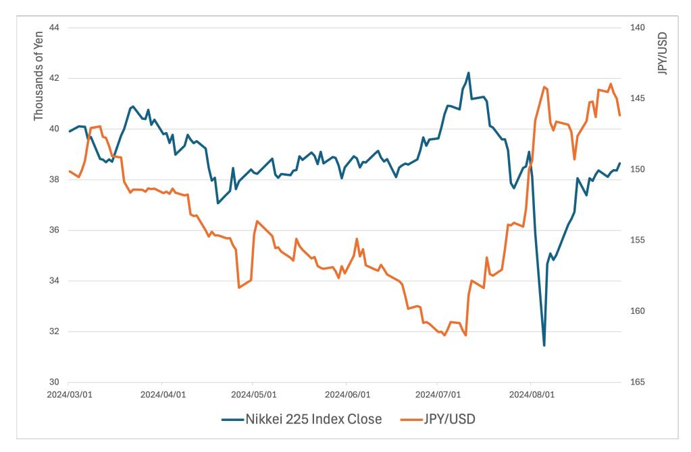

**Figure 1.** Nikkei 225 stock price and the JPY/USD exchange rate levels, March to August 2024. Notes: Daily aggregated data of Nikkei 225 stock closed price and the JPY/USD exchange rate levels, from 1 March 2024 to 30 August 2024. Source: Bloomberg.

The repeated occurrence of such episodes and their pronounced effects on exchange rates point to a central issue in international finance: the inability of the Uncovered Interest Rate Parity (UIRP) condition to account for observed exchange rate dynamics under conditions of heightened financial risk. These market disruptions suggest that exchange rates adjust not only in response to interest rate differentials but also through indirect channels linked to risk premiums, liquidity constraints, and cross-market spillovers. The recent volatility in the JPY/USD exchange rate therefore provides a timely setting to reassess traditional parity-based models and to incorporate insights from financial market behavior.

Motivated by these considerations, this study bridges traditional exchange rate theory and modern risk-based asset pricing by examining how financial indicators influence both interest rate differentials and short-run JPY/USD exchange rate returns, and how these variables interact endogenously. The following section reviews the literature on UIRP deviations and the role of financial risk channels in shaping exchange rate dynamics.

# **3. Literature Review**

Persistent deviations from Uncovered Interest Rate Parity (UIRP) documented across numerous empirical studies have motivated extensive research into the so-called UIRP puzzle. Early contributions focus on identifying the sources of these deviations and proposing alternative model specifications. One line of research emphasizes endogeneity concerns, noting that central banks may adjust interest rates in response to exchange rate movements [\(McCallum](#page-35-9) [1994;](#page-35-9) [Chinn and Meredith](#page-34-1) [2004\)](#page-34-1). Other studies attribute deviations to foreign exchange market inefficiencies arising from incorrect expectations or irrational investor behavior regarding interest rate differentials [\(Gourinchas and Tornell](#page-35-10) [2004;](#page-35-10) [Ilut and Schneider](#page-35-11) [2014\)](#page-35-11), as well as to slow portfolio rebalancing in the presence of adjustment costs [\(Bacchetta](#page-34-2) [and van Wincoop](#page-34-2) [2010;](#page-34-2) [Engel](#page-35-3) [2016\)](#page-35-3). A more influential strand of the literature instead

*Risks* **2026**, *14*, 46 5 of 37

emphasizes that exchange rate movements may be driven by additional factors correlated with interest rate differentials, namely the omitted variable bias. The foundational contribution in this area is the time-varying risk premium framework proposed by [Fama](#page-35-12) [\(1984\)](#page-35-12), which formalizes the "forward premium puzzle" and shows that forward exchange rates systematically deviate from UIRP due to changing risk compensation.

To address the forward premium puzzle, subsequent studies examine potential omitted variables that jointly affect the interest rate differentials and exchange rate dynamics, with a particular focus on financial risk and liquidity conditions. In particular, the Japanese Yen's behavior is sensitive to changes in global risk sentiment and liquidity stemming from FX markets, demonstrated by the connection with FX risk reversals and realized and implied FX volatility [\(Gagnon and Chaboud](#page-35-8) [2007\)](#page-35-8). Exchange rate sensitivity to risk extends beyond the FX market, showing strong interconnections with other financial markets. For instance, evidence of pronounced exchange rate skewness reports elevated 'crash risk' in equity markets, often associated with endogenous carry trade unwinding during liquidity spirals [\(Brunnermeier et al.](#page-34-3) [2009\)](#page-34-3). Similarly, the commodity market remains a key determinant of Yen fluctuations; supply-driven shocks tend to depreciate the currency by widening the trade deficit, while demand-driven shocks support appreciation through stronger export performance [\(Masujima and Sato](#page-35-13) [2024\)](#page-35-13). These examples underscore the pervasive risk of spillovers across diverse financial markets, also documented in the literature [\(Fang et al.](#page-35-14) [2023\)](#page-35-14). This link across financial markets is even more interesting once one considers how portfolio allocation strategies are deeply rooted in the utilization of multiple financial markets, exemplified by carry trade strategies. The risk sentiment connection with the exchange rate dynamics—derived from the risk premium hypothesis—is noticeably important during periods of heightened risk aversion as investors unwind leveraged positions [\(Gagnon and Chaboud](#page-35-8) [2007\)](#page-35-8). In summary, the literature on financial risks demonstrates that liquidity constraints and funding conditions amplify currency volatility by accelerating the unwinding of leveraged positions during periods of market stress, rendering exchange rates particularly sensitive to shifts in global risk sentiment, highlighting the relevance of the risk premium hypothesis to solve the forward bias puzzle. One issue with the large pool of proxies for financial risk is that decisions on which to incorporate into the model should not be made arbitrarily and the choice is large, but too-restrictive models might also be missing key elements to the risk premium dynamics. Recognizing the challenge posed by the large pool of financial risk proxies, this study contributes to resolving the forward bias puzzle by providing a comprehensive approach. This involves a reduced-form VAR with a theoretically motivated Cholesky decomposition, designed to integrate and discern the interplay of these complex risk factors.

One cannot bring up the discussion of risk and exchange rate without mentioning the particular status of a few currencies: safe-havens and currencies involved in carry trades. The Swiss Franc and the Japanese Yen in particular have acted as safe-havens, especially in periods of heightened volatility [\(Habib and Stracca](#page-35-15) [2012;](#page-35-15) [Coudert et al.](#page-34-4) [2014;](#page-34-4) [Lee](#page-35-0) [2017\)](#page-35-0) and post-COVID [\(Masujima and Sato](#page-35-13) [2024\)](#page-35-13), and the Yen's movements are far from being orthogonal to carry trade strategies [\(Hossfeld and MacDonald](#page-35-16) [2015\)](#page-35-16). The literature on safe-haven properties and carry trade strategies based on Japanese Yen dynamics points out the central role of global risk sentiment in defining the special role this currency plays on the international scene. More precisely, heightened volatility may have dual impacts on exchange rate returns, with carry trade unwinding as investors' risk tolerance declines and higher long-term returns via enhanced risk premiums driving up expected compensation once market conditions stabilize [\(Brunnermeier et al.](#page-34-3) [2009\)](#page-34-3). However, safe-haven status is rarely sustained during stable and extreme risk market conditions, and this could have important incidence on the risk premium hypothesis. For instance, [Brunnermeier et al.](#page-34-3) [\(2009\)](#page-34-3)

*Risks* **2026**, *14*, 46 6 of 37

identifies a VIX threshold of 27%, under which the Yen's flight-to-safety effect is strong during moderate stress but weakens under extreme crisis conditions. This nonlinear behavior suggests that incorporating risk sentiment indicators is essential for capturing nonlinearity in the exchange rate process and divergence across regimes. The comprehensive approach from this study integrates multiple risk—FX, equity and commodity markets—and return differentials—bond and equity markets—variables stemming from different financial markets, allowing for a clear identification of hedging strategies versus safe-haven status.

While liquidity constraints and financial risks account for one dimension of UIRP deviations, the role of equity markets and international capital flows introduces an additional layer of complexity. The portfolio balance model proposes that investors' re-allocation of imperfect substitutable assets would drive currency fluctuations as exchange rates adjust to compensate for imbalances in the assets' return. Building on the portfolio balance model, [Hau and Rey](#page-35-4) [\(2006\)](#page-35-4) proposes the Uncovered Equity Parity (UEP) theory, which lets the exchange rate equilibrium depend on the equity market's performance, assuming riskaverse investors, instead of on the bond market (i.e., UIRP). [Hau and Rey](#page-35-4) [\(2006\)](#page-35-4) emphasize the importance of jointly examining UIRP and UEP conditions rather than considering them separately, suggesting that complete equilibrium models of exchange rate dynamics should incorporate dynamical connections from multiple financial markets, which do not necessarily stem from risk. Japanese financial markets, with a significant presence of foreign investors combined with currency hedging practices and the growing prevalence of high-frequency trading (HFT), are characterized by a strong negative correlation between Japanese equity prices and the Yen's value [\(Fujiwara](#page-35-17) [2013\)](#page-35-17). These findings underscore the role of equity market dynamics, capital flows, and technological change in shaping exchange rate behavior.

Overall, the literature on UIRP deviations underscores the importance of integrating financial market variables—such as risk sentiment indicators, volatility measures, and liquidity proxies—to capture the complex and nonlinear dynamics of exchange rates. This study builds on existing research by incorporating the equity performance gap into the UIRP framework, thereby extending the analysis of indirect transmission channels that link interest rate differentials, financial risk conditions, and exchange rate movements. In doing so, the paper reinforces the argument that explicitly modeling financial risk indicators improves the explanatory power of parity-based exchange rate models.

# **4. Theoretical Framework**

Understanding the determinants of exchange rate movements is central to international finance, and the increasing openness of capital markets strengthens such a necessity. Exchange rates impact international trade (current account perspective), but even more international capital flows (financial account perspective). The Uncovered Interest Parity (UIRP) is one of the foundational models to explain bilateral exchange rate movements. This section presents the baseline UIRP model, further developments of the model to integrate time-varying risk premiums, and the emerging Uncovered Equity Parity (UEP) proposed by [Hau and Rey](#page-35-4) [\(2006\)](#page-35-4), explaining connections across theories through the microstructure of FX market.

## *4.1. The Uncovered Interest Rate Parity Theory*

The Uncovered Interest Rate Parity (UIRP) theory posits that the expected change in the exchange rate equals the difference between the domestic and the foreign interest rate, Risks 2026, 14, 46 7 of 37

and investors are risk-neutral. When the interest rate parity holds, the return on domestic assets and foreign assets are equal as described by Equation (1) below.

$$i = i^* - \frac{s_{t+1}^e - s_t}{s_t} \tag{1}$$

where i is the domestic interest rate,  $i^*$  is the foreign interest rate, and  $\frac{s_{t+1}^e - s_t}{s_t}$  denotes the expected appreciation of the domestic currency (where  $s_t$  equals the domestic currency per unit of the foreign currency).

Note that the domestic currency in the above equation is the Japanese Yen and the foreign currency the US Dollar, implying that the exchange rate is measured as JPY per USD. We rearrange Equation (1) above to obtain the equality below following Rossi (2013), adjusted to take into consideration the change in the interest rate differential rather than the interest rate differential itself, based on Masujima and Sato's (2024) argument1.

$$E_t(\Delta s_{t+1}) = \alpha + \beta(\Delta i_{t+1} - i_{t+1}^*)$$
(2)

where  $\Delta s_{t+1}$  represents the exchange rate (JPY/USD) change between period t and t+1,  $i_{t+1}$  is the domestic interest rate at time t + 1, and  $i_{t+1}^*$  is the foreign interest rate at time t + 1.

The UIRP theory proposes that  $\alpha$  equals zero and  $\beta$  is negative2. The theory implies that the domestic currency depreciates when the gap between the domestic and the foreign interest rates falls (or turns negative), as stated by hypothesis H1 below.

H1: If the UIRP theory holds, when the interest rate differential falls  $(\Delta(i_t - i_t^*))$ , the Japanese Yen depreciates.

Empirical evidence demonstrates the failure of UIRP (refer to Sections 1 and 2), leading to the so-called forward bias puzzle, implying that the change in the spot exchange rate does not reflect variations in the interest rate differential. Thereby, this puzzle offers opportunities for profitable carry trades—investors borrow (short) in low-interest-rate currencies and invest (long) in high-interest-rate currencies.

## 4.2. Risk Premium

Although the foreign exchange market is generally regarded as highly efficient, short-term exchange rate fluctuations fail to conform to interest rate parity conditions. Macroe-conomists have examined this puzzle from two perspectives: the presence of a time-varying risk premium or the irrationality of expectations. The empirical literature has primarily concentrated on the former, beginning with Fama's (1984) regression. Under the risk premium hypothesis, risk-averse market participants imply that the forward rate equals the expected future spot rate plus a risk premium to compensate for uncertainty, as represented by Equation (2).

$$F_t = E(S_{t+1}) + \delta_t \tag{3}$$

where  $F_t$  represents the forward exchange rate observed at time t,  $E(S_{t+1})$  represents the expected future nominal exchange rate at time t + 1, and  $\delta_t$  represents the risk premium.

This formula separates the expected future spot exchange rate from the risk premium  $\delta_t$ , which represents the market's compensation for the risk of holding foreign currency. Fama (1984) finds that most variations in forward rates are due to changes in the premium rather than the expected spot rate itself, and the risk premium and the expected future spot rate are negatively correlated. Assuming the Covered Interest Rate Parity holds (i.e.,

*Risks* **2026**, *14*, 46 8 of 37

the forward rate is equal to the expected change in the spot rate), Equation (2) can be rearranged as follows:

$$E_t \Delta s_{t+1} = \Delta (i_t - i_t^*) - \delta_t \tag{4}$$

where *Et*∆*st*+1 the expected log change in nominal exchange rate at time t, *it* represents the domestic interest rate at time t, *i* ∗ *t* represents the foreign interest rate at time t, and *δt* represents the risk premium.

Deviations from UIRP can be expressed as the risk premium. This risk premium may originate from various financial markets, given that these markets exhibit substantial risk spillovers. Moreover, researchers should more precisely delineate the transmission channels through which risk premium fluctuations influence currency excess returns prior to examining dynamic interrelationships.

#### *4.3. Portfolio Balance Model: Connecting Interest Rates, Risks, and Liquidity*

In the portfolio balance model of exchange rate determination, the risk premium influences currency excess returns through the pricing of assets that are imperfect substitutes. When demand for assets, such as equities, exceeds supply due to elevated expected returns or a reduced risk premium, exchange rate adjustments occur mechanically to restore balance. For instance, heightened demand for U.S. assets stemming from relatively higher expected returns would lead to an immediate depreciation of the Japanese Yen. Conversely, an increase in the risk premium on U.S. assets would prompt an appreciation of the Yen, as investors shift toward assets with lower premiums. The portfolio balance model adds to the UIRP theory by specifying that interest rate differentials changes should be jointly considered with the time-varying risk premium to define portfolio re-allocation dynamics.

Furthermore, the risk premium covaries with the interest rate differential, though its impact on the exchange rate varies by horizon [\(Engel](#page-35-3) [2016\)](#page-35-3). Rising interest rates render highinterest-rate assets riskier, elevating the risk premium; however, a strengthening domestic currency in the medium term mitigates this risk. Consequently, the risk premium's direction depends on the time horizon, generating an empirical puzzle concerning the relationship between exchange rates and changes in interest rate differentials.

A comprehensive analysis must also account for liquidity shocks, beyond interest rates and risk alone. [Engel](#page-35-3) [\(2016\)](#page-35-3) develops a theoretical model to express the risk–liquidity trade-off to explain the forward bias puzzle. In this liquidity risk model, a positive liquidity shock to domestic assets increases the expected excess return on foreign assets to offset the enhanced liquidity of domestic holdings, thereby appreciating the domestic currency amid surging demand. This effect may be partially counteracted by interest rate increases and the risk premium dynamics outlined by [Fama'](#page-35-12)s [\(1984\)](#page-35-12) model. [Engel](#page-35-3) [\(2016\)](#page-35-3) posits a trade-off between liquidity and risk, with the correlation between exchange rates and interest differentials reversing sign across horizons.

Synthesizing these theoretical insights from interest rate differentials, risk premiums, and liquidity shocks within the portfolio balance model yields the following key implications:

- A rise in the risk premium requested on foreign currency-denominated equity would induce a portfolio re-allocation to the domestic currency-denominated assets, leading to an appreciation of the domestic currency.
- In the short run, a foreign interest rate hike would be associated with a higher risk premium, which may just as well induce an appreciation of the domestic currency instead of the expected depreciation from the UIRP condition.
- Higher liquidity on foreign assets needs to be offset by a higher expected return on domestic assets. According to the portfolio re-allocation mechanism, the domestic

*Risks* **2026**, *14*, 46 9 of 37

currency could appreciate if demand is driven by liquidity concerns or depreciate if driven by return-seeking.

In this section, we discussed how portfolio balance models incorporate changes in the interest rate differential, the risk premium, and liquidity shocks to shape currency returns, thereby offsetting mismatches between supply and demand for financial assets, such as foreign and domestic equities. Short-run exchange rate dynamics are rooted in investors' actions about a portfolio comprising different assets. A simple illustration of this argument is the carry trade, where interest rate differentials meet currency demand in a timely manner. Some currencies, such as the Yen, are utilized as funding currencies for carry trades, with investors capitalizing on low-interest-rate currencies. On the other hand, high volatility periods are often associated with carry trade reversals [\(Hossfeld and](#page-35-16) [MacDonald](#page-35-16) [2015\)](#page-35-16), suggesting the importance of portfolio allocation strategies in shaping short-run exchange rate dynamics and the relevance of global risk indicators as proxies for market agents' uncertainty. Carry trade is one example of a portfolio allocation strategy, but not the only. In particular, during periods of heightened volatility, some currencies serve as safe havens, such as the Swiss Franc and the Japanese Yen [\(Habib and Stracca](#page-35-15) [2012;](#page-35-15) [Menkhoff et al.](#page-35-18) [2012;](#page-35-18) [Lee](#page-35-0) [2017\)](#page-35-0). We test hypotheses H2 to H3 below using the portfolio balance model, accounting for the Yen's safe-haven status.

*H2: Higher volatility raises market uncertainty and risk, driving investors' decisions toward safe-haven currencies with low interest rates. Thereby, low-interest-rate currencies would appreciate.*

*H2.a: A positive shock to the VIX, by driving up the risk premium on foreign assets, negatively impacts JPY/USD exchange rate (i.e., an appreciation of the Yen), reflecting the immediate unwinding of Yen-founded carry trades under heightened risk aversion and the Yen's safe-haven role.*

*H2.b: A rise in the Brent index price shocks, by signaling higher global risk, would result in the appreciation of the Yen, due to the safe-haven role of the Yen.*

*H2.c: A positive shock to FX risk reversals negatively affects JPY/USD exchange rate return (i.e., an appreciation of the Yen), indicating increased demand for Yen hedging.*

*H3: A negative foreign exchange liquidity shock, translating into a widening of the bid-ask spread, would make the exchange rate and Japanese equity less attractive to investors, implying that the Japanese Yen should depreciate.*

#### *4.4. The Uncovered Equity Parity Theory*

[Hau and Rey](#page-35-4) [\(2006\)](#page-35-4) explain that a trade-off exists between exchange rate risk exposure and the benefits from portfolio diversification abroad when a domestic investor decides to invest in a foreign country. With gains on their foreign investments, domestic investors can decide to reinvest in a foreign country or repatriate their capital. Moreover, the domestic investor will repatriate dividends earned from the foreign investments. In such a scenario, the investment decision not only relates to exchange rate dynamics but also to capital repatriation. The difference between the traditional portfolio balance model and the UEP theory is that the latter is explicitly derived from investors' currency demand, assuming market agents are risk-averse rather than risk-neutral and that exchange rate risk exposure is not entirely hedged. Grounded in the microstructure theory of exchange rate determinants, exchange rate dynamics result from how investors' currency demand affects exchange rate pricing by inducing shifts in FX order flow—an important driver of currency returns. As noted by [Hau and Rey](#page-35-4) [\(2006\)](#page-35-4), exchange rate dynamics are no

*Risks* **2026**, *14*, 46 10 of 37

longer related to macroeconomic conditions but are solely endogenous to financial markets, where portfolio allocation and diversification strategies determine market outcomes. When foreign equity outperforms domestic equity, domestic investors are exposed to enhanced exchange rate risk—expected depreciation of the foreign currency associated with high foreign equity demand. Accordingly, domestic investors rebalance their portfolio domestically to offset the risk, including repatriating capital and dividends rather than reinvesting in foreign equities. The re-allocation towards domestic assets increases domestic currency demand, leading to its appreciation. Therefore, UEP predicts that capital outflows and inflows, conditional on the relative return of foreign equities to domestic equities, drive currency returns. If the return on US equities is large relative to that on Japanese equities, foreign investors' exposure to US Dollar fluctuations increases (assuming such exposure is unhedged), leading to capital outflows from the US and the depreciation of the US Dollar. This implies a negative correlation between the equity performance gap (foreign minus domestic equity) and the exchange rate if expressed as domestic per unit of foreign currency (i.e., an appreciation of the domestic currency). The UEP mechanism could be described as a risk-rebalancing channel based on equity performance and the associated exchange rate risk. Accordingly, it is relevant to consider how the interaction between these two markets is embedded in market uncertainty. [Kim](#page-35-6) [\(2011\)](#page-35-6) points out that risk aversion is essential for deriving the UEP mechanism, and that a lower degree of risk aversion would hinder the proposed risk rebalancing mechanism. Not only would the equity performance gap drive currency demand through a risk-rebalancing mechanism, but it would also drive the associated risk to equity returns. This motivates a more integrated approach to modeling the interlinkages among the stock, bond, and FX markets, as well as financial risks.[3](#page-34-7) Based on the above, the UEP theory yields the following hypothesis.

*H4: When the equity gap rises, implying a higher return on S&P 500 relative to the return on TOPIX, the Japanese Yen appreciates due to investors' currency hedging strategies to rebalance their portfolio risk away from the Dollar currency risk.*

UEP has a similar concept to UIRP: the returns on international and domestic equity investments are expected to balance to zero. However, it differs from UIRP in that the financial market drives portfolio re-allocation, whether in the bond or stock markets. Shifting to the stock market is of particular interest for currencies involved in carry trades, for example. Carry trade explicitly implies that the bond market (i.e., the interest rate differential) is relevant to short-run exchange rate dynamics. Nevertheless, the Yen has also been regarded as a safe-haven currency in periods of heightened volatility, and portfolio re-allocation driven by safe-haven concerns could be better aligned with stock market dynamics, since the bond market is relatively safe. Moreover, changes in risk appetite are surely more closely tied to the equity market than to the bond market, and risk appetite is closely connected to exchange rate dynamics [\(Ding and Ma](#page-35-19) [2013\)](#page-35-19). One advantage of including UEP conditions in our modeling of short-run exchange rate dynamics is that portfolio allocation decisions are dependent on both the bond market, directly related to carry trade strategies, and the stock market, related to safe-haven status and portfolio diversification. While both mechanisms may be at play simultaneously, the opposite is also plausible. In other words, depending on the prevailing portfolio-allocation strategy (bond- or stock-driven) driving currency demand, the UIRP or UEP alone may suffice. Furthermore, imagine a situation where the US interest rate falls while the US stock index return rises; respective asset weights in investors' portfolios, their risk appetite, and global risk may drive the currency return one way or the other.

Risks 2026, 14, 46 11 of 37

The empirical evidence from Hau and Rey (2006) and Melvin and Prins (2015) supports the UEP theory, demonstrating that equity market performance can influence currency values through portfolio rebalancing behavior. However, recent research investigating the components driving the correlation between exchange rates and equity markets highlights heterogeneity across currency pairs and mixed evidence (Kunkler and MacDonald 2018). In summary, if the UIRP proposes that a high-interest-rate currency would appreciate, the risk and liquidity premium, and the UEP proposes that investors' behavior plays a significant role in explaining a reverse-signed or nonexistent correlation between the exchange rate and the interest rate differential.

## 4.5. The Forward Bias Puzzle and Currency Demand: A Microstructural Perspective

The portfolio balance model was one of the macroeconomic theories of exchange rate determination that presented weak empirical evidence in its early stage. Nevertheless, as microstructure theory of FX markets has developed, the portfolio balance model has been revisited to yield insightful conclusions (Black 2015). The major contribution of the microstructure theory lies in the value of FX order flow as a missing piece of the exchange rate puzzle (Evans and Lyons 2002). The connection to the portfolio balance model is established by deriving the FX order flow as originating from customers' demand for currencies, including commercial and financial customers. Lyons (2001) defined the exchange rate return as a function of customers' demand as follows:

$$\Delta s_{t+1} = g(C_t^L, C_t^U, C_t^N, Z_t) \tag{5}$$

where the exchange rate return at time t + 1 ( $\Delta s_{t+1}$ ) is a function of currency demand by leveraged investors ( $C_t^L$ ), unleveraged investors ( $C_t^U$ ), nonfinancial corporations ( $C_t^N$ ), and other factors ( $Z_t$ ).

Equation (5) tells us that the exchange rate return would reflect UIRP and UEP conditions only if leveraged investors exploit arbitrage opportunities immediately upon deviations from either condition. However, the UIRP or UEP could fail to hold because of exchange rate undershooting after a shock to interest rates or the equity returns differential. Lyons (2001) expressed this through the existence of an inaction range. In other words, leveraged investors, the ones to re-establish parity conditions, are refraining from entering the FX market because of their profit optimization strategy dependent on the Sharpe ratio. This limited participation model, empirically proven by Villanueva (2005), explains that if the Sharpe ratio is too low compared to that of alternative assets, the FX order flow would only reflect currency demand by customers with non-speculative behavior. The limited participation model is interesting in the sense that, if risk and liquidity cannot solve alone deviations from UIRP and UEP, the forward bias puzzle can be rationalized by currency demand composition based on customers category.

#### 5. Data and Empirical Methodology

#### 5.1. Data

Reconciling financial practices and macroeconomic theories, this research explores the three financial specifications of the Uncovered Interest Rate Parity (UIRP) model: liquidity constraints, global risk appetite, and the role of equity performance through Uncovered Equity Parity (UEP). We employ time-series daily data on the JPY/USD exchange rate, liquidity proxies (JPY/USD bid-ask spread), risk proxies (VIX index, the BRENT index for commodity market risk, and several horizons exchange rate risk reversals), and the return differential between the S&P 500 and TOPIX indexes to model UEP between 1 January 2018, and 31 December 2024. Daily data provide a more responsive, granular view than lower frequencies, allowing this study to accurately capture the reactions of market participants

*Risks* **2026**, *14*, 46 12 of 37

on a short-term basis [\(Masujima and Sato](#page-35-13) [2024\)](#page-35-13). All data are retrieved from the Bloomberg terminal. Due to differing national holidays, financial markets in Japan and the United States are closed on distinct days. To preserve the bulk of the dataset's information, we collect data aligned with the opening times of the foreign exchange market for Japanese Yen transactions, thereby ensuring that exchange returns and bid–ask spreads precisely capture daily exchange rates. We then align the dataset across these markets by excluding days featuring missing values for any variable of interest.

To test the traditional UIRP model, we retrieved the daily New York close price of the JPY/USD exchange rate, excluding weekends and holidays. We take the log difference of the exchange rate level to obtain the exchange rate return, then transform it into a percentage change. We employ short-term interest rates, i.e., Japan's call rate and the Fed Funds Rate. The interest rate differential is calculated as the domestic interest rate (Japan) minus the foreign interest rate (US). However, to ensure stationarity and following the argument of [Masujima and Sato](#page-35-13) [\(2024\)](#page-35-13), we utilize the change in the interest rate differential, taking the first difference of the interest rate differential. Furthermore, to account for shifts in monetary policy regimes, we employ the change in the domestic–foreign yield curve differential. This differential is derived by first calculating the slope of each country's yield curve based on Japanese government bonds (JGBs) and US T-Notes data (10-year government bond yield minus 2-year yield), which reflects the risk term structure of the bond market, where a normalized structure implies a risk premium on longer-maturity bonds. We then subtract the US yield curve slope from the Japanese yield curve slope, and employ the first difference of the domestic–foreign yield curve differential to retain stationarity. A positive value for this change in the domestic–foreign yield curve differential indicates that the relative risk premium on Japanese bonds is increasing compared to US bonds, and vice versa. In other words, the risk term structure in the Japanese bond market is even deeper than in the US bond market. Therefore, a positive shock to this variable indicates an acceleration in the widening of the relative risk premium of Japanese bonds over US bonds, suggesting that Japanese monetary policy is drifting further away from US monetary policy.

In line with the risk premium model of [Fama](#page-35-12) [\(1984\)](#page-35-12), we add proxies for global risk appetite to the traditional UIRP theory. We employ a measure of risk perceived by market participants, based on three indicators that capture equity market risk, commodity risk, and foreign exchange risk, respectively. The volatility index (VIX) is a real-time measure reflecting market expectations for the next 30 days' volatility in the S&P 500 index based on prices of its near-term options. Often referred to as the "fear gauge," the VIX is a key indicator of market sentiment. Second, we consider the Brent index reporting the price of 600,000 barrels on the 25-day Brent Blend, Forties, Oseberg, and Ekofisk (BFOE). The Brent index is one of the two commodity price indexes, along with the West Texas Intermediate (WTI) index, and it represents more than half of the crude oil market, reflecting not only the physical market dynamics of oil but also broader speculative interest, which can signal shifts in the global market's risk aversion. Given that Japan is a major energy importer, fluctuations in the Brent index prices also impact Japanese trade balances, which leads to the expectation of it being an effective driver of the JPY/USD exchange rate. Note that we employ the change in the Brent index to obtain a stationary data series through a log difference transformation. Lastly, the foreign exchange risk is proxied by risk reversals for multiple tenors (1, 3 and 6 months, and 1 year)[4](#page-34-9) , a measure of the skewness in currency option pricing by comparing the implied volatility of out-of-the-money calls and puts[5](#page-34-10) . Formally, the risk reversal is calculated as the implied volatility of the New York 5:00 p.m. close price of the call option minus that of the put option for a particular maturity for the same delta (delta equals to 25). A positive risk reversal implies that the implied volatility of

*Risks* **2026**, *14*, 46 13 of 37

the call option is higher than that of the put option, thereby signaling that investors require a higher risk premium due to market sentiment favoring a bullish FX market. Therefore, the risk reversal can be interpreted as the hedging costs of a currency position, with a positive shock to the risk reversal indicating greater demand for upside protection and the market's expectation of the Yen's appreciation (i.e., a negative relationship between the risk reversal and the JPY/USD return).

As [Engel](#page-35-3) [\(2016\)](#page-35-3) highlighted, the risk premium model proposed by [Fama](#page-35-12) [\(1984\)](#page-35-12) may not model investors' behavior as liquidity may play a role in explaining the interest rate differential and exchange rate movements. We consider liquidity constraints and opportunities by adding a measure of currency liquidity: the daily bid–ask spread of the JPY/USD exchange rate. A wider spread signals lower liquidity, implying higher trading costs. [Boller](#page-34-11)[slev and Melvin](#page-34-11) [\(1994\)](#page-34-11) identifies the bid–ask spread as being influenced by both liquidity and information asymmetry, with increased market uncertainty and volatility leading to wider spreads as market makers compensate for the higher risk. Similarly, [Gagnon and](#page-35-8) [Chaboud](#page-35-8) [\(2007\)](#page-35-8) emphasizes that liquidity shortages often coincide with unwinding carry trades, triggering rapid Yen appreciation.

This research builds on the existing literature by analyzing the role of the emerging UEP theory and its interactions with UIRP. After retrieving the S&P 500 and the Tokyo Price Index (TOPIX) stock prices, we obtain the indexes' daily returns by calculating the log difference from raw data (before synchronizing across markets). UEP is modeled as S&P 500 return minus TOPIX return. With the increased international openness of the capital market, equity markets become a key factor in explaining short-term exchange rate dynamics. For instance, before the recent unwinding of carry trades in August, the substantial performance of US technology (e.g., Nasdaq Composite) attracted significant capital inflows from investors employing Yen-funded carry-trade strategies. Empirical studies, including [Hau and Rey](#page-35-4) [\(2006\)](#page-35-4) and [Islami and Welfens](#page-35-24) [\(2013\)](#page-35-24), provide robust evidence of the dynamic interplay between equity and currency markets through the Portfolio Balance Model (PBM). Thus, the UEP theory could provide meaningful insight into the UIRP puzzle as an additional explanation for the risk and liquidity models. Table [1](#page-13-0) below summarizes the 1640 observations of the above data.

Table [1](#page-13-0) above highlights a zero mean exchange rate return, and the Augmented Dickey–Fuller test indicates stationarity. Moreover, the interest rate differential between Japan's call rate and the US federal funds rate ranges from −5.406 to −0.059, indicating that the US rate consistently exceeded Japan's. In terms of monetary regimes, both the Japanese and US yield curve slopes are positive on average during the sample period, consistent with the argument that longer-maturity bonds reflect a risk premium compared to shorter maturities. Additionally, the domestic-foreign yield curve differential is positive on average, with a high standard deviation, indicating that Japanese bonds exhibit a deeper risk term structure in bond yields across maturities. On the other hand, the change in this domestic–foreign yield curve differential accelerated and then decelerated during the sample period, suggesting both normalization and divergence of the risk term structure across the foreign and domestic bond markets. This highlights the importance of monetary regime switches. The bid–ask spread remains narrow, averaging 0.05, suggesting high liquidity and efficient pricing in the JPY/USD market. The 1-month risk reversal mean of −1.05, with a minimum of −9.32, reflects a persistent demand for Yen protection against appreciation, likely tied to the FX's risk management. The equity gap indicator has a mean of zero, indicating that the US index and the Japanese index perform similarly on average. Additionally, VIX and Brent volatility indexes show high variability, reflecting a mix of periods with high and low market uncertainty during the sample period.

Risks 2026, 14, 46

Table 1. Summary statistics.

| Statistic                                                                                                                   | Unit                                                                                                          | N                                                    | Mean                                                       | St. Dev.                                                 | Min                                                           | Max                                                        |
|-----------------------------------------------------------------------------------------------------------------------------|---------------------------------------------------------------------------------------------------------------|------------------------------------------------------|------------------------------------------------------------|----------------------------------------------------------|---------------------------------------------------------------|------------------------------------------------------------|
|                                                                                                                             | Exchange Rate                                                                                                 |                                                      |                                                            |                                                          |                                                               |                                                            |
| JPY/USD level JPY/USD ΔJPY/USD                                                                                        | NY last price Logarithm 100×Log differential                                                            | 1640 1640 1640                                 | 122.94 4.80 0.02                                     | 17.74 0.14 0.56                                    | 102.37 4.63 -3.86                                       | 161.70 5.09 3.17                                     |
|                                                                                                                             | Interest Rate Differential                                                                                    |                                                      |                                                            |                                                          |                                                               |                                                            |
| Call Rate Fed Fund Rate (FF rate) $i-i^*$ $\Delta(i-i^*)$                                                          | Call rate – FF rate $(i_t - i_t^*) - (i_{t-1} - i_{t-1}^*)$                                                   | 1640 1640 1640 1640                         | -0.07 2.34 -2.41 0.00                             | 0.09 1.99 1.95 0.06                             | -0.10 $0.04$ $-5.43$ $-0.75$                                  | 0.25 5.33 -0.14 0.85                              |
| YCurve Japan                                                                                                     | $Yield_{1}^{IGB,10Years} - Yield_{1}^{IGB,2Years}$                                                            | 1640                                                 | 0.30                                                       | 0.19                                                     | 0.02                                                          | 0.80                                                       |
| YCurve US                                                                                                        | $Yield_t^{JGB,10Years} - Yield_t^{JGB,2Years} \ Yield_t^{TNOTE,10Years} - Yield_t^{TNOTE,2Years}$             | 1640                                                 | 0.20                                                       | 0.58                                                     | -1.08                                                         | 1.59                                                       |
| YCurve Diff $\Delta$ YCurve Diff                                                                      | $YCurve^{Japan}_{t} - YCurve^{US}_{t} \ YCurve^{Diff}_{t} - YCurve^{Diff}_{t-1}$                              | 1640 1640                                         | 0.10 0.00                                               | 0.72 0.04                                             | -1.37 $-0.51$                                                 | 1.64 0.22                                               |
|                                                                                                                             | Risk Variables                                                                                                |                                                      |                                                            |                                                          |                                                               |                                                            |
| BRENT  \( \Delta BRENT \)  VIX  Risk Reversal 1 Month  Risk Reversal 3 Months  Risk Reversal 6 Months  Risk Reversal 1 Year | $BRENT_t - BRENT_{t-1}$                                                                                       | 1640 1640 1640 1640 1640 1640 1640 | 73.05 0.00 19.87 -1.05 -1.22 -1.27 -1.28 | 17.78 1.80 7.72 0.82 0.79 0.79 0.85    | 19.33 -16.84 9.22 -9.32 -8.78 -7.84 -6.75   | 127.98 8.62 82.69 0.53 0.51 0.50 0.66    |
|                                                                                                                             | Liquidity Variables                                                                                           |                                                      |                                                            |                                                          |                                                               |                                                            |
| Spread                                                                                                                      | $JPY/USD^{Ask}-JPY/USD^{Bid}$                                                                                 | 1640                                                 | 0.05                                                       | 0.05                                                     | 0.00                                                          | 0.45                                                       |
|                                                                                                                             | Equity Markets and Relative Equity Pe                                                                         | erformance                                           |                                                            |                                                          |                                                               |                                                            |
| S&P 500 TOPIX Index SPX ΔSPX (Return) TOPIX ΔTOPIX (Return) EGAP (Return differential)                                      | NY last price NY last price Logarithm Log differential Logarithm Log differential $\Delta SPX - \Delta TOPIX$ | 1640 1640 1640 1640 1640 1640 1640 | 3857.46 1954.08 3.57 0.00 3.28 0.00 0.00 | 918.64 372.42 0.10 0.01 0.08 0.01 0.01 | 2237.40 1236.34 3.35 -0.06 3.09 -0.06 -0.05 | 6090.27 2929.17 3.78 0.04 3.47 0.04 0.06 |

Notes: Time-series daily data, from January 2018 to December 2024, on JPY/USD exchange rate, the interest rate differential ( $i - i^*$ ), liquidity (bid-ask spread), global risks (risk reversal, VIX, and BRENT), and the Uncovered Equity Parity (EGAP). For the interest rate differential, the call rate represents the domestic interest rate, and the FF rate is the foreign interest rate. EGAP is calculated by the return on foreign equity index (S&P500) less the return on domestic equity index (TOPIX). All data are retrieved from Bloomberg.

### 5.2. VAR Modeling: Endogeneity and Complex Time-Series Dynamics

This study tests deviations from the Uncovered Interest Rate Parity (UIRP) theory and the connectivity with different financial indicators' role in solving the UIRP puzzle through a reduced-form VAR framework.

We first conduct a simple version of the VAR model with the exchange rate and the change in the interest rate differential, to test the UIRP theory6. Deviations from the UIRP report the existence of a premium, and larger deviations signify a larger premium to compensate for risks. In other words, deviations from the UIRP imply that the foreign exchange market regularly "leaves money on the table", as investors can capitalize on both the change in the interest rate differential and the subsequent appreciation (Miller 2014). We test for the existence of the forward bias puzzle utilizing the Granger causality test.

Alongside the change in the interest rate differential, we consider integrating financial indicators into our model to explain the premium in terms of risk, liquidity, and the equity market's relative performance. After conducting the Augmented Dickey–Fuller (ADF) test on the different financial data series, we confirm that the data are stationary. We estimate a VAR model, which is well-suited for examining the dynamic interrelationships among multiple stationary time series and for capturing how each variable responds to its own past values and to those of other variables over time. We run several VAR models with different financial indicators and either the daily exchange rate return or the change in the interest rate differential to capture interlinkages among financial variables that could disrupt the

Risks **2026**, 14, 46

relationship between the interest rate differentials and the exchange rate proposed by the UIRP theory. The estimated reduced-form VAR model is described below.

$$Y_{t} = \alpha + \sum_{j=1}^{p-1} \Gamma_{j} Y_{t-j} + e_{t}$$
 (6)

where  $Y_t$  is a vector of variables,  $\alpha$  is a vector of constant terms, and  $e_t$  is a vector of white noise errors.

Table 2 presents the optimal number of lag for each model according to the Schwarz criterion, and the variables includes in the vector  $Y_t$  to test different financial variables' relevance.

Table 2. VAR lag order and variables ordering.

| Model Variables (from Exogenous to Endogenous) |                                                                                                                                                                                                                                                                                                    | Lag Order (According to SC) |  |  |
|------------------------------------------------|----------------------------------------------------------------------------------------------------------------------------------------------------------------------------------------------------------------------------------------------------------------------------------------------------|-----------------------------|--|--|
| UIRP                                           | $Y_t = \left[\begin{array}{c} \Delta(i_t - i_t^*) \ \Delta J P Y / U S D_t \end{array}\right]$                                                                                                                                                                                                     | 1                           |  |  |
| IRD and Risk                                   | $Y_t = \left[\begin{array}{c} \Delta(i_t - i_t^*) \ \Delta JPY/USD_t \end{array}\right] \ Y_t = \left[\begin{array}{c} \Delta(i_t - i_t^*) \ \Delta BRENT_t \ VIX_t \ Risk\ Reversal\ 1\ Month_t \end{array}\right]$                                                                               | 2                           |  |  |
| EXR and Risk                                   | $Y_t = \begin{array}{c} \Delta BRENI_t \\ VIX_t \\ Risk\ Reversal\ 1\ Month_t \\ ALBY (MSD) \end{array}$                                                                                                                                                                                           | 2                           |  |  |
| IRD and Liquidity                              | $Y_t = \begin{bmatrix} \Delta(i_t - i_t^*) \\ Spread_t \end{bmatrix}$                                                                                                                                                                                                                              | 6                           |  |  |
| EXR and Liquidity                              | $Y_t = \begin{bmatrix} Spread_t \\ \Delta JPY/USD_t \end{bmatrix}$                                                                                                                                                                                                                                 | 5                           |  |  |
| Risk and Liquidity                             | $Y_{t} = \begin{bmatrix} \Delta JPY/USD_{t} \\ \Delta (i_{t} - i_{t}^{*}) \\ Spread_{t} \end{bmatrix}$ $Y_{t} = \begin{bmatrix} Spread_{t} \\ \Delta JPY/USD_{t} \end{bmatrix}$ $Y_{t} = \begin{bmatrix} \Delta BRENT_{t} \\ VIX_{t} \\ Spread_{t} \\ Risk Reversal \ 1 \ Month_{t} \end{bmatrix}$ | 2                           |  |  |
| IRD and EGAP                                   | $\begin{bmatrix} \bigg[ & Risk \ Reversal \ 1 \ Month_t \ \bigg] \ Y_t = \begin{bmatrix} \Delta(i_t - i_t^*) \ EGAP_t \ \bigg] \ Y_t = \begin{bmatrix} EGAP_t \ \Delta JPY/USD_t \ \end{bmatrix}$                                                                                                  | 1                           |  |  |
| EXR and EGAP                                   | $Y_t = \begin{bmatrix} EGAP_t \\ \Delta JPY/USD_t \end{bmatrix}$                                                                                                                                                                                                                                   | 1                           |  |  |
| UEP and Risk                                   | $Y_t = \left[\begin{array}{c} \Delta BRENT_t \ VIX_t \ Risk\ Reversal\ 1\ Month_t \ EGAP_t \end{array}\right]$                                                                                                                                                                                     | 2                           |  |  |
| UEP and Liquidity                              | $Y_t = \begin{bmatrix} Spread_t \\ \end{bmatrix}$                                                                                                                                                                                                                                                  | 5                           |  |  |
| Model with all variables                       | $Y_t = \begin{bmatrix} EGAP_t \ \Delta Y Curve^{Diff} \ \Delta (i_t - i_t^*) \ \Delta BRENT_t \ VIX_t \ Spread_t \ Risk \ Reversals_t \ EGAP_t \ \Delta JPY/USD_t \end{bmatrix}$                                                                                                                   | 1                           |  |  |

*Risks* **2026**, *14*, 46 16 of 37

In Equation (7) above, Γ*j* represents the coefficients for the lagged differences of **Y***t* , capturing the short-term interactions between variables, and *p* denotes the number of lags. The VAR methodology allows for a parsimonious model of endogenous variables to test dynamical correlations. This research explores the interdependencies among variables through impulse response functions over a week, the Granger causality test to assess the predictive power of each variable on the exchange rate, and forecast error variance decomposition (FEVD).

## *5.3. Theoretical Interlinkages: Baseline for Cholesky Decomposition*

This paper considers a reduced-form VAR model based on the Cholesky decomposition, with exogenous variables preceding the most endogenous variables. While structural VAR models yield theoretically interpretable empirical conclusions, such models are best specified with both long- and short-run restrictions on financial variables—a restriction that is highly restrictive given the empirical design of this research. This study aims to explain the short-run failure of the Uncovered Interest Rate Parity conditions via multiple intertwined financial channels, all of which are short-term. We therefore opt for a standard Cholesky decomposition, with a variable ordering derived from the development of theoretical models and empirical conclusions from the literature.

First, we regard monetary policy as the most exogenous variable of the model. Given daily exchange rate dynamics, it is straightforward to classify monetary policy variables as exogenous, on the grounds that the monetary policy response to exchange rate shocks is lagged [\(Eichenbaum and Evans](#page-35-26) [1995\)](#page-35-26). This would imply that monetary policy variables—yield curve slopes and the call rate—are independent from exchange rate dynamics in the short run. Similar conclusions can be drawn about other financial indicators (i.e., risk, liquidity, and equity market proxies) based on stylized facts about the Bank of Japan's monetary policy. For instance, while the call rate may fluctuate more freely than yield curve slopes, it has been significantly affected by decades of unconventional monetary policy. Additionally, the Bank of Japan's board meets only around six times a year, and we have seen minimal shifts in the monetary stance. FX markets and other financial instruments are not monetary policy goals either. Thereby, we can credibly assume that, starting with the yield curve slope differential, monetary policy variables are most exogenous, given the assumption of no short-run connections with financial markets.

The most widely analyzed explanation for the forward bias puzzle is the existence of a time-varying risk premium that accounts for excess currency returns. In this sense, financial market risks are important risk factors of currency movements. Furthermore, considering currencies involved in carry trade strategies such as the Yen, it is straightforward to see how risk positions in between interest rate differentials and currency returns: while interest rate differentials qualify a currency as a funding or investment currency, the financial risk is what would drive the currency return—carry trades or unwinding carry trades. [Nucera et al.](#page-35-27) [\(2024\)](#page-35-27) provide evidence that the risk premium in currency returns comes from nontradable risk factors stemming from FX market risk, global risks, and liquidity indicators. Looking back at [Fama'](#page-35-12)s [\(1984\)](#page-35-12) specification of currency return below, we can rewrite the risk premium as a function of different measures of risk and liquidity presented in Equation (9) below.

$$E_t \Delta s_{t+1} = \Delta (i_t - i_t^*) - \delta_t \tag{7}$$

$$\delta_t = f(\Delta BRENT_t, VIX_t, Spread_t, Risk Reversal_t)$$
 (8)

*Risks* **2026**, *14*, 46 17 of 37

We specify our Cholesky decomposition so that after the change in the interest rate differential come the three risk indicators contributing to the risk premium, following this logic: we order from the risk indicator that qualifies the most as a global uncertainty signal to the one that is the least, accounting for the role of the FX market liquidity. Thereby, the VAR model is ordered from second to fifth variables as we find first the commodity market risk indicator, then the equity market risk indicators, the exchange rate bid–ask spread, and lastly the FX market risk indicator. The reason for placing the FX market liquidity proxy before the FX market risk but after other markets risk measures is as follows: liquidity factors are important drivers of the currency risk premia [\(Nucera et al.](#page-35-27) [2024\)](#page-35-27) and interrelated to risk [\(Engel](#page-35-3) [2016\)](#page-35-3), so the assumption behind this ordering is that FX liquidity shocks would lead to higher FX market volatility but are not relevant to global uncertainty indicators because they is constrained to a single exchange rate.

That leaves us with the equity performance gap and the exchange rate. According to the Uncovered Equity Parity (UEP) theory, investors' hedging demand and currency returns are connected through risk rebalancing in investors' portfolios in response to stock market movements. Therefore, we position the equity performance gap (*EGAP*) below risk and liquidity indicators as per the assumption based on the Capital Asset Pricing Model (CAPM), which posits that the expected return on an asset (i.e., equity return here) depends on the expected rate of return of the market and a market risk premium. We assume that the equity performance gap is endogenous to global risk and FX risk indicators, as well as FX liquidity. This assumption is consistent with [Ding and Ma'](#page-35-19)s [\(2013\)](#page-35-19) observation that both foreign and domestic stocks are affected by common factor risks, such as global risks. Therefore, placing the equity performance gap after risk and liquidity indicators allows for a better identification of the effect of the equity return differential on the exchange rate. Moving on to the connections between the equity performance gap and exchange rate dynamics, we position the variable before the currency return based on insights from FX market microstructure theory. According to the microstructure theory, currency returns are driven by FX order flow—a proxy for FX demand pressure—derived from customers' demand for currencies. Here, customers include commercial and financial customers, with the latter comprising investors. As [Hau and Rey](#page-35-4) [\(2006\)](#page-35-4) posit, investor portfolio re-allocation induces currency movements through this microstructural connection. Therefore, we treat the equity performance gap as endogenous to risk and liquidity factors, and to changes in the interest rate differential, but exogenous to currency returns, because the daily currency return is driven by customers' FX demand on that day, not the other way around. This argument is supported by the claim that investors can only learn from the FX market order flow to re-allocate their portfolios at the end of the trading day, when FX dealers pass on the risk back to the market.

The exchange rate return is the most endogenous variable in the model. That is because, first, it is assumed to reflect UIRP equilibrium conditions. Second, the time-varying risk premium, rationalizing UIRP failure, is explained by several markets' risk and liquidity factors. Lastly, currency returns are correlated with FX order flow, which originates from customers' demand for currencies [\(Evans and Lyons](#page-35-22) [2002\)](#page-35-22). Such currency demand from customers, especially investors, is driven by relative equity performance and the associated risk-rebalancing strategy for portfolio allocation. The Cholesky decomposition for our reduced-form VAR model, including all financial variables, is summarized by specifying the vector in Equation (7) as below.

Risks 2026, 14, 46 18 of 37

$$Y_{t} = \begin{bmatrix} \Delta Y Curve^{Diff} \\ \Delta (i_{t} - i_{t}^{*}) \\ \Delta B R E N T_{t} \\ V I X_{t} \\ Spread_{t} \\ Risk Reversals_{t} \\ E G A P_{t} \\ \Delta J P Y / U S D_{t} \end{bmatrix}$$

$$(9)$$

While the variable ordering in the Cholesky decomposition above is grounded in theory, we also consider alternative variable orderings to discuss empirical findings robust to mistakes in the ordering.

#### 6. Results

## 6.1. VAR Estimations and the Granger Causality Test

We estimate a reduced-form VAR model to summarize the joint dynamics among the variables under several specifications: (1) UIRP and volatility indicators to explain the risk premium (VIX, Brent index price changes, and risk reversal measures); (2) UIRP and the liquidity premium theory through the exchange rate bid—ask spread; and (3) UIRP and its interaction with the Uncovered Equity Parity (UEP). We conduct a Granger causality test from the VAR models to gain insights into the predictability of the JPY/USD exchange rate and the interest rate differentials as predicted by financial indicators (risk, liquidity, and relative equity performance). We also test interlinkages between the three financial channels.

Table 3 summarizes Granger causality tests that assess whether lagged values of a variable contain statistically significant predictive information for another variable within the VAR system. When the null hypothesis is rejected, the variable has predictive power over the other variable. Table 3 reports that the change in the interest rate differential does not Granger-cause the JPY/USD exchange rate, an observation inconsistent with the UIRP condition. However, the Granger causality results propose dynamical correlation consistent with what is assumed from the risk premium and the UEP theory, bringing new insights to the UIRP puzzle. The volatility index Granger-causes the JPY/USD exchange rate and presents a two-way correlation with the change in the interest-rate differential. We also confirm that the risk premium Granger-causes liquidity (Model 4), supporting the proposed correlation based on the theoretical assumptions of Engel (2016). We also do not find evidence that the liquidity proxy (Spread) Granger-predicts exchange rate returns, nor that the interest rate differential Granger-predicts FX liquidity. Lastly, the equity gap Granger-causes the interest rate differential and the JPY/USD exchange rate, and is Grangercaused by risk premiums. This last point suggests that dynamical relationships between the equity and FX markets returns is consistent with the Uncovered Equity Parity (UEP) theory, highlighting the role it plays in the UIRP puzzle. The Granger causality results suggest that the risk premium and the relative equity performance could act as indirect transmission channels, explaining the disruption of the UIRP theory. This step does not allow for identifying hypotheses H2 to H4, but identifies existing dynamical relationships between the variables and confirms the UIRP puzzle, therefore rejecting hypothesis H1.

*Risks* **2026**, *14*, 46 19 of 37

**Table 3.** Granger causality test results.

| Null Hypothesis                                                             | F-Statistic | p-Value | Interpretation |  |  |  |  |
|-----------------------------------------------------------------------------|-------------|---------|----------------|--|--|--|--|
| Model 1: Uncovered Interest Rate Parity                                     |             |         |                |  |  |  |  |
| ∗ ∆(i − i ) does not Granger-cause ∆JPY/USD                           |             | 0.395   | Accept         |  |  |  |  |
| ∗ ∆JPY/USD does not Granger-cause ∆(i − i )                           | 9.417       | 0.002   | Reject         |  |  |  |  |
| Model 2: The Risk Premium                                                   |             |         |                |  |  |  |  |
| ∆BRENT, VIX, Risk Reversal 1 Month does not Granger-cause ∆JPY/USD          | 4.938       | 0.000   | Reject         |  |  |  |  |
| ∆JPY/USD does not Granger-cause ∆BRENT, VIX, Risk Reversal 1 Month          | 0.905       | 0.490   | Accept         |  |  |  |  |
| ∗ ∆BRENT, VIX, Risk Reversal 1 Month does not Granger-cause ∆(i − i ) | 5.866       | 0.000   | Reject         |  |  |  |  |
| ∗ ∆(i − i ) does not Granger-cause ∆BRENT, VIX, Risk Reversal 1 Month | 3.208       | 0.004   | Reject         |  |  |  |  |
| Model 3: The Liquidity Premium                                              |             |         |                |  |  |  |  |
| Spread does not Granger-cause ∆JPY/USD                                      | 2.046       | 0.069   | Accept         |  |  |  |  |
| ∆JPY/USD does not Granger-cause Spread                                      | 1.679       | 0.136   | Accept         |  |  |  |  |
| ∗ Spread does not Granger-cause ∆(i − i )                             | 2.652       | 0.014   | Reject         |  |  |  |  |
| ∗ ∆(i − i ) does not Granger-cause Spread                             | 1.161       | 0.324   | Accept         |  |  |  |  |
| Model 4: Risk and Liquidity Trade-off                                       |             |         |                |  |  |  |  |
| Spread does not Granger-cause ∆BRENT, VIX, Risk Reversal 1 Month            | 0.512       | 0.8     | Accept         |  |  |  |  |
| ∆BRENT, VIX, Risk Reversal 1 Month does not Granger-cause Spread            | 2.232       | 0.037   | Reject         |  |  |  |  |
| Model 5: Uncovered Equity Parity                                            |             |         |                |  |  |  |  |
| EGAP does not Granger-cause ∆JPY/USD                                        | 18.65       | 0.000   | Reject         |  |  |  |  |
| ∆JPY/USD does not Granger-cause EGAP                                        | 90.474      | 0.000   | Reject         |  |  |  |  |
| ∗ EGAP does not Granger-cause ∆(i − i )                               | 9.777       | 0.002   | Reject         |  |  |  |  |
| ∗ ∆(i − i ) does not Granger-cause EGAP                               | 0.681       | 0.409   | Accept         |  |  |  |  |
| Model 6: UEP, Risk and Liquidity                                            |             |         |                |  |  |  |  |
| EGAP does not Granger-cause ∆BRENT, VIX, Risk Reversal 1 Month              | 1.934       | 0.071   | Accept         |  |  |  |  |
| ∆BRENT, VIX, Risk Reversal 1 Month does not Granger-cause EGAP              | 17.604      | 0.000   | Reject         |  |  |  |  |
| EGAP does not Granger-cause Spread                                          | 1.857       | 0.099   | Accept         |  |  |  |  |
| Spread does not Granger-cause EGAP                                          | 0.849       | 0.515   | Accept         |  |  |  |  |

## *6.2. Impulse Response Function Results*

The second step of the analysis draws impulse responses of the JPY/USD exchange rate from shocks in volatility, liquidity, and equity market indicators, presented in Figure [2.](#page-20-0) This step evaluates whether the sign and timing of reduced-form exchange rate responses to orthogonalized shocks are consistent with the directional predictions in H2–H4, under the maintained Cholesky ordering assumptions. We employ a VAR model with lag one that includes all variables (refer to Table [2\)](#page-14-0). The orthogonal impulse response function is defined as the non-cumulative exchange rate response to a one-standard deviation shock in the change of the interest rate differential, risk, liquidity proxies, or the equity performance gap. We analyze the JPY/USD exchange rate response over a week (7 days) so that the scale represents the exchange rate return in percentages. The confidence interval reports the 95% confidence interval calculated through a residual-based bootstrap with 1000 runs as below.

*Risks* **2026**, *14*, 46 20 of 37

$$CI_s = [s_{\alpha/2}^*, s_{1-\alpha/2}^*]$$
 (10)

where *s* ∗ *α*/2 and *s* ∗ 1−*α*/2 are the lowest and highest quantiles of the bootstrap distribution.

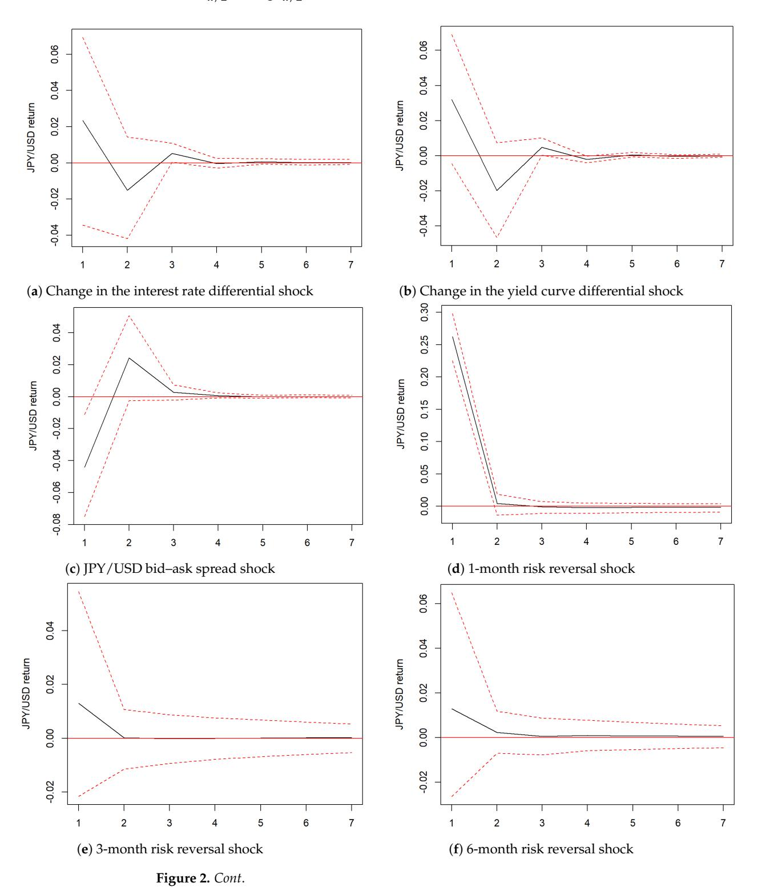

*Risks* **2026**, *14*, 46 21 of 37

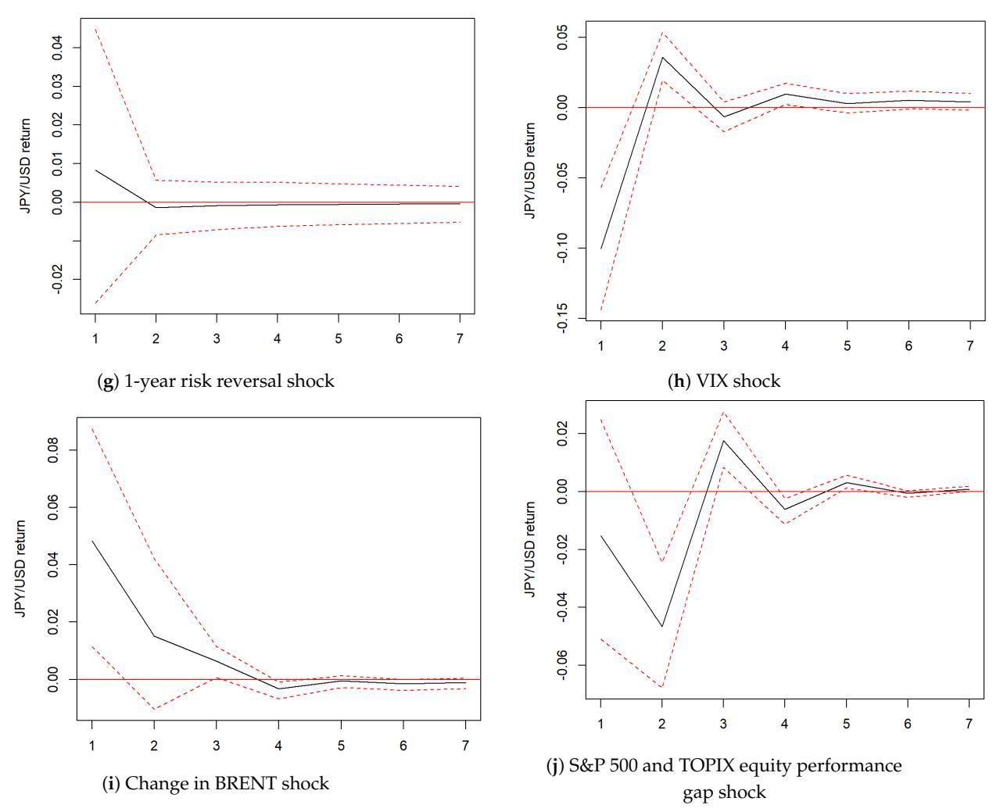

**Figure 2.** Impulse response of the JPY/USD exchange rate from various market shocks. Orthogonal impulse response function with 95% confidence intervals over 7 days, where a negative (positive) response means an appreciation (depreciation) of the Japanese Yen, scaled in percentage change.

The impulse response from a shock in the change of the interest rate differential presents controversy, with both a positive and negative exchange rate response and a large confidence interval (95%). Overall, these results are inconsistent with the correlations assumed under UIRP conditions, rejecting hypothesis H1. However, the opposite direction response from the exchange rate to a shock in the interest rate and the yield curve differentials, with large confidence intervals including positive and negative responses, tells us a story with regard to dynamical correlations: the immediate exchange rate response is of the opposite sign than that expected under UIRP, while the second day response tempers the UIRP deviation with diminishing response from the third day. Such an observation from the impulse response suggests that UIRP conditions are not entirely irrelevant to exchange rate equilibrium, but there might be exchange rate undershooting, as argued by [Villanueva](#page-36-1) [\(2005\)](#page-36-1), based on the limited participation model of [Lyons](#page-35-23) [\(2001\)](#page-35-23).

If the UIRP does not hold, the risk, liquidity premium, and the UEP theory may help address the puzzle. First, we consider the effect of global risk appetite on the JPY/USD exchange rate. A shock in the VIX index leads to an apparent negative response, pointing to Yen appreciation correlated with global risk sentiment increases. This confirms the unwinding of the Yen-founded carry trades theory and the traditional safe-haven expectation that both support the Yen would appreciate under increased market uncertainty. Therefore, we confirm hypothesis H2.a, which posits that a positive shock to the VIX negatively

*Risks* **2026**, *14*, 46 22 of 37

impacts the JPY/USD exchange rate due to the safe-haven role of the Yen. This result can be interpreted theoretically and empirically as follows. The stable monetary policies during the analyzed period likely played a key role, as the Bank of Japan's ultra-loose stance made the Yen a prime choice for funding currency. As [Brunnermeier et al.](#page-34-3) [\(2009\)](#page-34-3) highlight, VIX-driven shifts in risk tolerance can lead to complex capital flows, with increased demand for liquidity in investment currencies. Although [Jiang et al.](#page-35-28) [\(2021\)](#page-35-28) suggest that investors prioritize the Dollar during periods of heightened risk sentiment, the results point out that the Yen is still used as a hedging currency, regardless of the high volatility of the Japanese Yen and sticky monetary stance of the Bank of Japan.

If VIX captures equity market volatility, we also measure financial markets' risk using the Brent index for commodity markets and several risk reversals for FX markets. According to Figure [2i](#page-20-0), the JPY/USD responds positively to a shock to the Brent index for three days after the shock, i.e., a depreciation of the currency. Aligning with [Masujima and Sato'](#page-35-13)s [\(2024\)](#page-35-13) findings, a positive shock in Brent index (i.e., a rise in oil prices) causes a weakening of the Yen due to a supply-driven shock. Then, we observe a quick positive response of the exchange rate to a shock in the 1-month risk reversal, rejecting hypothesis H2.c, stating that a positive shock to risk reversals causes an appreciation of the Yen. The active Yen-funded carry trades can rationalize such results. The investors engage in market activities by purchasing Yen call options in anticipation of further depreciation, leveraging the backdrop of relatively sluggish inflation dynamics in Japan. Note that the positive answer is still present for 3-month, 6-month and 1-year risk reversals, but significantly smaller in size with large confidence interval bands.

Next, we investigate the liquidity premium channel. The bid–ask spread shock is followed by an appreciation of the Japanese Yen on the first day, which reverses to a depreciation of the currency on the second day. The mixed results reject hypothesis H3, stating that widening the bid–ask spread makes the Japanese Yen less attractive to investors, therefore depreciating the currency.

The Uncovered Equity Parity also plays a major role in this picture, as the JPY/USD exchange rate responds negatively for two days before bouncing back with a relatively smaller positive exchange rate response stabilizing by the end of the week. This indicates that higher US equity returns relative to Japanese returns drive the appreciation of the Japanese Yen. This finding confirms hypothesis H4, which proposes that through the portfolio balance model, investors hedge their risk away from the Dollar-denominated assets by demanding Japanese Yen, thereby causing an appreciation of the Yen.

The impulse response results allow for careful examination of the signed correlation between financial indicators and the exchange rate. Overall, the reduced-form responses are consistent with safe-haven comovement of the yen with global risk proxies, and with exchange rate dynamics that covary with option-implied FX risk sentiment and relative equity performance.

#### *6.3. Forecast Error Variance Decomposition*

To provide further insights into the role of financial indicators in explaining the JPY/USD exchange rate dynamics, we produced forecast error decomposition based on the VAR model, which incorporates all economic indicators. Figure [3](#page-23-0) presents the results.

If the impulse response function provides insights on how the exchange rate reacts to shocks in one variable, holding others constant, the forecast error variance decomposition (FEVD) pictures the relative importance of the variables in explaining the FEVD of the exchange rate. Therefore, the FEVD helps us address the relevance of each financial indicator. Focusing on the FEVD for the exchange rate (Figure [3a](#page-23-0)), as expected, the exchange rate error variance is mainly explained by the shock in the exchange rate. Such a result is *Risks* **2026**, *14*, 46 23 of 37

not surprising considering the high autocorrelation nature of financial data series. On the other hand, the 1-month risk reversal does account for more than 20% and VIX for around 5% of the FEVD of the JPY/USD exchange rate. Even though the JPY/USD exchange rate responds to most financial indicators, the one-month risk reversal accounts for a larger share of the forecast error variance of exchange rate returns over the one-week horizon. While not as visually appealing as the FX and equity markets risk sentiments, the interest rate differential appears to account for a small percentage of the exchange rate variance, represented by the thin band at the top of the variance decomposition. The relative equity performance gap variance (Figure [3b](#page-23-0)) relies in the majority on itself, and around one quarter on FX and equity markets' risk indexes.

The relative importance of short-term risk proxies in explaining the variance of exchange rate returns underscores the essential role of market sentiment and risk appetite in driving currency dynamics. More precisely, if the interest rate differential or the relative equity performance may drive portfolio rebalancing based on return-based strategies or on the risk associated with changes in those relative returns, the FEVD gives them little weight, with the relative importance of their effects on the exchange rate variance compared to market sentiment proxies. This suggests that the currency risk premium, a central explanation for the forward bias puzzle, is not solely dependent on UIRP and UEP conditions, but also on changing risk appetite stemming from the equity and FX markets. Risk appetite which might not be solely derived from exchange rate behavior or equity performance, but relate to macroeconomic conditions, expectations—a primary factor of exchange rate modeling—or news which has a great impact on currency return [\(Taylor](#page-36-0) [1995\)](#page-36-0). Furthermore, safe-haven status is closely related to financial stress. This points out that if the Yen acts as a hedge against risky assets as per UEP theory, this connection is tied to market agents' risk appetite and actual financial stress, proxied by risk indicators.

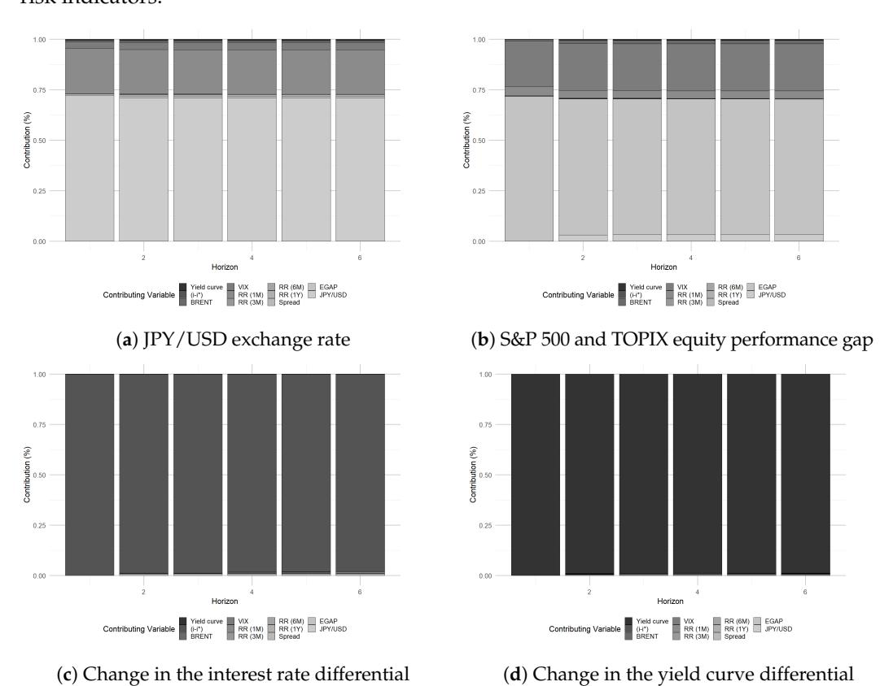

**Figure 3.** *Cont*.

*Risks* **2026**, *14*, 46 24 of 37

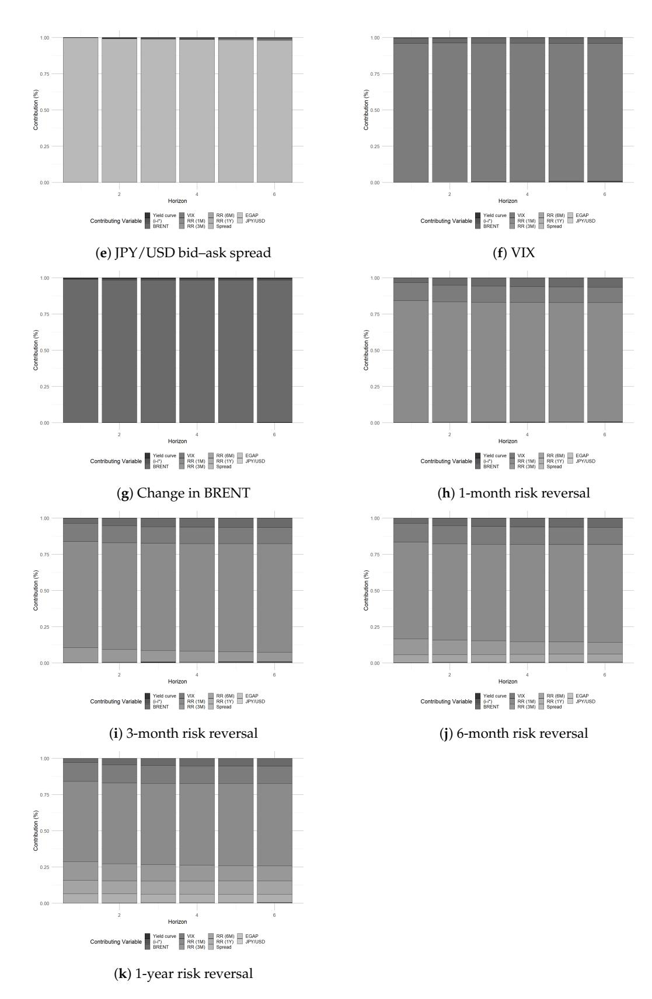

**Figure 3.** Forecast Error Variance Decomposition based on VAR(1) model over one week.

## *6.4. Robustness Check: Stability of the Model Across Subsamples*

The baseline analysis demonstrates the sensitivity of the exchange rate to the risk and equity market indicators. To reinforce our empirical findings, we re-estimate the baseline VAR model across four subsamples: one encompassing top-quartile VIX days, *Risks* **2026**, *14*, 46 25 of 37

one covering the remaining sample period, and pre-2022 (January 2018–December 2021) and post-2022 (January 2022–December 2024) periods. The top-quartile threshold, which distinguishes high-stress days from relatively low-stress days, is set at 22.86 based on the VIX value. Variations in the impulse response functions are depicted in Figures [4](#page-24-0)[–7](#page-27-0) below. IRFs exhibiting exchange rate responses that do not deviate substantially from the baseline are not reported[8](#page-34-14) .

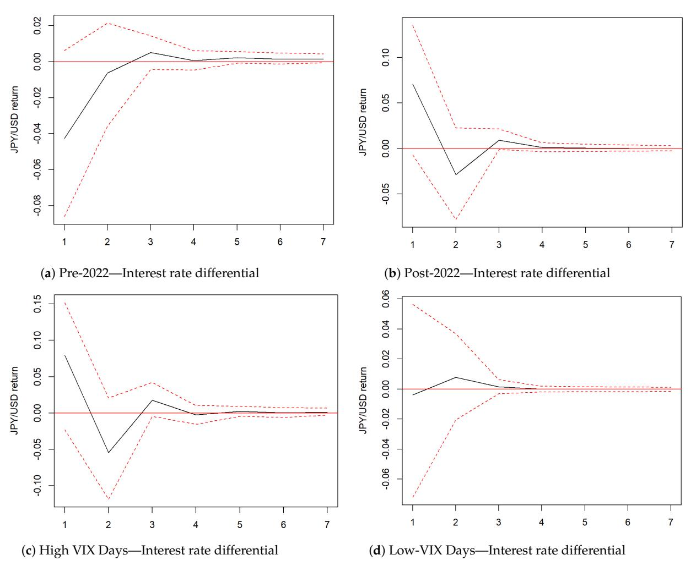

**Figure 4.** IRF: Exchange rate response to a shock in the change of the interest rate differential. Orthogonal impulse response function with 95% confidence intervals over 7 days, where a negative (positive) response means an appreciation (depreciation) of the Japanese Yen, scaled in percentage change.

In the baseline model, a shock to the interest rate differential was positively correlated with a positive response in the exchange rate, followed by a negative response on the second day, accompanied by wide confidence intervals. This pattern indicates a marked deviation from uncovered interest rate parity, which predicts a statistically significant negative correlation between these variables. Figure [4](#page-24-0) reveals that the baseline model's empirical results are predominantly driven by the post-2022 subsample, although the UIRP violation occurs across both high- and low-financial-stress episodes. In particular, prior to 2022, the exchange rate responded inversely to changes in the interest rate differential, consistent with the UIRP condition in terms of directionality. Analogous findings obtained for the yield curve differential suggest that UIRP failures were related to structural breaks. We now turn to heterogeneity in the effects of risk proxies.

*Risks* **2026**, *14*, 46 26 of 37

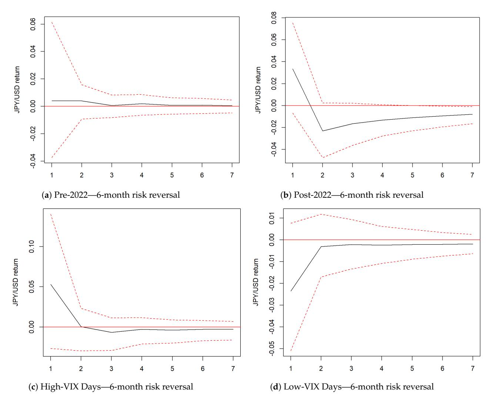

**Figure 5.** IRF: Exchange rate response to a shock in the 6-month FX risk reversal. Orthogonal impulse response function with 95% confidence intervals over 7 days, where a negative (positive) response means an appreciation (depreciation) of the Japanese Yen, scaled in percentage change.

In the baseline model, the impulse response function to an FX risk reversal shock shows a depreciation of the Japanese Yen across various horizons following a positive shock. This outcome contradicts hypothesis H2.c, which predicts that market participants would demand a higher premium for Yen holdings in response to such a shock, leading to Yen appreciation. Figure [5](#page-25-0) illustrates that longer-horizon risk reversals conform with expectations—a Yen appreciation due to elevated currency premia—specifically for the 6-month risk reversal in the post-2022 sample, beginning on the second day with a persistent exchange rate adjustment over the subsequent week, and on typical VIX days. These findings indicate that longer-horizon risk reversals more closely adhere to the premium hypothesis, which addresses hedging for upside and downside currency exposures. Longer horizon sentiment in the FX market relates to currency excess returns when market is absent from elevated financial stress, whereas atypical macroeconomic conditions tend to increase demand for currency hedging.

*Risks* **2026**, *14*, 46 27 of 37

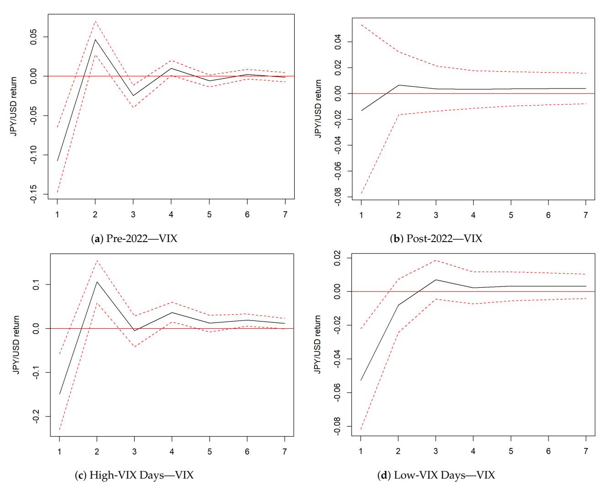

**Figure 6.** IRF: Exchange rate response to a shock in the VIX. Orthogonal impulse response function with 95% confidence intervals over 7 days, where a negative (positive) response means an appreciation (depreciation) of the Japanese Yen, scaled in percentage change.

The VIX serves as a robust indicator of market sentiment and global uncertainty originating from the US equity market. Our baseline analysis reveals strong Yen hedging dynamics amid escalating market uncertainty. Subsampling further elucidates this dynamic relationship. Specifically, similar exchange rate responses are observed in the pre-2022 sample and on both low- and high-VIX days, with a quantitatively smaller positive rebound on the second day. This corroborates the hypothesis that the Yen exhibits a negative correlation with market uncertainty and functions as a risk hedge. This finding remains robust across varying financial stress levels but differs based on macroeconomic disruptions from exogenous shocks like COVID-19. Such a correlation breakdown may reflect home bias, driven by COVID-induced global uncertainty, whereby market participants avoid hedging through foreign markets. In addition to VIX, we explore variations in the impulse response functions to shocks in the equity performance gap to assess the impact of the equity market.

*Risks* **2026**, *14*, 46 28 of 37

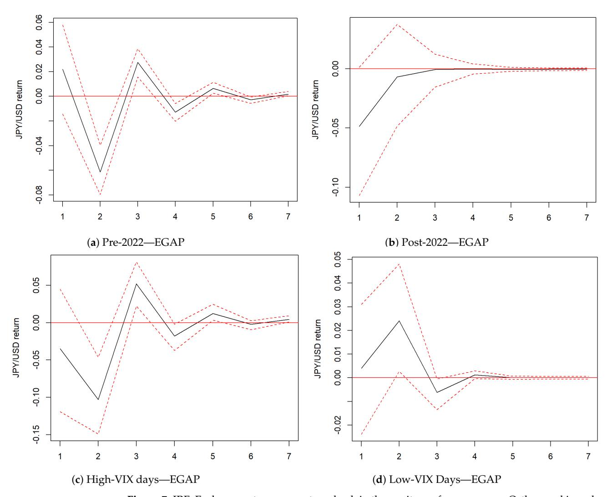

**Figure 7.** IRF: Exchange rate response to a shock in the equity performance gap. Orthogonal impulse response function with 95% confidence intervals over 7 days, where a negative (positive) response means an appreciation (depreciation) of the Japanese Yen, scaled in percentage change.

According to the Uncovered Equity Parity (UEP) hypothesis, an increase in the relative return on the foreign asset leads investors to rebalance their portfolios by purchasing foreign currencies to hedge against risk. Equivalently, a positive shock to the equity performance differential correlates with Yen appreciation, manifested as a negative response. Figure [7](#page-27-0) indicates that the exchange rate response aligns with UEP theory and the baseline model across the full sample period, despite a lag in the post-2022 subsample. Crucially, results conform to UEP conditions solely on high financial stress days, highlighting foreign currency hedging as a primary mechanism amid elevated market uncertainty.

The following Figure [8](#page-28-0) displays the FEVD for exchange rate returns across all subsamples. In stable macroeconomic conditions and high financial stress periods, respectively, approximately 62% and 70% of exchange rate variance is accounted for by its own shocks, with the remainder predominantly attributable to various risk proxies and, to a lesser extent, other VAR model variables. This pattern is absent in the post-2022 and low-VIX subsamples, where risk reversals and the exchange rate itself constitute the primary contributors.

*Risks* **2026**, *14*, 46 29 of 37

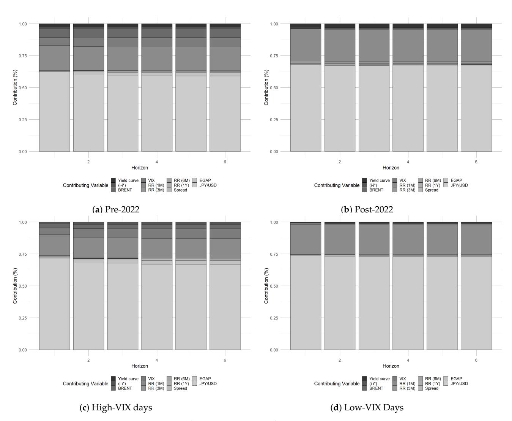

**Figure 8.** FEVD: Exchange rate variance decomposition.

Overall, the subsampled IRF and FEVD analyses indicate that the association between currency excess returns, risk, URIP, and UEP conditions hinges on financial stress and exogenous shocks that substantially disrupt global macroeconomic conditions. From a theoretical standpoint, these empirical findings affirm the enduring role of parity conditions in shaping exchange rate dynamics. UEP does not override UIRP; rather, their relative influence alternates with market conditions—UIRP aligns most closely with exchange rate movements during stable global macroeconomic periods, whereas UEP predominates amid heightened financial stress.

#### *6.5. Robustness Check: Alternatives to the Cholesky Decomposition*

Although the Cholesky decomposition employed in the baseline analysis above is theoretically grounded, the short-run financial variables exhibit strong interdependencies, which may constrain the empirical inferences derived from the impulse response functions and forecast error variance decompositions discussed earlier. To verify the robustness of our empirical results to this Cholesky ordering, we performed impulse response and FEVD

Risks **2026**, 14, 46 30 of 37

analyses with five alternative Cholesky decompositions. In these alternatives, the  $Y_t$  vector in Equation (6) adopts the forms presented below.

$$Y_{t} = \begin{bmatrix} \Delta BRENT_{t} \\ VIX_{t} \\ Spread_{t} \\ Risk Reversals_{t} \\ EGAP_{t} \\ \Delta YCurve^{Diff} \\ \Delta (i_{t} - i_{t}^{*}) \\ \Delta JPY/USD_{t} \end{bmatrix}$$

$$(11)$$

$$Y_{t} = \begin{bmatrix} \Delta Y Curve^{Diff} \\ \Delta (i_{t} - i_{t}^{*}) \\ EGAP_{t} \\ \Delta BRENT_{t} \\ VIX_{t} \\ Spread_{t} \\ Risk \ Reversals_{t} \\ \Delta JPY/USD_{t} \end{bmatrix}$$

$$(12)$$

$$Y_{t} = \begin{bmatrix} \Delta Y Curve^{Diff} \\ \Delta (i_{t} - i_{t}^{*}) \\ EGAP_{t} \\ \Delta BRENT_{t} \\ VIX_{t} \\ Risk Reversals_{t} \\ Spread_{t} \\ \Delta JPY/USD_{t} \end{bmatrix}$$

$$(13)$$

$$Y_{t} = \begin{bmatrix} \Delta BRENT_{t} \\ VIX_{t} \\ Spread_{t} \\ Risk Reversals_{t} \\ EGAP_{t} \\ \Delta JPY/USD_{t} \\ \Delta YCurve^{Diff} \\ \Delta (i_{t} - i_{t}^{*}) \end{bmatrix}$$

$$(14)$$

$$Y_{t} = \begin{bmatrix} \Delta Y Curve^{Diff} \\ \Delta (i_{t} - i_{t}^{*}) \\ EGAP_{t} \\ \Delta JPY/USD_{t} \\ \Delta BRENT_{t} \\ VIX_{t} \\ Spread_{t} \\ Risk Reversals_{t} \end{bmatrix}$$

$$(15)$$

We examined two alternative scenarios to the baseline model in which monetary policy variables are not perfectly exogenous to other financial variables: one where they precede exchange rate returns (11), and another where they follow all others (14), rendering them endogenous to exchange rate movements. Additionally, we analyzed the positioning of the

*Risks* **2026**, *14*, 46 31 of 37

equity performance gap before market risk indicators (12), the dependence of FX market liquidity on FX market risk (13), and a revision of market risk based on exchange rate dynamics (15).

Altering the exogeneity assumption for monetary policy variables produces impulse response functions that remain unchanged, featuring conflicting positive and negative exchange rate responses. Confidence intervals stay wide, encompassing both positive and negative values, thereby affirming deviations from the uncovered interest rate parity condition and the presence of arbitrage opportunities. The one exception is when the change in the domestic–foreign yield curve differential is endogenous to other financial variables (Specification (14)). Then, the exchange rate responds negatively to a positive shock to the differential, implying that the Yen appreciates with an acceleration of an increase in the relative Japanese bond premium. This has important implications as to whether the relative bond premium structure depends on the exchange rate, especially from the standpoint of international portfolio diversification.

Considering liquidity and risk based on market sentiment, reordering variables from one configuration to another yields impulse response results for exchange rate responses to all other variables that mirror the baseline model[9](#page-34-15) . Thus, regardless of whether FX liquidity precedes or follows financial risk proxies, whether the equity performance gap is placed before or after liquidity and risk measures, or whether monetary policy exogeneity is relaxed, the conclusions from the baseline model hold regarding market risk sentiment and liquidity.

The sole exception occurs in specification (15), where risk and liquidity indicators derive from exchange rate dynamics, predicated on UIRP and uncovered equity parity conditions. Impulse responses for exchange rate reactions to shocks in FX risk reversals, monetary variables, the equity performance gap, and BRENT prices align with the baseline model. However, responses diverge markedly for FX liquidity and the VIX index, as illustrated in Figure [9](#page-31-0) below. The Japanese Yen depreciates amid heightened equity market uncertainty, against hypothesis H2.a, and diminished FX liquidity, supporting hypothesis H3.

Consistent with the baseline model, the forecast error variance decomposition consistently highlights the VIX indicator's role in accounting for exchange rate return variance across specifications. The primary distinction across models from the FEDV results concerns which FX risk reversal accounts for one fifth of the exchange rate return variance; for example, specification (12) attributes approximately 20% to the three-month risk reversal, in contrast to the one-month risk reversal in others. Specification (15) again presents a unique pattern where the exchange rate variance is exclusively driven by exchange rate dynamics.

Regarding the exchange rate response to a shock to relative equity performance, the results depend on the ordering of the variables. Across all alternative specifications, only specification (15) retains some findings similar to those of the baseline model, in which the exchange rate is negatively correlated with the equity performance gap. On the other hand, the reversal of the baseline results for a positive exchange rate response may contradict hypothesis H4, but it highlights return-chasing strategies rather than risk rebalancing. This suggests that the correlation between the FX and stock markets is more complex than a single risk-rebalancing mechanism, and that the intersection between risk appetite and portfolio rebalancing is not indivisible.

*Risks* **2026**, *14*, 46 32 of 37

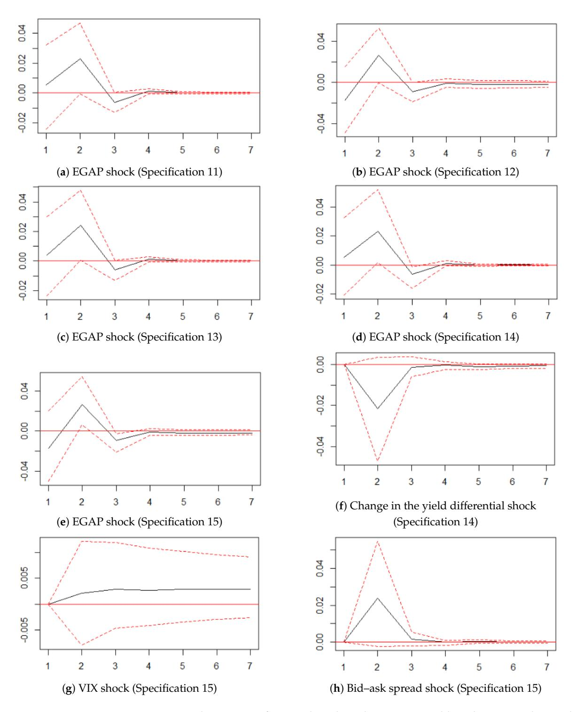

**Figure 9.** Impulse response function based on alternative variable orderings. Orthogonal impulse response function with 95% confidence intervals over 7 days, where a negative (positive) response means an appreciation (depreciation) of the Japanese Yen, scaled in percentage change.

For the majority of alternative variables ordering examined, the sequence of results remains consistent with the empirical findings from the baseline model, thereby corroborating violations of uncovered interest parity conditions, the Yen's safe-haven status, and carry trade patterns. Discrepancies in the final alternative variable ordering and shocks in the equity performance gap underscore the tension between risk, liquidity premia and the equity market, along with the endogeneity linking exchange rate movements to the

*Risks* **2026**, *14*, 46 33 of 37

risk premium, thereby emphasizing the imperative for enhanced comprehension of the risk premium.

#### *6.6. Summary of the Findings and Discussion*

Figure [10](#page-32-0) synthesizes the main empirical results obtained from the Granger causality tests, impulse response functions, and forecast error variance decomposition. Directed arrows indicate statistically significant Granger-causal relationships between variables. Blue (red) arrows denote positive (negative) exchange rate responses to shocks originating from the corresponding financial indicators. Highlighted arrows identify the two principal indirect transmission channels through which financial risk factors interact with the traditional UIRP framework.

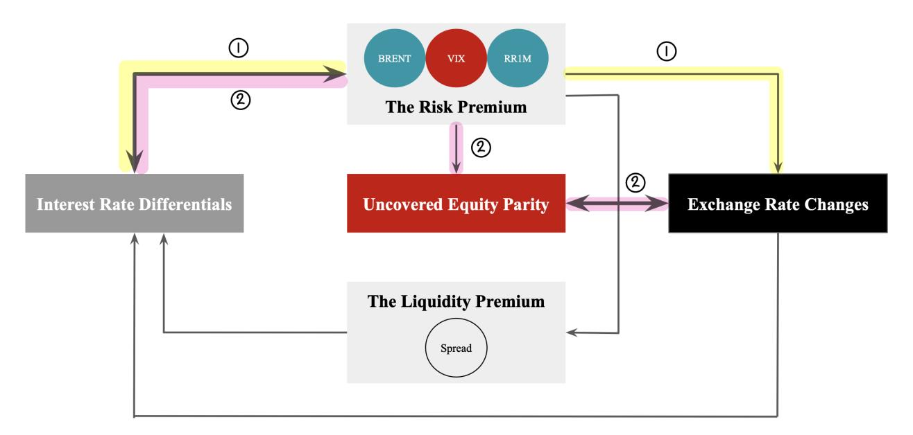

**Figure 10.** Interlinkages between financial indicators, interest rate differentials, and the JPY/USD exchange rate returns. Number one and two illustrate the two indirect transmission channels through which interest rates affect exchange rates.

The figure illustrates the dynamic interactions between interest rate differentials and key financial market channels in shaping JPY/USD exchange rate returns. We observe the presence of an unidirectional relationship between risk proxies and exchange rate movements and the large share of exchange rate return variance explained by short-term risk reversals, underscoring the dominant role of market risk sentiment and risk appetite in driving short-term exchange rate dynamics.

Second, there is a bidirectional relationship between relative equity market performance and exchange rate returns, providing empirical support for an indirect transmission mechanism consistent with the Uncovered Equity Parity (UEP) framework. This channel is indirect in the sense that UIRP conditions are reflected through financial risk premiums, subsequently affecting the equity performance gap (EGAP) through portfolio rebalancing, ultimately being translated into exchange rate adjustments. Such a mechanism proposes that deviations from parity arise not from a single missing factor, but from the interaction of multiple financial risk channels linking currency and equity markets.

*Risks* **2026**, *14*, 46 34 of 37

# **7. Conclusions**

This study revisits the Uncovered Interest Rate Parity (UIRP) puzzle from a financial risk perspective by examining the roles of risk premiums, liquidity conditions, and relative equity market performance and the Uncovered Equity Parity (UEP) through a unified framework. Employing a vector autoregression framework with daily data on key financial indicators and the JPY/USD exchange rate, the analysis investigates how financial risk transmission channels interact endogenously with interest rate differentials to shape shortrun exchange rate dynamics.

The findings reveal strong interdependencies among financial risk indicators, interest rate differentials, and exchange rate returns. Elevated currency market risk is associated with depreciation of the Japanese Yen, whereas higher equity market risk is linked to Yen appreciation. Moreover, the Yen tends to appreciate when U.S. equity returns outperform Japanese equity returns, underscoring the importance of relative equity market performance in driving exchange rate adjustments. Financial risk indicators from both currency and equity markets explain a substantial share of exchange rate variance. Overall, the results point to an indirect financial risk transmission channel in which variations in interest rate differentials are transmitted through risk premiums and relative equity market performance before being reflected in exchange rate movements. These findings reaffirm the Yen's continued role as a safe-haven currency, the persistence of Yen-funded carry trade strategies, and the empirical relevance of the Uncovered Equity Parity framework proposed by [Hau and Rey](#page-35-4) [\(2006\)](#page-35-4).

While this study documents the existence of indirect financial risk transmission channels linking interest rate differentials to exchange rate dynamics, it does not explicitly model the structural mechanisms through which these channels operate. Future research could examine these transmission pathways in greater detail by incorporating structural identification strategies or regime-dependent specifications. In addition, integrating business cycle phases into the analysis may provide further insight into how equity returns, financial risk sentiment, and liquidity conditions jointly influence currency valuation across expansions, recessions, and crisis periods. Such extensions would offer a more nuanced understanding of JPY/USD exchange rate dynamics and the cyclical nature of UIRP deviations under varying financial risk environments.

**Author Contributions:** Conceptualization, O.G., H.A.M. and P.Y.; methodology, O.G., H.A.M. and P.Y.; software, O.G., H.A.M. and P.Y.; validation, O.G. and P.Y.; formal analysis, O.G. and P.Y.; investigation, O.G., H.A.M. and P.Y.; resources, O.G., H.A.M. and P.Y.; data curation, O.G. and P.Y.; writing—original draft preparation, O.G., H.A.M. and P.Y.; writing—review and editing, O.G., H.A.M. and P.Y.; visualization, O.G., H.A.M. and P.Y.; supervision, H.A.M.; project administration, O.G., H.A.M. and P.Y.; funding acquisition, O.G., H.A.M. and P.Y. All authors have read and agreed to the published version of the manuscript.

**Funding:** This research received no external funding.

**Data Availability Statement:** Restrictions apply to the availability of these data. Data were obtained from Bloomberg and are available at [https://www.bloomberg.com/professional/products/](https://www.bloomberg.com/professional/products/bloomberg-terminal/) [bloomberg-terminal/](https://www.bloomberg.com/professional/products/bloomberg-terminal/) (accessed on 1 November 2025) with the permission of Bloomberg.

**Acknowledgments:** The authors thank Insang Hwang of the International Christian University for valuable guidance and feedback on an earlier draft. We are also grateful to the discussants and participants at the 2025 Japanese Society of Monetary Economics Spring Annual Meeting for insightful comments and constructive suggestions. Any remaining errors are the authors' responsibility.

*Risks* **2026**, *14*, 46 35 of 37

**Conflicts of Interest:** Author Peiqing Yang was employed by the company BlackRock (Japan). The remaining authors declare that the research was conducted in the absence of any commercial or financial relationships that could be construed as a potential conflict of interest. The BlackRock (Japan) had no role in the design of the study; in the collection, analyses, or interpretation of data; in the writing of the manuscript, or in the decision to publish the results.

# **Notes**

- [1](#page-6-0) [Masujima and Sato](#page-35-13) [\(2024\)](#page-35-13) note that rather than the magnitude of the interest rate differentials, employing variations of the differentials is relevant to daily exchange rate returns due to frequent portfolio re-allocation arising from higher-frequency trading instruments availability to investors.
- [2](#page-6-1) As we consider JPY/USD exchange rate, the domestic currency is the Japanese Yen and the domestic interest rate is Japan's interest rate, the expected sign of the *β* coefficient is reversed from what is common in UIRP specifications.
- [3](#page-9-0) This study employs a reduced-form VAR to account for endogeneity among financial risks, the stock market, and the FX market, allowing for the investigation of dynamical correlations and testing of theoretical predictions. However, while empirical conclusions support the expected negative correlation proposed by UEP theory, the inherent data-driven nature of the reduced-form VAR limits its capacity to explicitly identify and distinguish the specific structural mechanisms underlying these relationships, suggesting a need for further theoretical refinements and empirical tests using structural models.
- [4](#page-11-0) The Bloomberg tickers for the JPY/USD risk reversals are given by "USDJPY25R1M" for the one-month tenor, "USDJPY25R3M" for the three-month tenor, "USDJPY25R6M" for the six-month tenor, and "USDJPY25R1Y" for the one-year tenor. The number of days until expiration are 28, 91, 182, and 365 days respectively on the tenor.
- [5](#page-11-1) A call (put) option gives a trader the right to buy (sell) the underlying asset, at a predetermined price (known as the "strike price") within a specific time period (or "expiration"). "Out-of-the-money" (OTM) refers to an option that currently has no intrinsic value because the underlying asset's market price is not favorable for immediate exercise. Specific occasions are when the strike price exceeds the current market price for call options, and the current market price beats the strike price for put options.
- [6](#page-13-1) Traditional empirical investigations of the UIRP theory consist of estimating Equation (2) through a linear regression such as OLS and other variants, testing for *β* = 1. [Flood and Rose](#page-35-29) [\(1996\)](#page-35-29) estimate Fama's *β* as 0.70 for the 1979–1994 European Monetary System; [Coleman](#page-34-16) [\(2012\)](#page-34-16) finds the *β* around 0.50 during the classical gold standard; [Froot and Thaler](#page-35-30) [\(1990\)](#page-35-30) report that the average value for the *β* in scores of estimates is −0.88, referred to multiple studies; [Chinn and Meredith](#page-34-1) [\(2004\)](#page-34-1) also find that regressions using short-horizon data yield negative *β*, for advanced economies except Italy.
- [7](#page-13-2) We employ a log difference transformation on the change of the interest rate differential and the Brent index to obtain stationary data.
- [8](#page-24-1) The IRFs for FX liquidity shocks, as well as one-month and one-year risk reversal shocks, and Brent oil price shocks are not reported due to their similarity to the baseline results. Although the scale and timing of the exchange rate responses may exhibit minor variations, these do not constitute significant departures from the baseline empirical conclusions.
- [9](#page-30-0) The one exception among the risk proxies is the 6-month risk reversal impulse response function, which shows a negative exchange rate response (i.e., currency appreciation). This result is consistent across all alternative specifications and with those from low financial stress days in Figure [5,](#page-25-0) strengthening the argument that longer-horizon risk reversals induce currency premiums.

# **References**

Bacchetta, Philippe, and Eric van Wincoop. 2010. Infrequent portfolio decisions: A solution to the forward discount puzzle. *American Economic Review* 100: 870–904. [\[CrossRef\]](http://doi.org/10.1257/aer.100.3.870)

Black, Stanley W. 2015. The portfolio theory of exchange rates—Then and now. *Review of International Economics* 23: 379–86. [\[CrossRef\]](http://dx.doi.org/10.1111/roie.12167) Bollerslev, Tim, and Michael Melvin. 1994. Bid—Ask spreads and volatility in the foreign exchange market: An empirical analysis. *Journal of International Economics* 36: 355–72. [\[CrossRef\]](http://dx.doi.org/10.1016/0022-1996(94)90008-6)

Brunnermeier, Markus K., Stefan Nagel, and Lasse H. Pedersen. 2009. Carry trades and currency crashes. *NBER Macroeconomics Annual* 23: 313–47. [\[CrossRef\]](http://dx.doi.org/10.1086/593088)

Chen, Shu-Hsiu. 2017. Carry trade strategies based on option-implied information: Evidence from a cross-section of funding currencies. *Journal of International Money and Finance* 78: 1–20. [\[CrossRef\]](http://dx.doi.org/10.1016/j.jimonfin.2017.07.020)

Chinn, Menzie D., and Guy Meredith. 2004. Monetary policy and long-horizon uncovered interest parity. *IMF Staff Papers* 51: 409–30. [\[CrossRef\]](http://dx.doi.org/10.2307/30035956)

Coleman, Andrew. 2012. Uncovering uncovered interest parity during the classical gold standard era, 1888–1905. *The North American Journal of Economics and Finance* 23: 20–37. [\[CrossRef\]](http://dx.doi.org/10.1016/j.najef.2011.10.001)

Coudert, Virginie, Cyriac Guillaumin, and Hélène Raymond. 2014. Looking at the Other Side of Carry Trades: Are there any Safe Haven Currencies? Working Paper Economix. Available online: <https://hal.science/hal-04141355/> (accessed on 1 November 2025).

*Risks* **2026**, *14*, 46 36 of 37

Ding, Liang, and Jun Ma. 2013. Portfolio reallocation and exchange rate dynamics. *Journal of Banking & Finance* 37: 3100–24. [\[CrossRef\]](http://dx.doi.org/10.1016/j.jbankfin.2013.02.035) Eichenbaum, Martin, and Charles L. Evans. 1995. Some empirical evidence on the effects of shocks to monetary policy on exchange rates. *The Quarterly Journal of Economics* 110: 975–1009. [\[CrossRef\]](http://dx.doi.org/10.2307/2946646)

- Engel, Charles. 2016. Exchange rates, interest rates, and the risk premium. *American Economic Review* 106: 436–74. [\[CrossRef\]](http://dx.doi.org/10.1257/aer.20121365)
- Evans, Martin D. D., and Richard K. Lyons. 2002. Order flow and exchange rate dynamics. *Journal of Political Economy* 110: 170–80. [\[CrossRef\]](http://dx.doi.org/10.1086/324391)
- Fama, Eugene F. 1984. Forward and Spot Exchange Rates. *Journal of Monetary Economics* 14: 319–38. [\[CrossRef\]](http://dx.doi.org/10.1016/0304-3932(84)90046-1)
- Fang, Siran, Yunjie Wei, and Shouyang Wang. 2024. 30 years of exchange rate analysis and forecasting: A bibliometric review. *Journal of Economic Surveys* 38: 973–1007. [\[CrossRef\]](http://dx.doi.org/10.1111/joes.12572)
- Fang, Yi, Zhiquan Shao, and Yang Zhao. 2023. Risk spillovers in global financial markets: Evidence from the COVID-19 crisis. *International Review of Economics & Finance* 83: 821–40. [\[CrossRef\]](http://dx.doi.org/10.1016/j.iref.2022.10.016)
- Flood, Robert P., and Andrew K. Rose. 1996. Fixes: Of the Forward Discount Puzzle. *The Review of Economics and Statistics* 78: 748–52. [\[CrossRef\]](http://dx.doi.org/10.2307/2109962)
- Froot, Kenneth A., and Richard H. Thaler. 1990. Anomalies: Foreign exchange. *Journal of Economic Perspectives* 4: 179–92. [\[CrossRef\]](http://dx.doi.org/10.1257/jep.4.3.179) Fujiwara, Shigeru. 2013. Recent Strengthening of the Correlation Between Stock Prices and Exchange Rates. Bank of Japan Review, 2013-J-8. Available online: [https://www.boj.or.jp/research/wps\\_rev/rev\\_2013/rev13j08.htm](https://www.boj.or.jp/research/wps_rev/rev_2013/rev13j08.htm) (accessed on 1 November 2025).
- Gagnon, Joseph, and Alain Chaboud. 2007. What can the data tell us about carry trades in Japanese yen? *FRB International Finance Discussion Paper* 899. [\[CrossRef\]](http://dx.doi.org/10.17016/ifdp.2007.899)
- Gourinchas, Pierre-Olivier, and Aaron Tornell. 2004. Exchange rate puzzles and distorted beliefs. *Journal of International Economics* 64: 303–33. [\[CrossRef\]](http://dx.doi.org/10.1016/j.jinteco.2003.11.002)
- Habib, Maurizio M., and Livio Stracca. 2012. Getting beyond carry trade: What makes a safe haven currency? *Journal of International Economics* 87: 50–64. [\[CrossRef\]](http://dx.doi.org/10.1016/j.jinteco.2011.12.005)
- Hau, Harald, and Helene Rey. 2006. Exchange rates, equity prices, and capital flows. *Review of Financial Studies* 19: 273–317. [\[CrossRef\]](http://dx.doi.org/10.1093/rfs/hhj008) Hossfeld, Oliver, and Ronald MacDonald. 2015. Carry funding and safe haven currencies: A threshold regression approach. *Journal of International Money and Finance* 59: 185–202. [\[CrossRef\]](http://dx.doi.org/10.1016/j.jimonfin.2015.07.005)
- Ilut, Cosmin L., and Martin Schneider. 2014. Ambiguous business cycles. *American Economic Review* 104: 2368–99. [\[CrossRef\]](http://dx.doi.org/10.1257/aer.104.8.2368)
- Islami, Mevlud, and Paul J. J. Welfens. 2013. Financial market integration, stock markets and exchange rate dynamics in Eastern Europe. *International Economics and Economic Policy* 10: 47–79. [\[CrossRef\]](http://dx.doi.org/10.1007/s10368-013-0229-8)
- Ismailov, Adilzhan, and Barbara Rossi. 2018. Uncertainty and deviations from uncovered interest rate parity. *Journal of International Money and Finance* 88: 242–59. [\[CrossRef\]](http://dx.doi.org/10.1016/j.jimonfin.2017.07.012)
- Jiang, Zhengyang, Arvind Krishnamurthy, and Hanno Lustig. 2021. Foreign safe asset demand and the dollar exchange rate. *The Journal of Finance* 76: 1049–89. [\[CrossRef\]](http://dx.doi.org/10.1111/jofi.13003)
- Kim, Heeho. 2011. The risk adjusted uncovered equity parity. *Journal of International Money and Finance* 30: 1491–505. [\[CrossRef\]](http://dx.doi.org/10.1016/j.jimonfin.2011.06.020)
- Kunkler, Michael, and Ronald MacDonald. 2018. Decomposition of the uncovered equity parity correlation. *Journal of International Financial Markets, Institutions and Money* 57: 44–58. [\[CrossRef\]](http://dx.doi.org/10.1016/j.intfin.2018.04.006)
- Lee, Kang-Soek. 2017. Safe-haven currency: An empirical identification. *Review of International Economics* 25: 924–47. [\[CrossRef\]](http://dx.doi.org/10.1111/roie.12289)
- Lyons, Richard K. 2001. *The Microstructure Approach to Exchange Rates*. Cambridge, MA: The MIT Press. [\[CrossRef\]](http://dx.doi.org/10.7551/mitpress /4602.001.0001)
- Masujima, Yuki, and Yuki Sato. 2024. *Drivers of Post-Pandemic Currency Movement: Recurring Impacts of Sovereign Risks and Oil Prices*. Discussion papers 24054. Tokyo: Research Institute of Economy, Trade and Industry (RIETI).
- McCallum, Bennett T. 1994. A reconsideration of the uncovered interest parity relationship. *Journal of Monetary Economics* 33: 105–32. [\[CrossRef\]](http://dx.doi.org/10.1016/0304-3932(94)90016-7)
- Melvin, Michael, and John Prins. 2015. Equity hedging and exchange rates at the London 4 pm fix. *Journal of Financial Markets* 22: 50–72. [\[CrossRef\]](http://dx.doi.org/10.1016/j.finmar.2014.11.001)
- Menkhoff, Lukas, Lucio Sarno, Maik Schmeling, and Andreas Schrimpf. 2012. Carry trades and global foreign exchange volatility. *The Journal of Finance* 67: 681–718. [\[CrossRef\]](http://dx.doi.org/10.1111/j.1540-6261.2012.01728.x)
- Miller, Norman C. 2014. Exchange rate economics: The uncovered interest parity puzzle and other anomalies. In *Exchange Rate Economics*. Surrey: Edward Elgar Publishing.
- Nucera, Federico, Lucio Sarno, and Gabriele Zinna. 2024. Currency risk premiums redux. *The Review of Financial Studies* 37: 356–408. [\[CrossRef\]](http://dx.doi.org/10.1093/rfs/hhad049)
- Rossi, Barbara. 2013. Exchange rate predictability. *Journal of Economic Literature* 51: 1063–119. [\[CrossRef\]](http://dx.doi.org/10.1257/jel.51.4.1063)
- Takechi, Hiroshi, Asako Iguchi, and Hisa Narisawa. 2024. Tokyo Stocks' Day of Record-Breaking Losses Begs Question: What Happened? The Mainichi Newspaper. Available online: <https://mainichi.jp/english/articles/20240806/p2a/00m/0bu/017000c> (accessed on 1 November 2025).

*Risks* **2026**, *14*, 46 37 of 37

Taylor, Mark P. 1995. The economics of exchange rates. *Journal of Economic literature* 33: 13–47. Available online: [http://www.jstor.org/](http://www.jstor.org/stable/2728909) [stable/2728909](http://www.jstor.org/stable/2728909) (accessed on 1 November 2025).

Villanueva, O. Miguel. 2005. FX dynamics, limited participation, and the forward bias anomaly. *Financial Review* 40: 67–93. [\[CrossRef\]](http://dx.doi.org/10.1111/j.0732-8516.2005.00093.x)

**Disclaimer/Publisher's Note:** The statements, opinions and data contained in all publications are solely those of the individual author(s) and contributor(s) and not of MDPI and/or the editor(s). MDPI and/or the editor(s) disclaim responsibility for any injury to people or property resulting from any ideas, methods, instructions or products referred to in the content.